In this workshop, TKG version used is v1.4.1
For detailed Installation procedure, refer to official vmware doc. We have already installed the required CLI tools for this workshop. 

```dashboard:open-url
url: https://docs.vmware.com/en/VMware-Tanzu-Kubernetes-Grid/1.4/vmware-tanzu-kubernetes-grid-14/GUID-index.html
```

<p style="color:blue"><strong> Click here to test the execution in terminal</strong></p>

```execute-1
echo "Hello, Welcome to Partner workshop session"
```

<p style="color:blue"><strong> Click here to check Tanzu version</strong></p>

```execute
tanzu version
```

<p style="color:blue"><strong> Click here to check TMC CLI version</strong></p>

```execute
tmc version
```

<p style="color:blue"><strong> Click here to check terraform CLI version</strong></p>

```execute
terraform --version
```

<p style="color:blue"><strong> Click here to check AZ CLI version</strong></p>

```execute
az --version
```

<p style="color:blue"><strong> Export session name as env variable</strong></p>

```execute-all
export SESSION_NAME={{ session_namespace }}
```

###### SE will provide the AZ Credentials, edit and execute in terminal

```copy-and-edit
az login --service-principal -u <App ID> -p <Password> --tenant <Tenent ID>
```

<p style="color:blue"><strong> Set up the environment</strong></p>

<p style="color:red"><strong>Please wait for 3-5 mins once you execute below script. Continue once the ongoing task is completed in Terminal-1.</strong></p>

```execute-1
source ~/script-session.sh
```

<p style="color:blue"><strong> Connect to jumpbox in Terminal-2 to deploy a Management cluster</strong></p>

```execute-2
ssh -i id_rsa azureuser@{{ session_namespace }}.centralindia.cloudapp.azure.com -o StrictHostKeyChecking=accept-new
```

<p style="color:blue"><strong> Deploy management cluster using bind. Once this command is executed, wait for a min and then proceed with next command to access the Installer page. 
</strong></p>

```execute-2
tanzu management-cluster create --ui --bind 0.0.0.0:8080
```

<p style="color:blue"><strong> Access below url and select Microsoft Azure in Installer page</strong></p>

```dashboard:open-url
url: http://{{ session_namespace }}.centralindia.cloudapp.azure.com:8080
```

<p style="color:blue"><strong> Azure environment details for management cluster creation can be found by executing this command in terminal 1: </strong></p>
    
<p style="color:red"><strong> Copy and paste the values as given by SE into Installer page opened in browser </strong></p>

     AZURE_TENANT_ID
     
    
     AZURE_CLIENT_ID
     

     AZURE_CLIENT_SECRET
     

     AZURE_SUBSCRIPTION_ID
     

     AZURE ENVIRONMENT: Public Cloud

<p style="color:black"><strong> Click CONNECT </strong></p>

<p style="color:black"> --------------------- </p>

<p style="color:Orange"> Region: West US 2 </p>

<p style="color:black"> --------------------- </p>

<p style="color:Orange"> SSH PUBLIC KEY </p>

```execute
cat /home/eduk8s/id_rsa.pub 
```

<p style="color:black"> --------------------- </p>

Resource Group: Create a new resource group and provide below name: 

<style>
H5{color:Blue !important;}
H6{color:DarkOrange !important;}
</style>

<p style="color:Orange"> {{ session_namespace }}-RG </p>

<p style="color:black"><strong>Example:</strong></p>

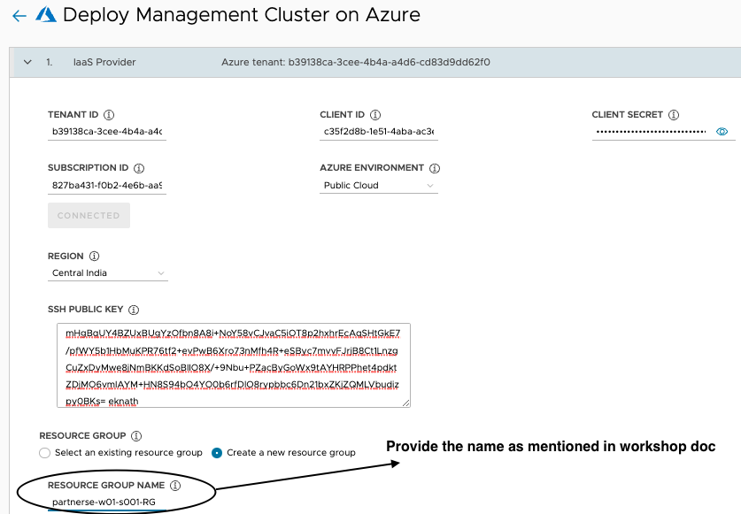

<p style="color:black"> --------------------- </p>
    
<p style="color:black"><strong>Azure VNET Settings: </strong></p>

Create a new VNET on Azure > from drop down select the newly created RG:

<p style="color:Orange"> {{ session_namespace }}-RG </p>

<p style="color:black"> --------------------- </p>

Provide VNET name as:

<p style="color:Orange"> {{ session_namespace }}-vnet </p>

<p style="color:black"> --------------------- </p>

Control Plane subnet name : 

<p style="color:Orange"> {{ session_namespace }}-cp </p>

<p style="color:black"> --------------------- </p>

Worker node subnet name: 

<p style="color:Orange"> {{ session_namespace }}-worker </p>

<p style="color:black"><strong>Example:</strong></p>

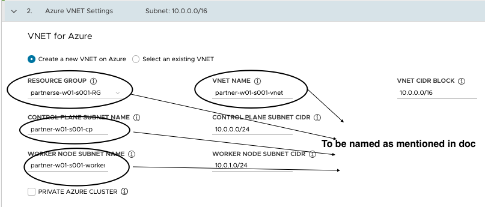

<p style="color:black"> --------------------- </p>

<p style="color:black"><strong>Management Cluster Settings: </strong></p>

<p style="color:orange">Development</p>

<p style="color:black"> --------------------- </p>

Instance Type: 

<p style="color:Orange"> Standard_D2s_v3 </p>

<p style="color:black"> --------------------- </p>
    
Management Cluster Name: 

<p style="color:Orange"> {{ session_namespace }}-mgmt </p>

<p style="color:black"> --------------------- </p>
    
Worker Node Instance Type: 

<p style="color:Orange"> Standard_D2s_v3 </p>

<p style="color:black"> --------------------- </p>

<p style="color:black"><strong>Example:</strong></p>

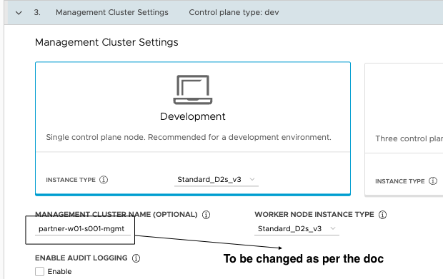

<p style="color:black"><strong>Click NEXT</strong></p>

<p style="color:black"> --------------------- </p>
    
Metadata: 

###### Leave to default and click NEXT

<p style="color:black"> --------------------- </p>

Kubernetes Network: 

###### Leave to default and click NEXT
    
<p style="color:black"> --------------------- </p>
    
<p style="color:black"><strong>Identity Management: </strong></p>

<p style="color:Orange"> Enable Identity Management Settings > Select LDAPS </p>

<p style="color:black"> --------------------- </p>

LDAPS Endpoint: 

<p style="color:Orange"> partnerdemodc01.tanzupartnerdemo.com </p>

<p style="color:black"> --------------------- </p>

port: <p style="color:Orange"> 636 </p>

<p style="color:black"> --------------------- </p>

BIND DN (OPTIONAL) : 

<p style="color:Orange"> cn=partner_admin,cn=Users,dc=partnerdemodc01,dc=tanzupartnerdemo,dc=com </p>

<p style="color:black"> --------------------- </p>

BIND PASSWORD (OPTIONAL) : 

<p style="color:Orange"> Welcome11! </p>

<p style="color:black"> --------------------- </p>

<p style="color:black"><strong>User Search Attributes </strong></p>

BASE DN (OPTIONAL) : 

<p style="color:Orange"> cn=Users,dc=partnerdemodc01,dc=tanzupartnerdemo,dc=com </p>

<p style="color:black"> --------------------- </p>

FILTER (OPTIONAL) : 

<p style="color:Orange"> (objectClass=Person) </p>

<p style="color:black"> --------------------- </p>

USERNAME (OPTIONAL) : 

<p style="color:Orange"> userPrincipalName </p>

<p style="color:black"> --------------------- </p>

<p style="color:black"><strong>Group Search Attributes </strong></p>

BASE DN (OPTIONAL) : 

<p style="color:Orange"> dc=partnerdemodc01,dc=tanzupartnerdemo,dc=com </p>

<p style="color:black"> --------------------- </p>

FILTER (OPTIONAL) : 

<p style="color:Orange"> (objectClass=group) </p>

<p style="color:black"> --------------------- </p>

NAME ATTRIBUTE (OPTIONAL) : 

<p style="color:Orange"> cn </p>

<p style="color:black"> --------------------- </p>

USER ATTRIBUTE (OPTIONAL) : 

<p style="color:Orange"> DN </p>

<p style="color:black"> --------------------- </p>

GROUP ATTRIBUTE (OPTIONAL) : 

<p style="color:Orange"> member </p>

<p style="color:black"> --------------------- </p>

<p style="color:black"><strong> ROOT CA (OPTIONAL) </strong></p>

```execute-1
cat ~/ldap-ca.pem
```
<p style="color:black"> --------------------- </p>

<p style="color:black"><strong> VERIFY LDAP CONFIGURATION (OPTIONAL): </strong></p>

<p style="color:red"><strong> verify LDAP configuration : In TEST USER NAME field, provide the below user to verify the load configuration </strong></p>


  |     User Name             |
  |    ----------------       |
  |  {{ session_namespace }}  |

<p style="color:black"><strong> Click START </strong></p>

Expected result: 

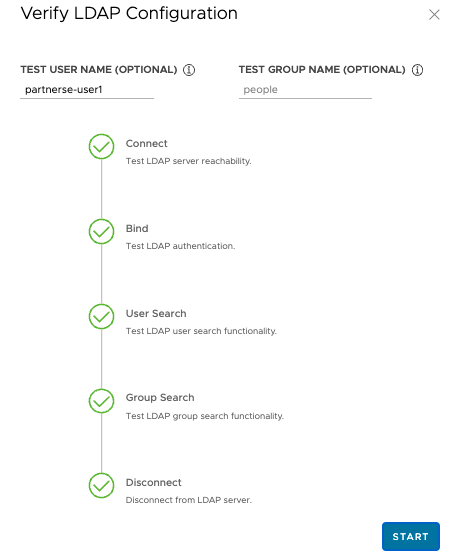

<p style="color:black"> --------------------- </p>

<p style="color:black"><strong> OS Image: from dropdown select Ubuntu-20.04 </strong></p>

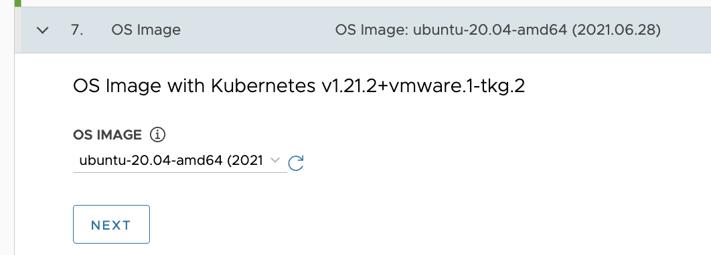

<p style="color:black"><strong> CEIP Agreement: Leave to default and click NEXT </strong></p>

<p style="color:Orange"><strong> Review Configuration and click on Deploy management cluster </strong></p>

<p style="color:black"><strong>Example:</strong></p>


    
<p style="color:red"><strong>Cluster creation takes about 15 mins</strong></p>

<p style="color:brown"><strong>Note: In 1.4.1, while deploying the management cluster using bind, It is expected to see the below errors in Terminal-2 </strong></p>

<p style="color:black"> --------------------- </p>

<p style="color:black">unable to open browser: exec: “xdg-open”: executable file not found in $PATH”</p>

<p style="color:black">Upgrader.CheckOriginweb socket upgrade error: websocket: request origin not allowed by Upgrader.CheckOriginweb socket upgrade error: websocket:</p>

<p style="color:black"> --------------------- </p>

<p style="color:black"><strong>Short video on TKG</strong></p>

```dashboard:open-url
url: https://www.youtube.com/watch?v=BCPU8rGDf_M
```

<p style="color:red"><strong>Please wait till the management cluster is created. Proceed further only once you see this on screen (terminal-2)</strong></p>

<p style="color:black"><strong>Example:</strong></p>

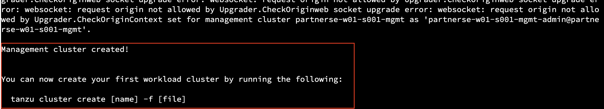

<p style="color:blue"><strong> Check for the contexts in Terminal-2</strong></p>

```execute-2
kubectl config get-contexts
```

<p style="color:blue"><strong> Check the management cluster info in Terminal-2</strong></p>

```execute-2
tanzu mc get
```

<p style="color:blue"><strong> Check resources in pinniped-supervisor namespace in Terminal-2</strong></p>

```execute-2
kubectl get all -n pinniped-supervisor
```

<p style="color:blue"><strong> Check resources in tanzu-system-auth namespace in Terminal-2</strong></p> 

```execute-2
kubectl get all -n tanzu-system-auth
```

<p style="color:blue"><strong> Export the variable in Terminal-2</strong></p>

```execute-2
export TANZU_CLI_PINNIPED_AUTH_LOGIN_SKIP_BROWSER=true
```

<p style="color:blue"><strong>Generate a kubeconfig file in Terminal-2</strong></p> 

```execute-2
tanzu management-cluster kubeconfig get --export-file /tmp/ldaps-tkg-mgmt-kubeconfig
```

<p style="color:black"><strong>Lets deliver the config file to a user which we assume is using Terminal-1, execute below command to copy the exported config from Terminal-2 (temporary JB) to Terminal-1</strong></p> 

```execute-1
scp -i ~/id_rsa -o StrictHostKeyChecking=accept-new azureuser@{{ session_namespace }}.centralindia.cloudapp.azure.com:/tmp/ldaps-tkg-mgmt-kubeconfig .
```

<p style="color:blue"><strong>Read the generated config file</strong></p> 

```execute-1
cat ~/ldaps-tkg-mgmt-kubeconfig
```

```execute-2
export SESSION_NAME={{ session_namespace }}
```

```execute-2
sed -i -r "s/username/$SESSION_NAME@partnerdemodc01.tanzupartnerdemo.com/g" ~/clusterrolebinding.yaml
```

```execute-2
cat ~/clusterrolebinding.yaml
```

<p style="color:blue"><strong>Create cluster role binding as admin in Terminal-2</strong></p>  

```execute-2
kubectl apply -f ~/clusterrolebinding.yaml
```

<p style="color:brown"><strong>Stop the Jumpbox: Please wait for 2 mins once you execute below command. Continue once the ongoing task is completed in Terminal-1.</strong></p>

```execute-1
az vm stop -n {{ session_namespace }} -g {{ session_namespace }}-JB
```

<p style="color:red"><strong>Once below command is executed, output is displayed on terminal-1 with an url. Click on the url to open in your local browser</strong></p>

```execute-1
kubectl --kubeconfig=ldaps-tkg-mgmt-kubeconfig get nodes
```

<p style="color:black"><strong>Example:</strong></p>

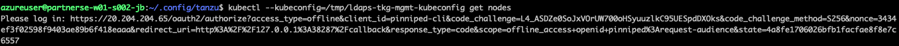

<p style="color:black"> --------------------- </p>

###### "Credentials as given in below table"


  |     User Name             |    Password     |
  |    ----------------       |    ---------    |
  |  {{ session_namespace }}@partnerdemodc01.tanzupartnerdemo.com  |    Welcome11!   |


<p style="color:black"><strong>Ref Screenshots: </strong></p> 

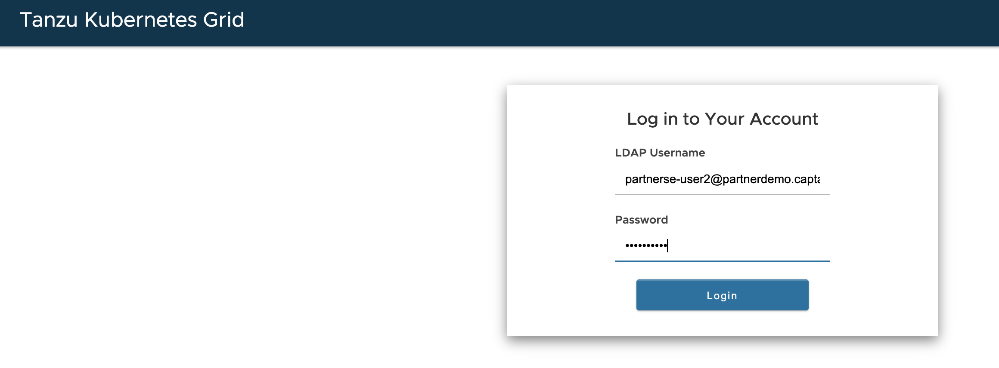
    
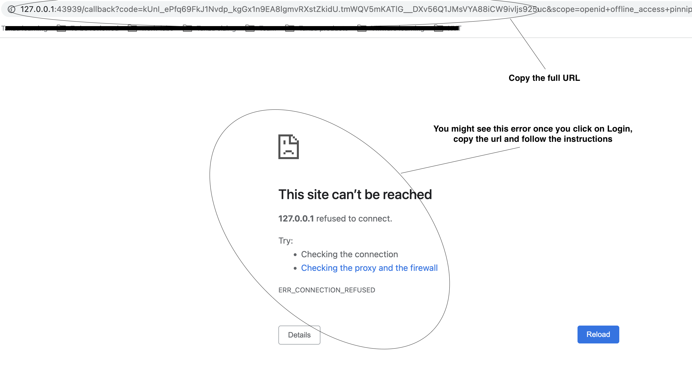
    
<p style="color:black"><strong>Run below curl command in Terminal-2 with the url that is copied earlier.  </strong></p> 

```copy-and-edit
curl -L "paste the url copied earlier that starts with http://127.0.0.1/"
```
<p style="color:red"><strong>Note: In Terminal-2, right click and paste to edit above curl command. </strong></p>

<p style="color:black"><strong>Example:</strong></p>

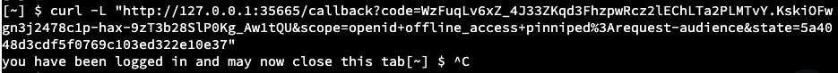

<p style="color:black"> --------------------- </p>

Expected result: 

<p style="color:black"><strong>you have been logged in and may now close this tab</strong></p>

<p style="color:black"> --------------------- </p>

<p style="color:blue"><strong> This script copies the config file into .kube  directory</strong></p>

```execute-1
cp ldaps-tkg-mgmt-kubeconfig ~/.kube/config
```

<p style="color:blue"><strong>Tanzu login</strong></p>

```execute-1
tanzu login --kubeconfig ~/.kube/config --context tanzu-cli-{{ session_namespace }}-mgmt@{{ session_namespace }}-mgmt --name tanzu-cli-{{ session_namespace }}-mgmt
```    

<p style="color:blue"><strong>Set the context</strong></p> 

```execute-1
kubectl config use-context tanzu-cli-{{ session_namespace }}-mgmt@{{ session_namespace }}-mgmt
```

<p style="color:blue"><strong>Verify the context and it shouldn't be admin</strong></p>  
    
```execute-1
kubectl config get-contexts
```

<p style="color:black"><strong>After successful login as LDAP user, you should see the output of below commands. </strong></p>  

```execute-1
kubectl get nodes
```

```execute-1
kubectl get pods -A
```

<p style="color:blue"><strong>Read the config file to understand the variables defined for Tanzu Kubernetes cluster which will be deployed shortly</strong></p>  

```execute-1
cat /home/eduk8s/wc-config.yaml
```

<p style="color:blue"><strong> Provide the Azure configuration values in wc-config file </strong></p>  

```editor:open-file
file: ~/wc-config.yaml
line: 25
```

```editor:open-file
file: ~/wc-config.yaml
line: 26
```

```editor:open-file
file: ~/wc-config.yaml
line: 27
```

```editor:open-file
file: ~/wc-config.yaml
line: 28
```

<p style="color:blue"><strong>Click here to deploy workload cluster. </strong></p>  

```execute-1
tanzu cluster create {{ session_namespace }} -f /home/eduk8s/wc-config.yaml
```

<p style="color:red"><strong>Now the cluster is being deployed as LDAP user.  </strong></p>   

 
<p style="color:red"><strong>Click here to check the progress of workload creation from logs </strong></p>   

```execute-2
podname=$(kubectl get pods -n capz-system -o=jsonpath={.items[0].metadata.name})
kubectl logs $podname -n capz-system -c manager -f
```

###########################################################
#### Wait for the cluster to get created ##################
###########################################################

```execute-2
<ctrl+c>
```

<p style="color:red"><strong>Proceed further only once you see this on screen (terminal-1) </strong></p>   

<p style="color:black"><strong>Example:</strong></p>

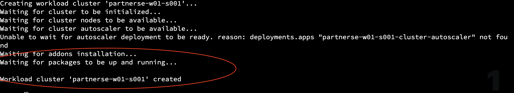


<p style="color:blue"><strong>Click here to check the deployed workload clusters  </strong></p>  

```execute-1
tanzu cluster list
```

<p style="color:blue"><strong>Get credentials and export the config file  </strong></p>  

```execute
tanzu cluster kubeconfig get {{ session_namespace }} --admin --export-file ~/.kube/config-tkg
```

<p style="color:blue"><strong>Read the kubeconfig file </strong></p>  

```execute
cat  ~/.kube/config-tkg
```

<p style="color:blue"><strong>Click here to change the context from management cluster to workload </strong></p>  
 
```execute
kubectl config use-context {{ session_namespace }}-admin@{{ session_namespace }} --kubeconfig /home/eduk8s/.kube/config-tkg
```

<p style="color:blue"><strong>Verify the context </strong></p>  

```execute
kubectl config get-contexts --kubeconfig /home/eduk8s/.kube/config-tkg
```

<p style="color:blue"><strong>Check the nodes in workload cluster</strong></p>  
 
```execute
kubectl get nodes -A --kubeconfig /home/eduk8s/.kube/config-tkg
```

<p style="color:blue"><strong>Check the pods in workload cluster</strong></p>  

```execute
kubectl get pods -A --kubeconfig /home/eduk8s/.kube/config-tkg
```

#### Deploy a test application in workload cluster

<p style="color:blue"><strong>Create namespace test-application in workload cluster which will be used to deploy an application</strong></p>  

```execute
kubectl create ns test-application --kubeconfig /home/eduk8s/.kube/config-tkg
```
    
<p style="color:blue"><strong>Check all the namespaces in workload cluster</strong></p>  

```execute
kubectl get ns --kubeconfig /home/eduk8s/.kube/config-tkg
```
    
<p style="color:blue"><strong>Create a deployment with 2 replicas</strong></p>  

```execute
kubectl create deployment spring-deploy --port=8080 --image=eknath009/tbs-spring-image:3 --replicas=2 -n test-application --kubeconfig /home/eduk8s/.kube/config-tkg
```

<p style="color:blue"><strong>Expose the deployment </strong></p>  
  
```execute
kubectl expose deployment spring-deploy --port=8080 --type=LoadBalancer -n test-application --kubeconfig /home/eduk8s/.kube/config-tkg
```
    
<p style="color:blue"><strong>Collect the External IP and access the same in browser with port 8080, wait for a min and execute again </strong></p>  

```execute
kubectl get svc -n test-application --kubeconfig /home/eduk8s/.kube/config-tkg
```
    
<p style="color:blue"><strong>Access the application on port 8080 </strong></p>   
    
```dashboard:open-url
url: http://externalipcollectedabove:8080
```

############################################################
#### Inform VMware SE if application is not accessible #####
############################################################

<p style="color:black"><strong>Example:</strong></p>

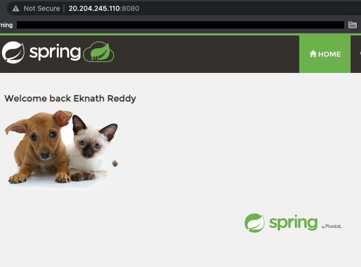 

<p style="color:blue"><strong>Delete the test application </strong></p>   

```execute
kubectl delete ns test-application --kubeconfig /home/eduk8s/.kube/config-tkg
```

##### Variable interpolation

workshop_name: {{ workshop_name }}

session_namespace: {{ session_namespace }}

workshop_namespace: {{ workshop_namespace }}

training_portal: {{ training_portal }}

ingress_domain: {{ ingress_domain }}

ingress_protocol: {{ ingress_protocol }}

#### Web site links

[Create TKG Cluster](https://docs.vmware.com/en/VMware-Tanzu-Kubernetes-Grid/1.5/vmware-tanzu-kubernetes-grid-15/GUID-tanzu-k8s-clusters-azure.html)
