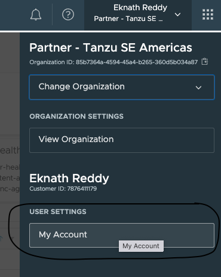
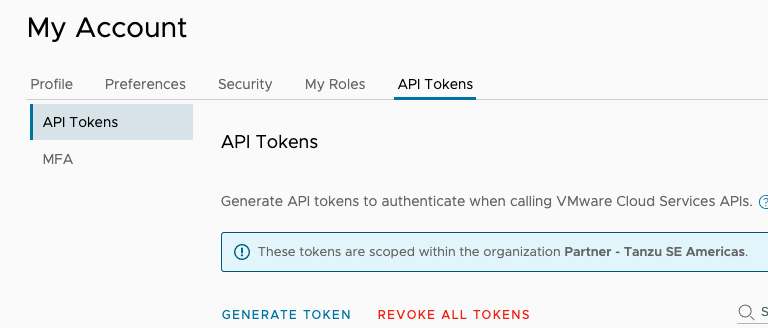
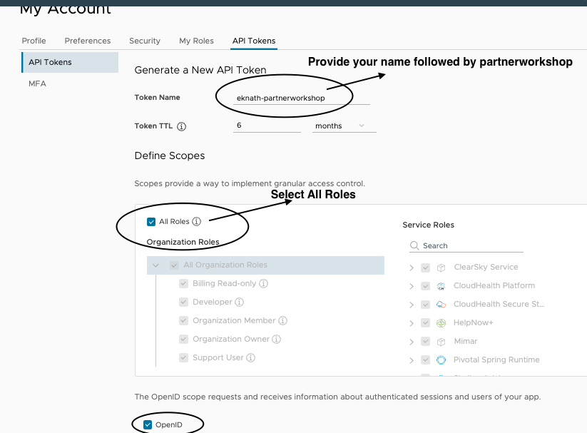
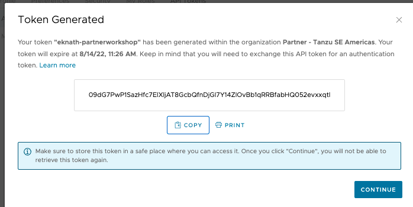
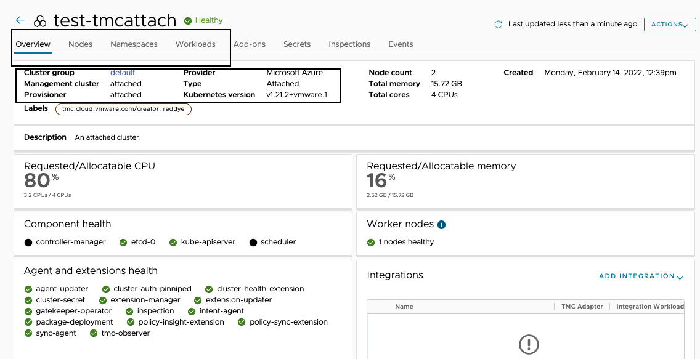

In this section, Lets explore about TMC CLI by running some basic operations. 

<style>
H5{color:Blue !important;}
H6{color:DarkOrange !important;}
</style>

#### Follow the below steps to get API Token from TMC console

```dashboard:open-url
url: https://partnertanzuseamericas.tmc.cloud.vmware.com/
```
Navigate to TMC console > My Account > API Token > Generate Token





Provide your name followed by partnerworkshop
select All Roles



<p style="color:red"><strong>Copy the token and save it for later use</strong></p>




<p style="color:blue"><strong> Authenticate to TMC</strong></p> 

```execute
tmc login -n {{ session_namespace }} --no-configure
```

<p style="color:Orange"> Provide API Token</p> 
<p style="color:Orange"> Login context name(leave to default) - Press Enter</p> 

<p style="color:blue"><strong> Configure: </strong></p> 

```execute
tmc system context configure -l "log" -m {{ session_namespace }}-mgmt
```

<p style="color:blue"><strong> List the available management cluster </strong></p> 

```execute
tmc managementcluster list
```

<p style="color:blue"><strong> Create Cluster group: {{ session_namespace }}-cg</strong></p> 

```execute
tmc clustergroup create --name {{ session_namespace }}-cg --description "Workshop of {{ session_namespace }}"
```

<p style="color:blue"><strong> List the cluster groups and verify if the created cg: {{ session_namespace }}-cg  is shown in the list </strong></p>

```execute
tmc clustergroup list
```

<p style="color:blue"><strong> Register the management cluster (created in previous section) {{ session_namespace }}-mgmt into TMC</strong></p> 

```execute
tmc managementcluster register {{ session_namespace }}-mgmt  -k ~/.kube/config -p TKG -c {{ session_namespace }}-cg
```

<p style="color:black"><strong>Wait for the registration to complete, ETA: 2 mins</strong></p>

<p style="color:blue"><strong> List the management clusters and verify if registered management cluster {{ session_namespace }}-mgmt is shown in the list </strong></p>  

```execute
tmc managementcluster list
```

<p style="color:blue"><strong> Check resources in vmware-system-tmc namespace </strong></p> 

Dont worry if some pods are in creating state, it generally takes few minutes to complete. 

```execute
kubectl get all -n vmware-system-tmc
```

<p style="color:blue"><strong> It takes few mins to turn healthy </strong></p> 

```execute
tmc managementcluster get {{ session_namespace }}-mgmt
```

<p style="color:blue"><strong>Check in TMC Console to know the status of management cluster</strong></p> 

Navigate to TMC console > Administration > Management clusters > click on {{ session_namespace }}-mgmt

```dashboard:open-url
url: https://partnertanzuseamericas.tmc.cloud.vmware.com/
```

<p style="color:blue"><strong> Attach the workload cluster (created in previous section) {{ session_namespace }} using TMC CLI, wait for the process to complete. </strong></p> 

```execute
tmc cluster attach -g {{ session_namespace }}-cg -n {{ session_namespace }} -m {{ session_namespace }}-mgmt -p TKG --kubeconfig ~/.kube/config-tkg
```

<p style="color:blue"><strong> Check in TMC Console to know the status of attached workload cluster </strong></p> 

Navigate to  TMC console > Clusters > click on clustername {{ session_namespace }}



```execute
tmc cluster validate --kubeconfig ~/.kube/config-tkg
```
