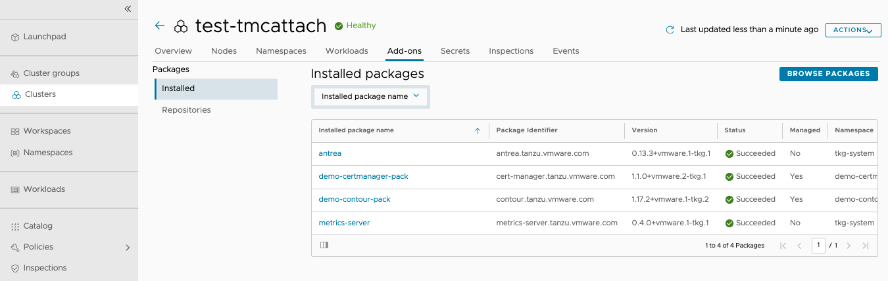

In this section, lets see the procedure to push packages(catalog) from TMC and console. 

```dashboard:open-url
url: https://docs.vmware.com/en/VMware-Tanzu-Mission-Control/services/tanzumc-using/GUID-EF35646D-8762-41F1-95E5-D2F35ED71BA1.html
```

<style>
H5{color:Blue !important;}
H6{color:DarkOrange !important;}
</style>


##### Install cert-manager Package using TMC Console: 

Navigate to TMC console > Catalog > select cluster {{ session_namespace }} from drop down and click on cert-manager


Click on Install Package which can be found on top right side of the page


Name the Installed package name as : {{ session_namespace }}-certm and click NEXT


Leave to Default and click NEXT

Install Package

<p style="color:blue"><strong> Verify the pods</strong></p>  

```execute
kubectl get pods -n cert-manager
```

Navigate to TMC console > Catalog > Installed > check if the package (cert-manager.tanzu.vmware.com) is succeeded and healthy


##### Install Contour Package using TMC Console: 

Navigate to TMC console > Catalog > select cluster {{ session_namespace }} from drop down and click on Contour


Click on Install Package which can be found on top right side of the page


Name the Installed package name as : {{ session_namespace }}-contour and click NEXT


Leave to Default and click NEXT

<p style="color:blue"><strong> Execute the command to see the config values in Terminal-2</strong></p>  

```execute-2
cat ~/contour.yaml
```

 

Install Package

Navigate to TMC console > Catalog > Installed > check if the package (cert-manager.tanzu.vmware.com) is succeeded and healthy

 


<p style="color:blue"><strong> Verify the envoy Load Balancer, this IP will be used later.</strong></p>  

```execute
kubectl get svc -n tanzu-system-ingress --kubeconfig ~/.kube/config-tkg
```

##### Install Harbor Package using TMC Console: 

Navigate to TMC console > Catalog > select cluster {{ session_namespace }} from drop down and click on Harbor


Click on Install Package which can be found on top right side of the page

Name the Installed package name as : {{ session_namespace }}-harbor and click NEXT


Leave to Default and click NEXT

<p style="color:blue"><strong> Execute the command to see the config values in Terminal-1 </strong></p>  

```execute-1
cat ~/harbor.yaml
```
Copy the values from harbor.yaml and paste in TMC configure values page as shown below: 


Install Package

<p style="color:blue"><strong> Verify the pods, this might take ~5 mins to complete </strong></p>  

```execute-1
kubectl get pods -n tanzu-system-registry --kubeconfig ~/.kube/config-tkg
```

<p style="color:red"><strong> Note the Load Balancer External IP and make an entry in your local machine ( /etc/hosts ) mapping the IP to {{ session_namespace }}-harbor.tkoworkshop.tanzupartnerdemo.com </strong></p>  

```execute-1
kubectl get svc -n tanzu-system-ingress --kubeconfig ~/.kube/config-tkg
```

<p style="color:black"><strong>Example:</strong></p>


```dashboard:open-url
url: https://{{ session_namespace }}-harbor.tkoworkshop.tanzupartnerdemo.com/
```

<p style="color:black">----------------</p>

Enter the credentials: 

###### admin, Welcome11!

<p style="color:black">----------------</p>

<p style="color:black"><strong>Example:</strong></p>


