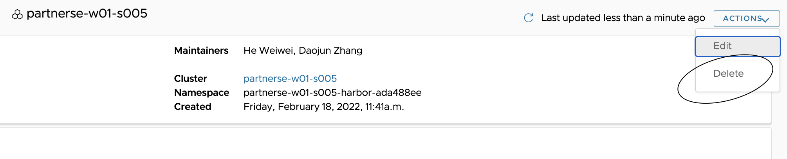
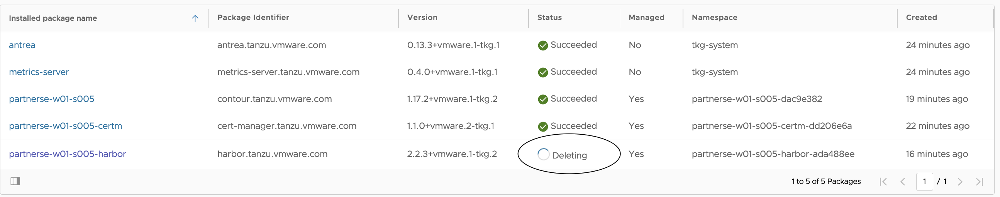
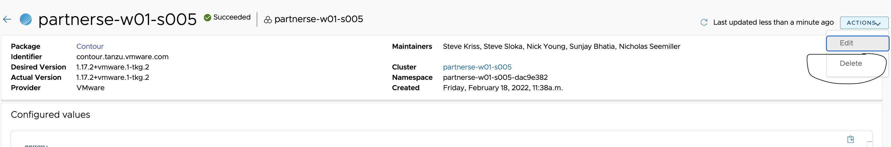
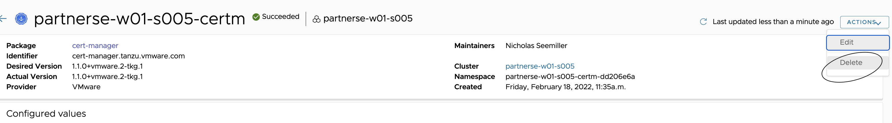
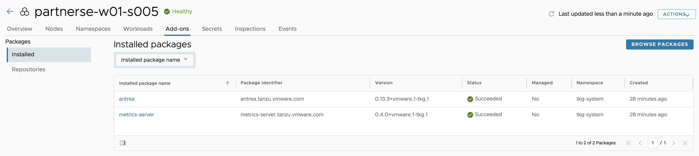

In this section, lets see the procedure to delete packages(catalog) from TMC Console. 

##### Delete Harbor Package:

<style>
H5{color:Blue !important;}
H6{color:DarkOrange !important;}
</style>

<p style="color:black"><strong>Navigate to TMC console > Clusters > select the cluster {{ session_namespace }} > Add-ons > click on {{ session_namespace }}-harbor</strong></p>

Click on Delete which can be found in top right corner > Actions > Delete

<p style="color:black"><strong>Example:</strong></p>



<p style="color:black">---------------</p> 

provide the name:

<p style="color:Orange">{{ session_namespace }}-harbor </p> 

<p style="color:black">---------------</p>

DELETE

Check the status of deletion by navigating to TMC console > Clusters > select the cluster  {{ session_namespace }} > Add-ons > Installed

<p style="color:black"><strong>Example:</strong></p>



<p style="color:blue">Verify the pods termination status </p> 

```execute
kubectl get pods -n tanzu-system-registry --kubeconfig ~/.kube/config-tkg
```

##### Delete Contour Package:

<p style="color:black"><strong>Navigate to TMC console > Clusters > select the cluster  {{ session_namespace }} > Add-ons > click on {{ session_namespace }}-contour</strong></p>

Click on Delete which can be found in top right corner > Actions > Delete

<p style="color:black">---------------</p>

provide the name:

<p style="color:Orange">{{ session_namespace }}-contour </p> 

<p style="color:black">---------------</p>

DELETE

<p style="color:black"><strong>Example:</strong></p>



<p style="color:blue"><strong>Verify the services status </strong></p> 

```execute
kubectl get svc -n tanzu-system-ingress --kubeconfig ~/.kube/config-tkg
```

##### Delete Cert-manager Package:

<p style="color:black"><strong>Navigate to TMC console > Clusters > select the cluster  {{ session_namespace }} > Add-ons > click on {{ session_namespace }}-certm</strong></p>

Click on Delete which can be found in top right corner > Actions > Delete

<p style="color:black"><strong>Example:</strong></p>



<p style="color:black">---------------</p>

provide the name:

<p style="color:Orange">{{ session_namespace }}-certm </p> 

<p style="color:black">---------------</p>

DELETE

<p style="color:blue"><strong>Verify the pods termination status </strong></p> 

```execute
kubectl get pods -n cert-manager --kubeconfig ~/.kube/config-tkg
```

<p style="color:black">Navigate to TMC console > Clusters > select the cluster  {{ session_namespace }} > Add-ons </strong></p>

Verify if the packages are deleted. 

<p style="color:black"><strong>Example:</strong></p>



