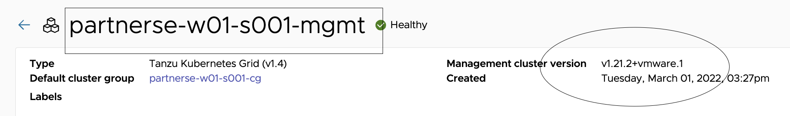
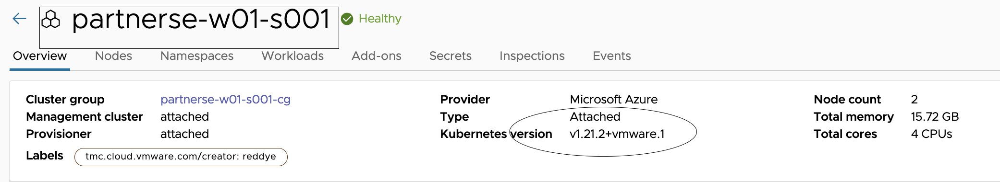
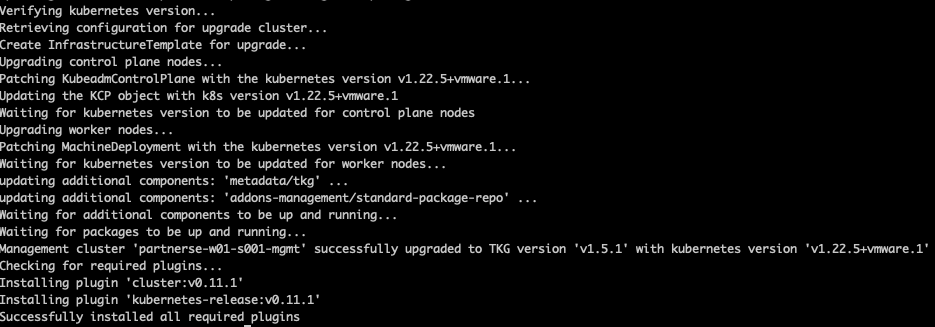
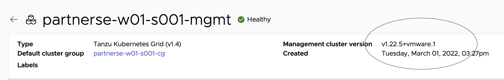
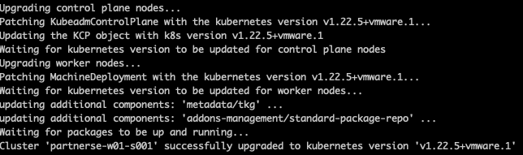
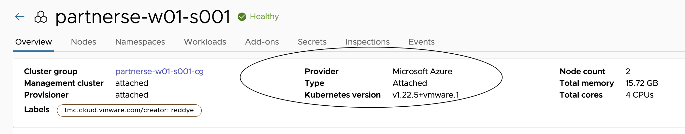

In this section, lets upgrade the deployed Management and workload clusters to 1.5.1

<style>
H5{color:Blue !important;}
H6{color:DarkOrange !important;}
</style>

##### lets do the prechecks before starting with cluster upgrade. 

Navigate to TMC console > Administration > Management clusters {{ session_namespace }}-mgmt

<p style="color:black"><strong>Check the management cluster version as shown here: </strong></p>



Navigate to TMC console > Clusters > click on clustername {{ session_namespace }}

<p style="color:black"><strong>Check the workload cluster version as shown here: </strong></p>




<p style="color:blue"><strong>Start the JB vm, wait for the task to complete </strong></p> 

```execute-1
az vm start -n {{ session_namespace }} -g {{ session_namespace }}-JB
```

<p style="color:blue"><strong>Connect to JB to trigger the upgrade </strong></p> 

```execute-2
ssh -i id_rsa azureuser@{{ session_namespace }}.centralindia.cloudapp.azure.com -o StrictHostKeyChecking=accept-new
```

<p style="color:blue"><strong>Upgrade the CLI and required tools to 1.5.1 in JB, this takes few mins to complete</strong></p> 

```execute-2
/bin/sh ~/script-session-upgrade.sh
```

<p style="color:blue"><strong>Verify the Tanzu CLI Version</strong></p> 

```execute-2
tanzu version
```

<p style="color:blue"><strong>Verify Kubectl version</strong></p> 

```execute-2
kubectl version
```

<p style="color:blue"><strong>Check the current context</strong></p> 

```execute-2
kubectl config get-contexts
```

<p style="color:blue"><strong>Initiate the management cluster upgrade to 1.5.1, this should take around 30 mins to complete</strong></p> 

```execute-2
tanzu management-cluster upgrade {{ session_namespace }}-mgmt --os-name ubuntu --os-version 20.04 --os-arch amd64 -y
```

#####################
# BREAK TIME
#####################

<p style="color:brown"><strong>Once the management cluster is upgraded: </strong></p> 

<p style="color:black"><strong>Example:</strong></p>



Navigate to TMC console > Administration > Management clusters {{ session_namespace }}-mgmt



<p style="color:blue"><strong>List the clusters</strong></p> 

```execute-2
tanzu cluster list --include-management-cluster
```

<p style="color:blue"><strong>Info about kubernetes releases</strong></p> 

```execute-2
tanzu kubernetes-release get
```

<p style="color:blue"><strong>Upgrades available for a workload cluster</strong></p> 

```execute-2
tanzu cluster available-upgrades get {{ session_namespace }}
```

<p style="color:blue"><strong>Trigger workload cluster upgrade to 1.5.1, this should take around 15 mins to complete. After successfull completion, version should be v1.22.5+vmware.1 for both clusters</strong></p> 

```execute-2
tanzu cluster upgrade {{ session_namespace }} -y
```

<p style="color:blue"><strong>List the clusters and now the version should be v1.22.5+vmware.1 </strong></p> 

```execute-2
tanzu cluster list --include-management-cluster
```

<p style="color:brown"><strong>Once the workload cluster is upgraded: </strong></p> 

<p style="color:black"><strong>Example:</strong></p>



Navigate to TMC console > Clusters > {{ session_namespace }}


