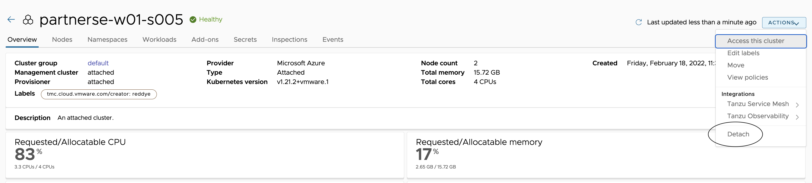
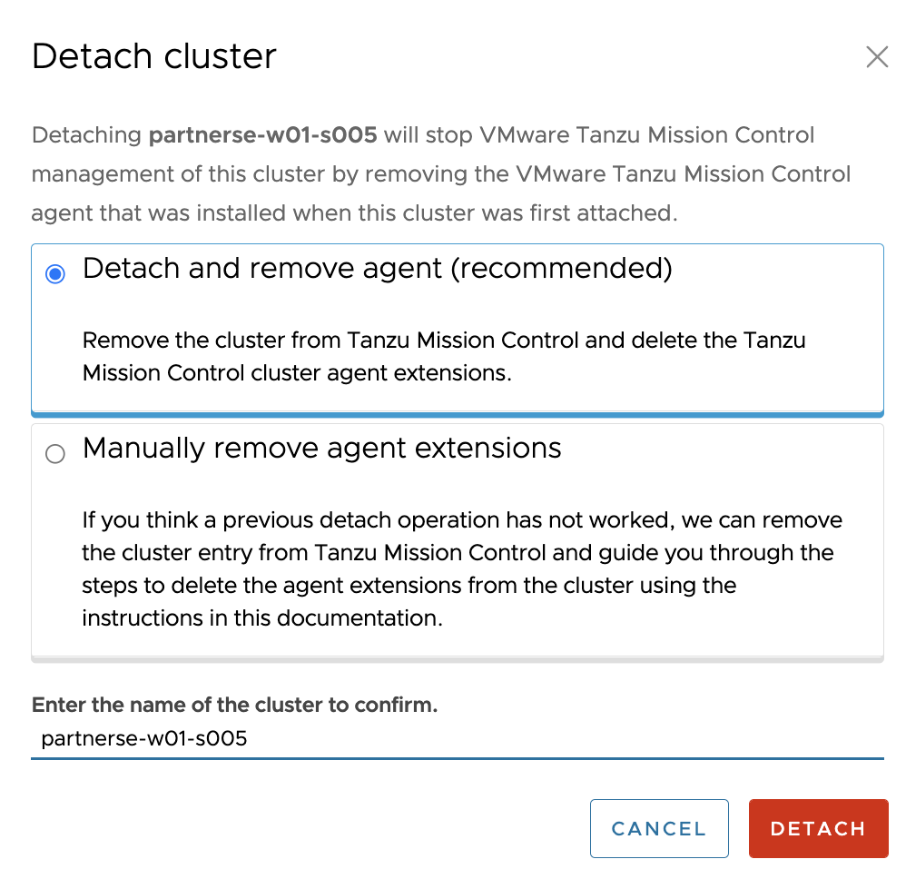
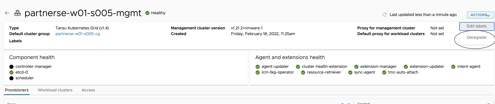
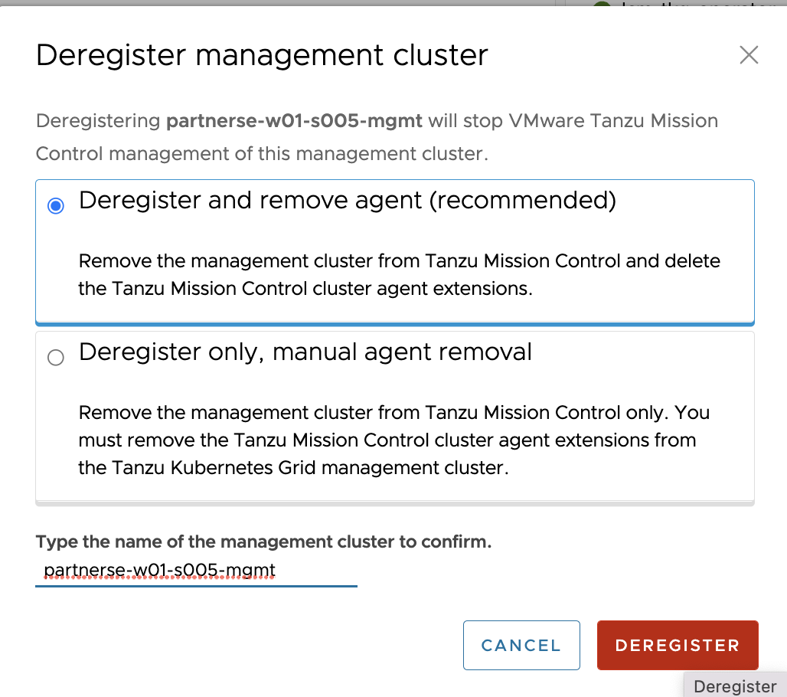

In this section, lets see the procedure to detach the clusters from TMC console and delete management, workload clusters. 

<p style="color:blue"><strong> DETACH Workload cluster from TMC Console  </strong></p> 

Navigate to TMC console > Clusters > select the cluster {{ session_namespace }} > Actions (can be located in top right corner) > Detach

###### Example: 



<p style="color:Orange"><strong> Provide name: {{ session_namespace }} </strong></p> 

DETACH

###### Example: 



<p style="color:blue"><strong> Verify the pod status, should take few mins to complete </strong></p> 

```execute
kubectl get pods -n vmware-system-tmc --kubeconfig ~/.kube/config-tkg
```

<p style="color:blue"><strong> Deregister Management cluster from TMC console </strong></p> 

Navigate to TMC console > Administration > Management clusters > click on {{ session_namespace }}-mgmt > Actions (can be located in top right corner) > Deregister 

###### Example: 



<p style="color:Orange"><strong> Provide name: {{ session_namespace }}-mgmt </strong></p> 

DEREGISTER

###### Example: 



<p style="color:blue"><strong> Verify the pod termination status in management cluster context, should take few mins to complete </strong></p> 

```execute-2
kubectl get pods -n vmware-system-tmc
```

<p style="color:blue"><strong> List the management clusters and {{ session_namespace }}-mgmt should be missing </strong></p> 

```execute
tmc managementcluster list
```

```execute
tmc clustergroup list
```

<p style="color:blue"><strong> Delete workload cluster using Tanzu CLI, should take 10-15 mins to complete </strong></p> 

```execute-2
tanzu cluster delete {{ session_namespace }} -y
```

```execute-2
tanzu cluster list
``` 

<p style="color:red"><strong> Proceed further once the workload cluster is deleted completely </strong></p> 

<p style="color:blue"><strong> Delete Management cluster using Tanzu CLI, should take 15 mins to complete </strong></p> 

```execute-2
tanzu mc delete -y
```

<p style="color:blue"><strong> Terminate the Jumpbox </strong></p> 

```execute-1
jbdelete=$(az group delete -n {{ session_namespace }}-JB --yes)
```

<p style="color:black"><strong> Delete the localhost file </strong></p> 

<p style="color:black"><strong> In your local machine, delete the entry that has hostname mapped with name {{ session_namespace }}-harbor.tkoworkshop.tanzupartnerdemo.com from /etc/hosts
 </strong></p> 
