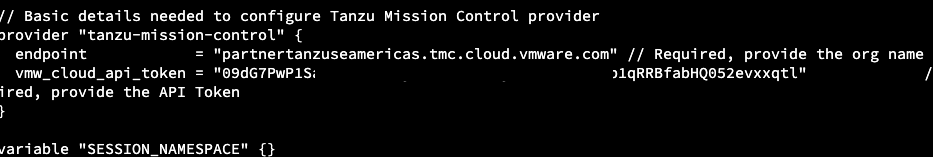
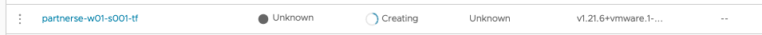
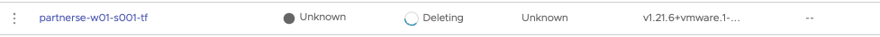

###### Please do not execute the steps covered in this section, just go through it and understand the steps to manage cluster lifecycle management using Terraform

<p style="color:blue"><strong> Check Terraform Version </strong></p> 

```execute
terraform version
```

<p style="color:blue"><strong> Change the directory </strong></p> 

```execute
cd ~/terraform-demo
```

<p style="color:blue"><strong> Read the terraform files </strong></p> 

```execute
cat provider.tf
```

```execute
cat create-cg.tf
```

```execute
cat tkgs-create-cluster.tf
```

<p style="color:blue"><strong> Edit and change the API token and org name in provider.tf file > Save </strong></p> 

```execute
vi provider.tf
```
<p style="color:black"><strong>Example:</strong></p>




<p style="color:blue"><strong> Initialize the providers </strong></p> 

```execute
terraform init
```

<p style="color:blue"><strong>  Export the variable </strong></p> 

```execute
export TF_VAR_SESSION_NAMESPACE=$SESSION_NAME
```

<p style="color:blue"><strong> Create cluster group </strong></p> 


```execute
terraform apply -target tanzu-mission-control_cluster_group.create_cluster_group -auto-approve
```

<p style="color:blue"><strong> List the resources state </strong></p> 

```execute
terraform state list
```

<p style="color:blue"><strong>Create workload cluster with name as {{ session_namespace }}-tf </strong></p> 

```execute
terraform apply -target tanzu-mission-control_cluster.create_tkgs_workload -auto-approve
```

<p style="color:blue"><strong>Navigate to TMC Console to check the status of cluster creation, which generally takes 5-10 mins to complete.  </strong></p> 

```dashboard:open-url
url: https://partnertanzuseamericas.tmc.cloud.vmware.com/
```
<p style="color:black"><strong>Example:</strong></p>


  
<p style="color:red"><strong>Once completely deployed, execute below commands to delete the resources. </strong></p> 

<p style="color:blue"><strong> Delete the cluster </strong></p> 

```execute
terraform destroy -target tanzu-mission-control_cluster.create_tkgs_workload -auto-approve
```
<p style="color:black"><strong>Example:</strong></p>



<p style="color:blue"><strong> Delete the cluster group </strong></p> 

```execute
terraform destroy -target tanzu-mission-control_cluster_group.create_cluster_group -auto-approve
```
