## **TMC Administration**

As a platform operator or infrastructure operator, use VMware Tanzu Mission Control to connect your cloud provider account for data protection and complete cluster lifecycle management.

When you register your cloud provider account in Tanzu Mission Control, you can use that connection, or credential, to manage data protection or provision Tanzu Kubernetes clusters and leverage the built-in cluster lifecycle management best practices of Cluster API.

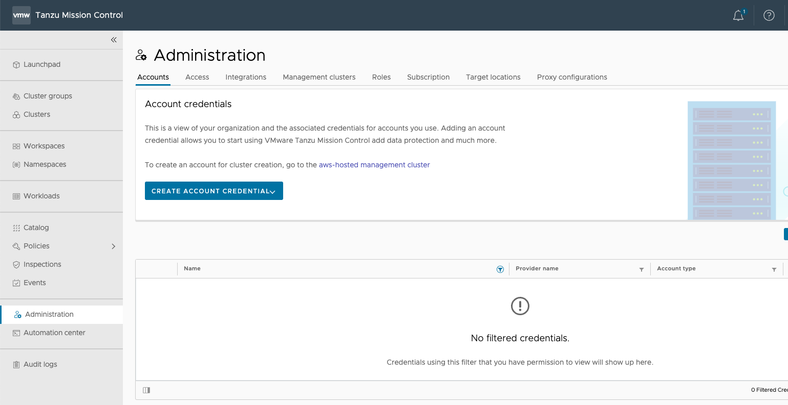

### **<ins>Cloud Provider Accounts</ins>**

There is a one-to-one relationship between your cloud provider account and the connection you create to it in Tanzu Mission Control.

- For a cloud provider account, you create only one CloudFormation stack for Tanzu Mission Control.
- When you generate a template in Tanzu Mission Control to create a stack, it can be used only once.
- You can use a cloud provider account for only one connection in one organization. You cannot use the same stack or cloud provider account for connections in multiple organizations.

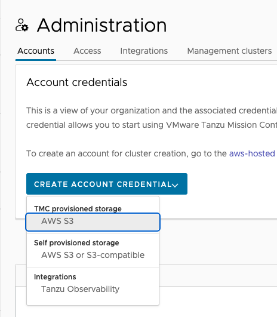

#### **_Connect an AWS Account for Data Protection_**

1. In the Tanzu Mission Control console, click Administration in the left navigation pane.

2. On the Accounts tab of the Administration a page, click Create Account Credential, and then select the type of credential to create. To use the AWS S3 storage managed by Tanzu Mission Control in your cloud provider account, select AWS S3.

3. On the Create credential page, provide a name for the credential, click Generate template, and then click Next. The name that you enter is the name that appears in the list of connected accounts on the Administration page. When you click Generate template, Tanzu Mission Control generates the template and then downloads it.
    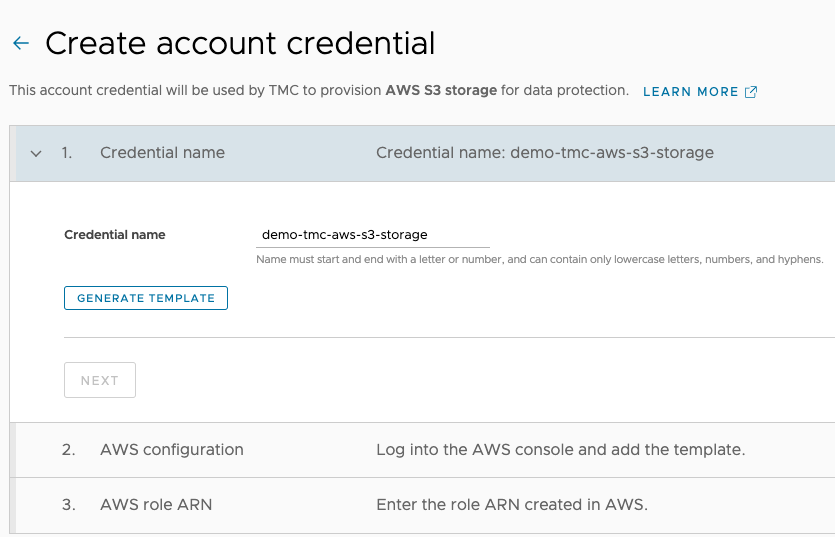
    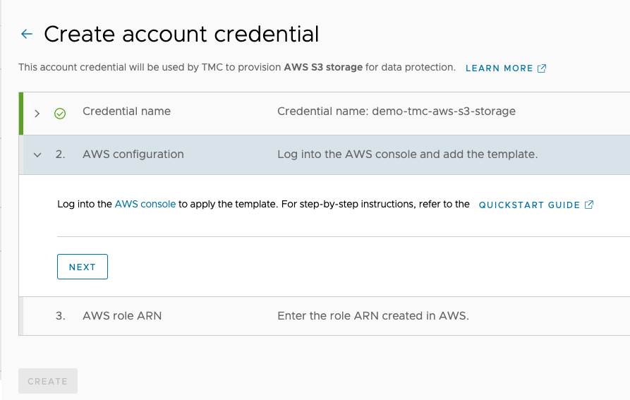

    >**Note** : Do not reuse a template from a previously created stack. Each time you create a cloud provider account connection, you must download the template and create a new stack, even if you use the same AWS account.
4. In the AWS console, create a CloudFormation stack using the downloaded template, and when it completes retrieve the ARN.

    i. Login to your AWS account and select CloudFormation service
    
    ii. Click on create Stack

    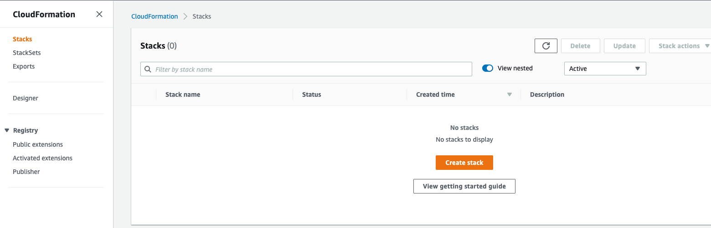

    iii. On Create Stack, select Upload a template file and chose the downloaded template from step 3

    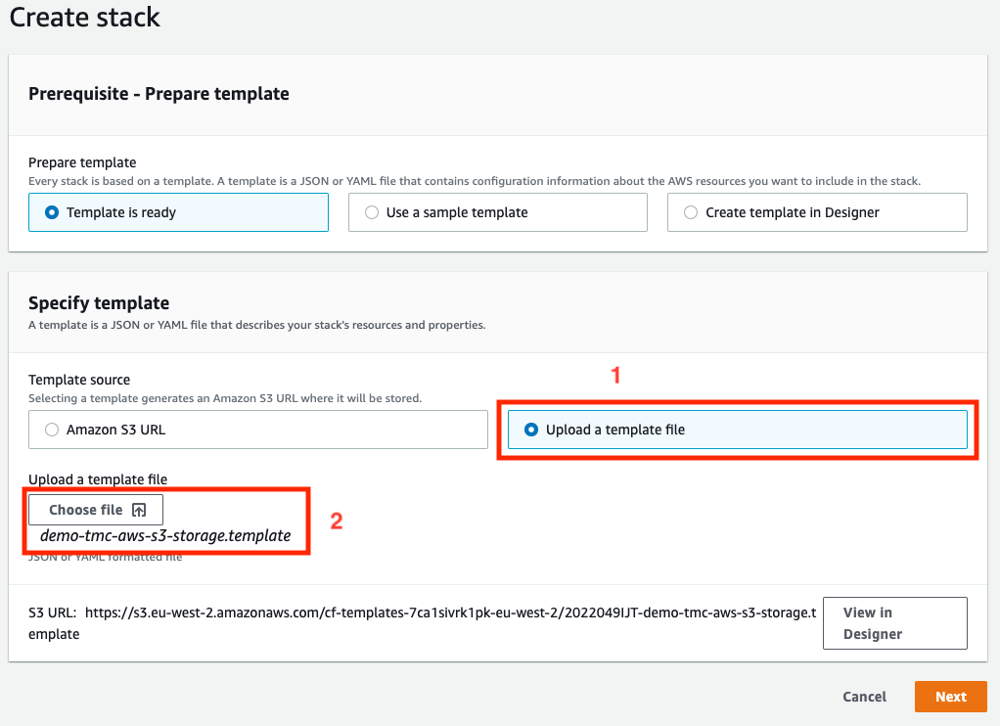

    iv. Click on next, and then follow the steps as the screenshots below

    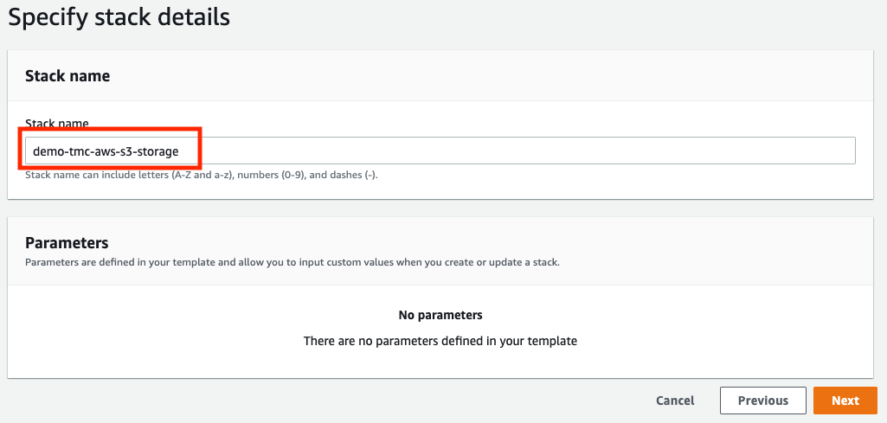

    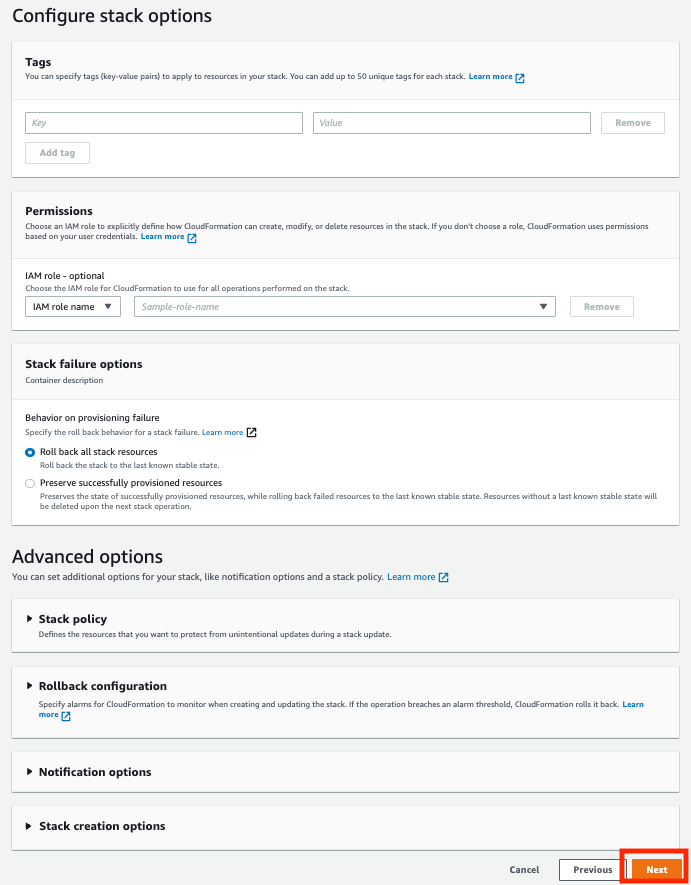

    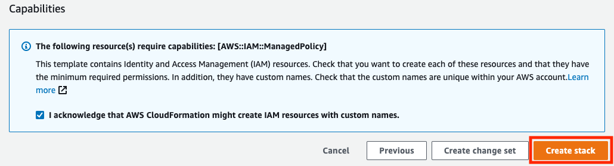

    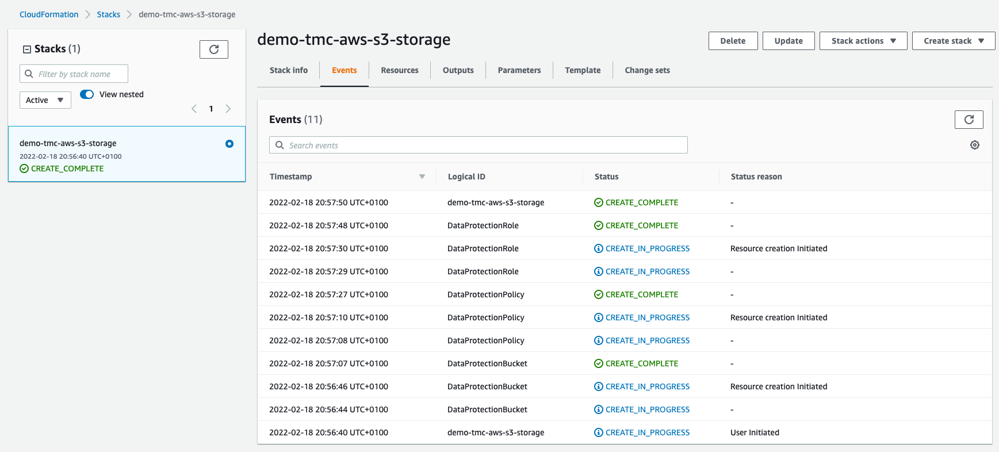
    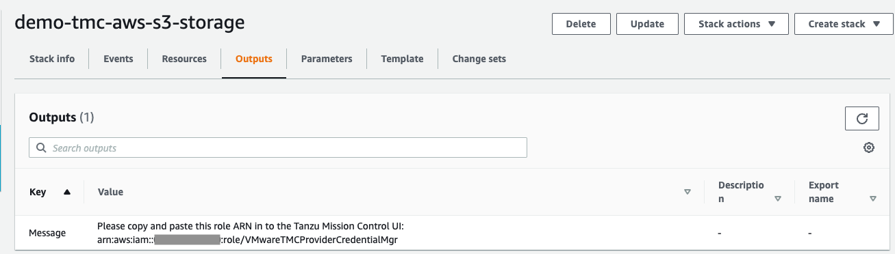

5. In the Tanzu Mission Control console, still on the Create credential page, click Next and then paste the role ARN that you copied from the AWS console

    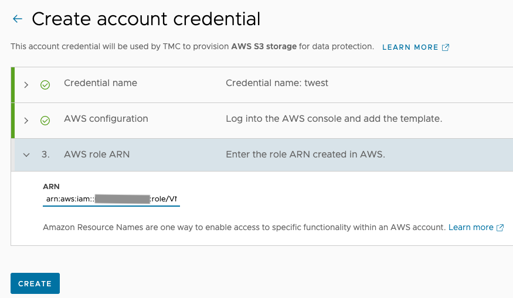

6. Click Create Credential to create the connection to your cloud provider account.

    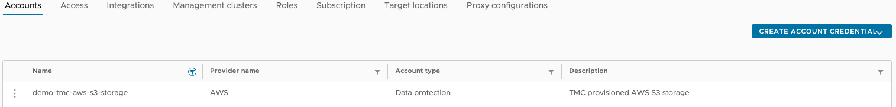

#### **_Create a Data Protection Credential for S3 or S3-Compatible Storage_**

Set up a credential for data protection that allows you to create a target location that uses an S3-compatible storage location that you create and maintain (either in your cloud provider account or in an on-premises data center).

1. On the Accounts tab of the Administration page, click Create Account Credential, and then select the type of _AWS S3 or S3-compatible_

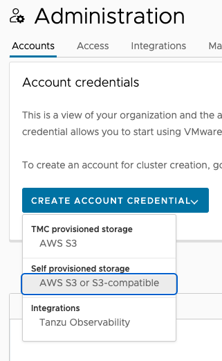

2. On the Create credential page, provide a name for the credential.

The name that you enter is the name that appears in the list of credential objects on the Accounts tab of the Administration page.

3. Enter the access key ID and secret access key for your S3-compatible storage.

4. Click Create.

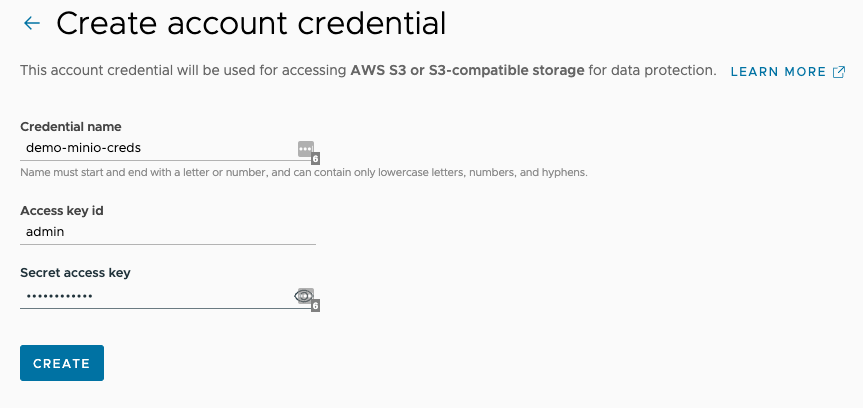

#### **_Create a Tanzu Observability Credential Object_**

Set up a credential object to connect to your Tanzu Observability by Wavefront account, to enable you to add clusters to Tanzu Observability through VMware Tanzu Mission Control.

1. On the Accounts tab of the Administration page, click Create Account Credential, and then select Tanzu Observability by Wavefront credential.

    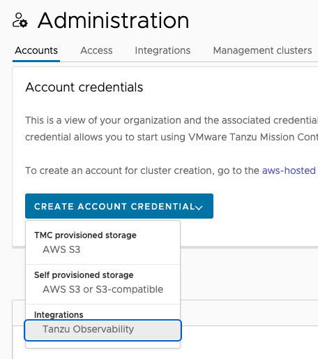

2. On the Create credential page, provide a name for the credential.

3. Enter the Wavefront instance URL and API token from your Wavefront account.

>**Note**: The value for these fields come from your Wavefront account, and not your Tanzu Mission Control account. For information about how to retrieve these values from your Wavefront account, see [Generate a Token for Tanzu Mission Control](ttp://docs.wavefront.com/integrations_tmc.html) and [Your Wavefront Account](ttps://docs.wavefront.com/users_account_managing.html) in the Tanzu Observability by Wavefront documentation.

4. Click Create.
    
You can optionally click Create and Add Role Binding which directs you to the Access tab of the Administration page where you can apply a role binding to the credential object to secure it. For more information about access control, see [Managing Access to Your Resources](ttps://docs.vmware.com/en/VMware-Tanzu-Mission-Control/services/tanzumc-using/GUID-CA5A31BC-4D7B-4EDD-A4C8-95BEEC08F7C4.html#GUID-CA5A31BC-4D7B-4EDD-A4C8-95BEEC08F7C4).

### **<ins>Managing Access to Your Resources</ins>**

VMware Tanzu Mission Control uses secure-by-default, role-based access control (RBAC) to manage user permissions at each level of the hierarchical structure for your organization. Each object is protected by an access policy that defines who has access to that resource, and these policies are inherited down through the organizational hierarchy.

Create a role binding in the access policy for a credential to specify permissions for a member or group.

_Prerequisites_

Log in to the Tanzu Mission Control console, and then go to the Administration page.

Make sure you have the appropriate permissions.

>To view and edit the access policy for a credential, you must be associated with the _credential.admin_ role on the credential, or the _organization.credential.admin_ role for the organization.

_Procedure_

1. On the Administration page in the Tanzu Mission Control console, click the **_Access_** tab.

2. On the Access tab of the Administration page, select the credential whose access policy you want to edit.

3. Click the arrow next to the credential name under **_Direct access policies_**.

4. Click  **_Create Role Binding_**.

5. Select the role that you want to bind to an identity.

6. Select the identity type that you want to bind.

7. Enter the identity to bind, and click **_Add_**.

8. After adding the role bindings you want to create, click **_Save_**.

    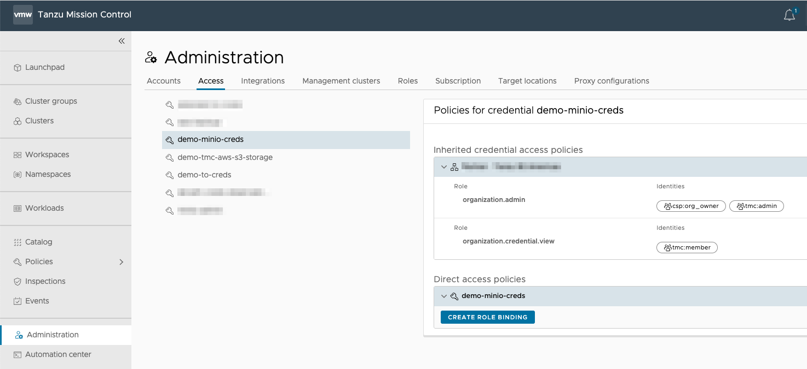

## Managing Integrations

As a platform operator, you can integrate external services to add functionality to VMware Tanzu Mission Control.

Through Tanzu Mission Control, you can enable connections to external services that allow you to extend how you manage your Kubernetes clusters.

For example, you can enable integration with Tanzu Observability by Wavefront, and then add clusters to capture metrics for analysis in Wavefront.

<ins>Enable Observability for Your Organization</ins>

As a platform operator, you can enable Tanzu Observability by Wavefront for your organization, which allows you to connect your managed clusters to your Wavefront account to collect and analyze cluster metrics.

_Prerequisites_

This procedure assumes that you have a managed cluster, either attached or provisioned, and that you have set up a Wavefront account.

To enable observability for your organization, you must be associated with the organization.admin role.

_Procedure_

1. In the left navigation pane, click Administration.

2. On the Administration page, click the Integrations tab.

3. In the Tanzu Observability by Wavefront box, click Enable.

4. In the confirmation dialog, click Confirm.

    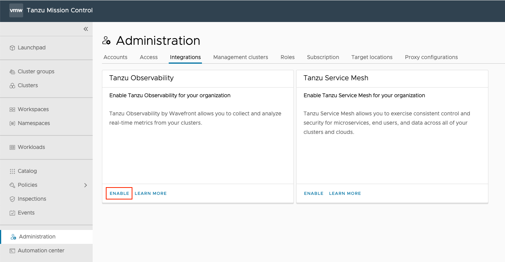

<ins>Enable Service Mesh for Your Organization</ins>

As a platform operator, you can enable Tanzu Service Mesh for your organization, which allows you to connect your managed clusters to your Tanzu Service Mesh account.

_Prerequisites_

This procedure assumes that you have a managed cluster, either attached or provisioned, and that you have set up a Tanzu Service Mesh account.

>**Note**: To enable Tanzu Service Mesh and then add clusters, your Tanzu Service Mesh account must be in the same organization as your Tanzu Mission Control account.

_Procedure_

1. In the left navigation pane, click Administration.

2. On the Administration page, click the Integrations tab.

3. In the Tanzu Service Mesh box, click Enable.

4. In the confirmation dialog, click Confirm.

    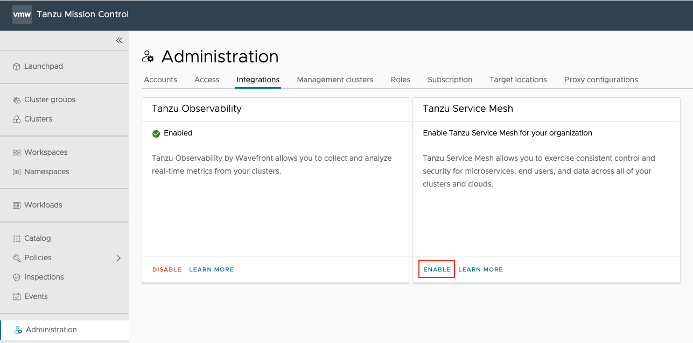

## <ins>Register a Management Cluster with Tanzu Mission Control</ins>

As a platform operator, you can work with your Tanzu Kubernetes Grid administrator to register a management cluster with VMware Tanzu Mission Control to enable lifecycle management of its workload clusters.

When you register a management cluster, you create secure connection to Tanzu Mission Control that allows you to subsequently bring its workload clusters under management, assign them to cluster groups, and apply policies. You can also manage the entire lifecycle of your clusters (including create, update, and delete) from Tanzu Mission Control.

1. In the Tanzu Mission Control console, click **_Administration_** in the left navigation pane.

2. Click the **_Management clusters_** tab.

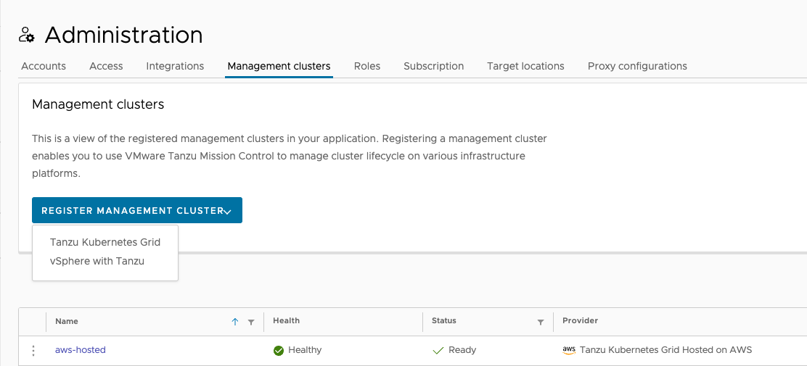

3. Click **_Register Management Cluster_** , and then choose the kind of cluster you are registering. In this example we'll register a vSphere with Tanzu supervisor cluster as a management cluster.

>**Note** : the registration of Tanzu Kubernetes Grid management cluster on AWS/Azure/vSphere has similar steps, just follow the wizard. For more information, see [Register a Management Cluster with Tanzu Mission Control](ttps://docs.vmware.com/en/VMware-Tanzu-Mission-Control/services/tanzumc-using/GUID-EB507AAF-5F4F-400F-9623-BA611233E0BD.html) in _VMware Tanzu Mission Control Product Documentation_

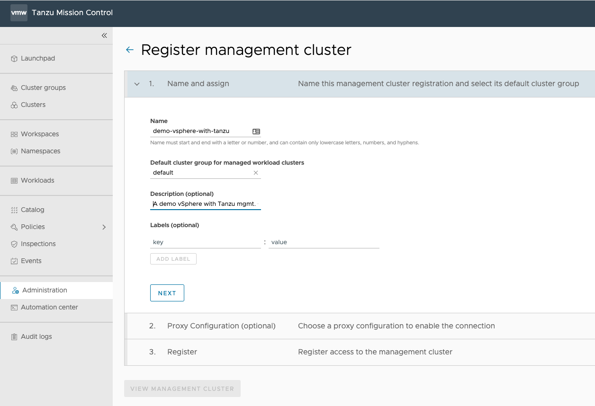

4. On the Register page, provide a name for the management cluster, and select a default cluster group for workload clusters.

When you add workload clusters, you can choose the cluster group into which to place them. This setting simply indicates the default choice.

5. You can optionally provide a description and labels for the management cluster.
x
6. Click **_Next_**.

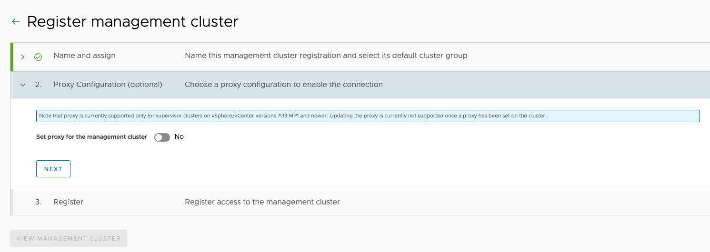

7. You can optionally select a proxy configuration for the cluster.

  i. Click to toggle the **_Set proxy for the management cluster_**  option to **_Yes_**.

  ii. Select the proxy configuration you defined for this cluster.

  iii. You can optionally specify an alternative proxy configuration to use as the default selection for managed workload clusters.

When you add workload clusters, you can choose which proxy configuration to use. This setting simply indicates the default choice.

8. Click Next.

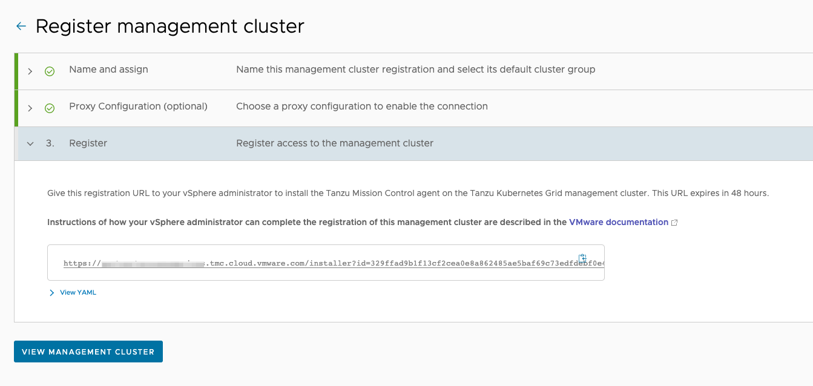

When you click Next, Tanzu Mission Control generates a YAML file that defines how the management cluster connects to Tanzu Mission Control for registration. The credential provided in the YAML expires after 48 hours. You can optionally click View YAML to see the code.

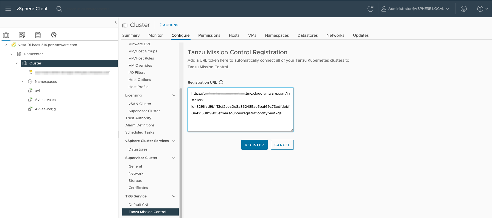

9. Copy the URL provided on the Register page, and give it to the administrator of your Tanzu Kubernetes Grid deployment to install the cluster agent on your management cluster and complete the registration process.

For clusters running in vSphere or vSphere with Tanzu, this is typically the vSphere administrator.

>If you have vCenter/vSphere version prior to 7U3, follow the steps described [here](ttps://docs.vmware.com/en/VMware-Tanzu-Mission-Control/services/tanzumc-using/GUID-CC6E721E-43BF-4066-AA0A-F744280D6A03.html).

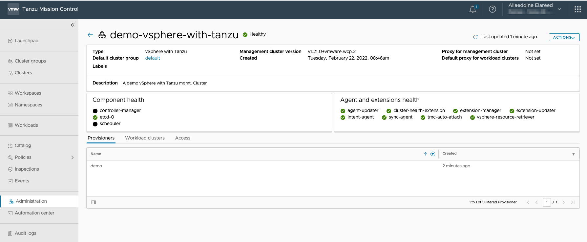

10. Click **_View Management Cluster_**.

## Configuring the AWS-hosted Management Cluster

You can use the AWS hosted Management available in your TMC environment to create workload cluster into your AWS account.

1. In the Tanzu Mission Control console, click **_Administration_** in the left navigation pane.

2. Click the **_Management clusters_** tab.

3. Click the **_aws-hosted_**  cluster

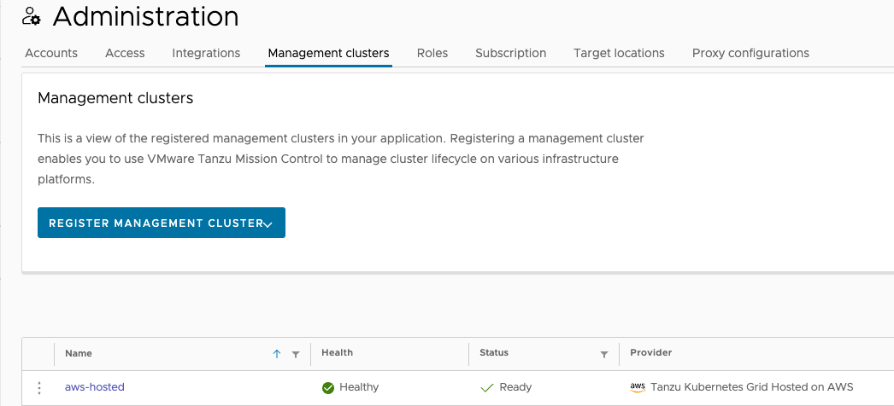

4. Click **_CREATE PROVISIONER_**

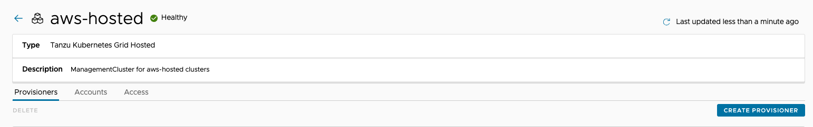

5. Give your provisioner a name and click **_CONFIRM_**

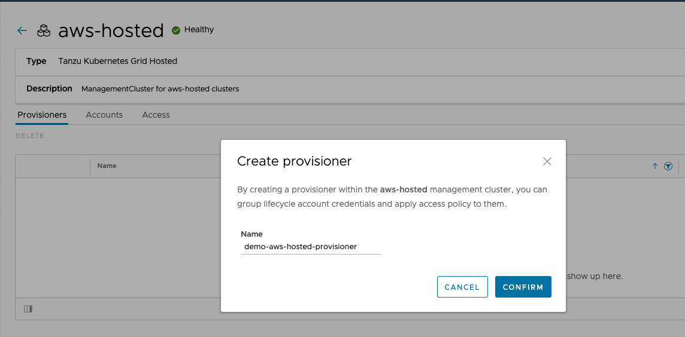

6. Click the **_Accounts_** tab

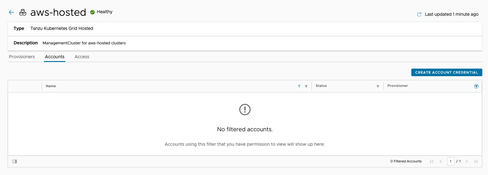

7. Click **_CREATE ACCOUNT CREDENTIAL_**

8. Select the provisioner created in Step 5, give your credential a name and click **_GENERATE TEMPLATE_**

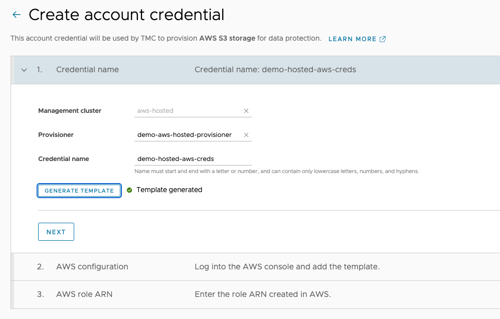

9. Click **_NEXT_**

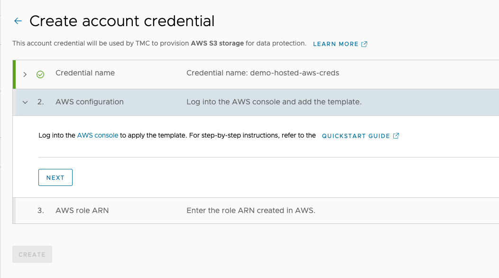

10. Log into your AWS Account, create a CloudFormation stack using the downloaded template, and when it completes retrieve the ARN.

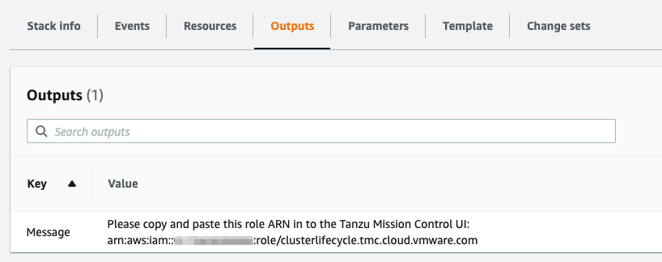

11. In the Tanzu Mission Control console, still on the AWS Configuration page, click **_Next_** and then paste the role ARN that you copied from the AWS console

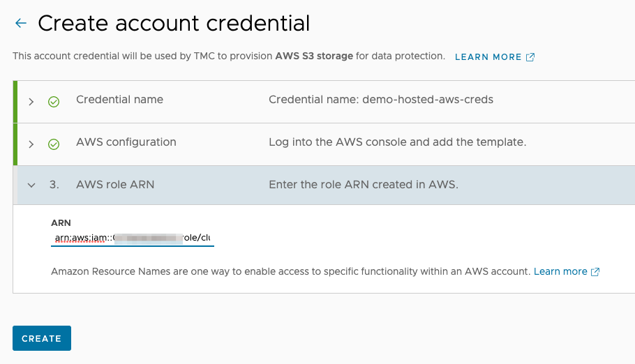

12. Click **_CREATE_** to finish the setup of your credential

13. Click the **_Access_** tab.

14. Select the provisioner whose access policy you want to edit or aws-hosted cluster.

15. Click the arrow next to the provisioner name under **_Direct access policies_**.

16. Click  **_Create Role Binding_**.

17. Select the role you want to assign

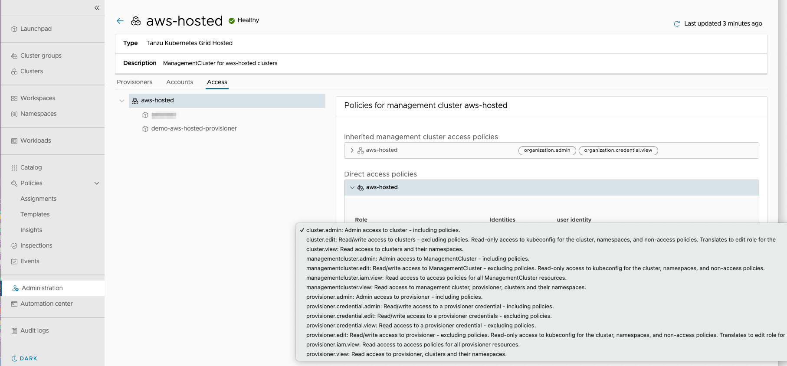

18. Select the targeted Identity (User or Group), insert the name of the identity and click add

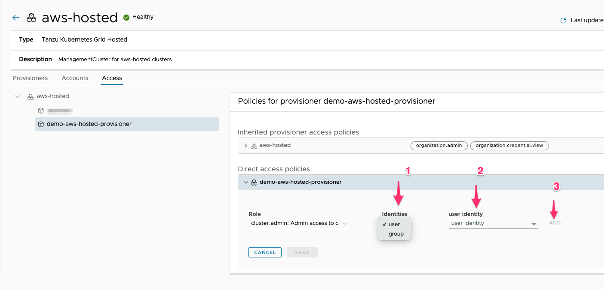

19. Click **_SAVE_**

## **<ins>Access Roles and Permissions for Tanzu Mission Control</ins>**

As an organization administrator, you can use VMware Tanzu Mission Control to view the built-in and custom roles that can be used in your access policies, as well as the individual permissions that are included in these roles.

Tanzu Mission Control provides a set of roles that you can use in your organization's access policies, and you can create your own access roles using a set of focused permissions. You can view these roles and permissions through the Roles tab on the Administration page of the Tanzu Mission Control console.

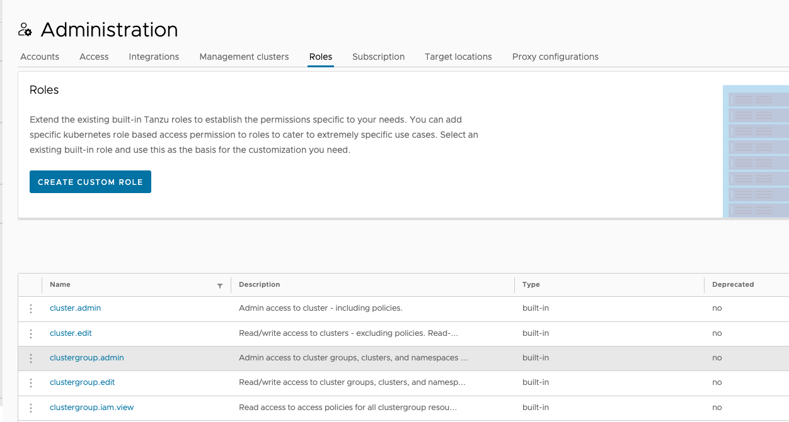

As an administrator, you can create a custom role that you can use in access policies in VMware Tanzu Mission Control.

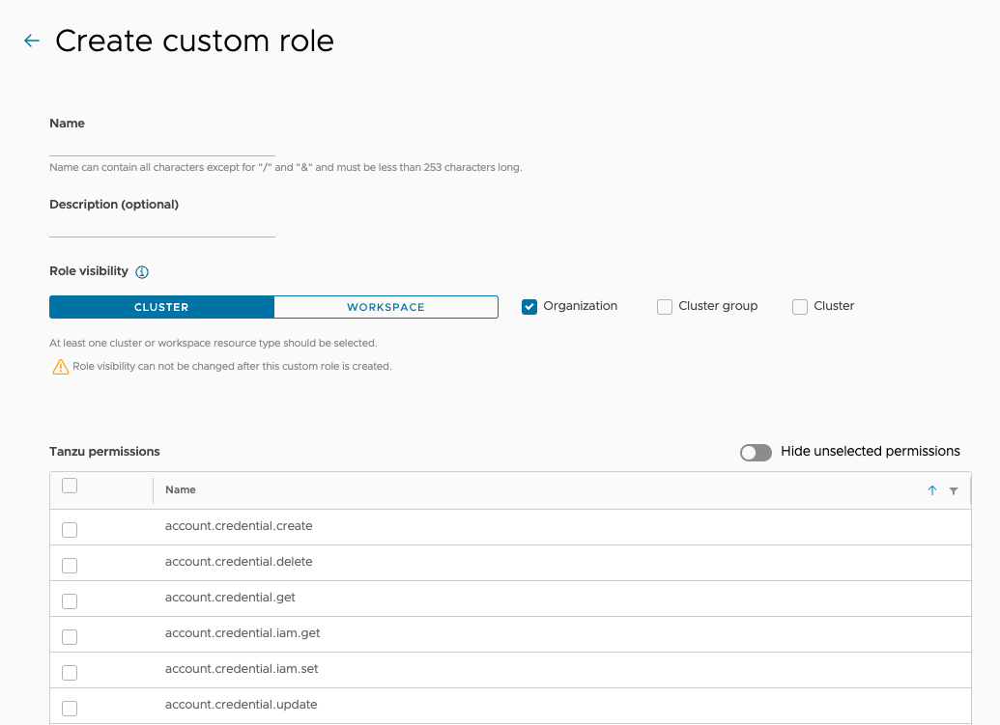

For more information about creating custom roles, see [Create a Custom Access Role](ttps://docs.vmware.com/en/VMware-Tanzu-Mission-Control/services/tanzumc-using/GUID-F314ED9E-2736-48CC-A1BB-CB9C32900B30.html) in _VMware Tanzu Mission Control Product Documentation._

## **<ins>View your Tanzu Mission Control Subscription</ins>**

A Tanzu Mission Control organization corresponds to a group or line of business that is subscribed to Tanzu Mission Control through VMware Cloud Services.

To view the status of your TMC subscription:

1. In the Tanzu Mission Control console, click **_Administration_** in the left navigation pane.

2. Click the **_Subscription_** tab.

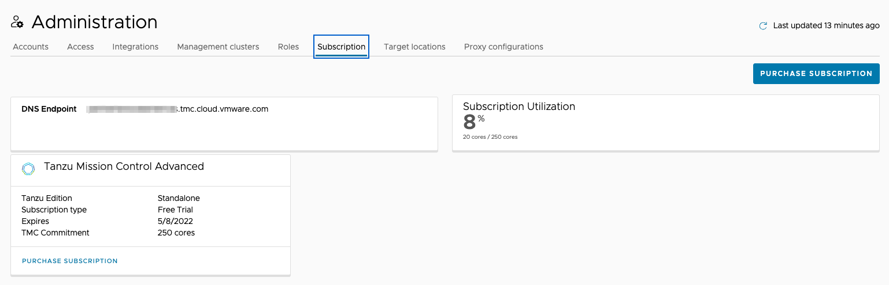

## **<ins>Target Location for Data Protection</ins>**

When you run a backup using Tanzu Mission Control, the resources that you specify to be backed up are written to a storage location that you identify. This location can be the AWS S3 storage that is managed by Tanzu Mission Control in your cloud provider account, or an AWS S3 or S3-compatible storage location that you create and maintain in your cloud provider account. This procedure shows how to create a target location that you can use for backups.

1. On the Administration a page, click the Target Locations tab.

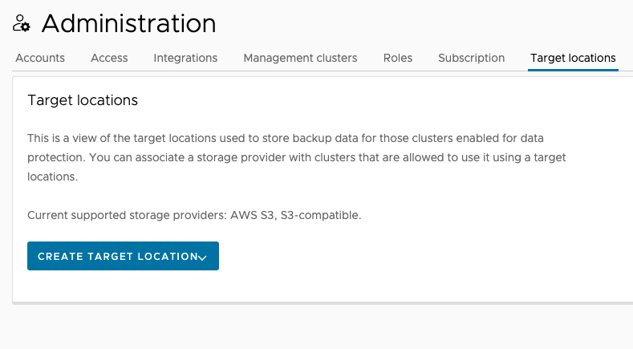

2. Click Create Target Location, and then choose the type of storage for the new target location.

- TMC managed AWS S3 storage
- Customer provisioned S3-compatible storage

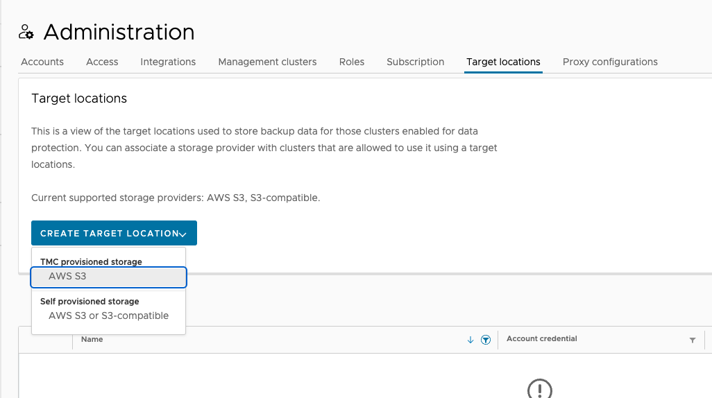

3. Select an account credential, and then click **_Next_**.

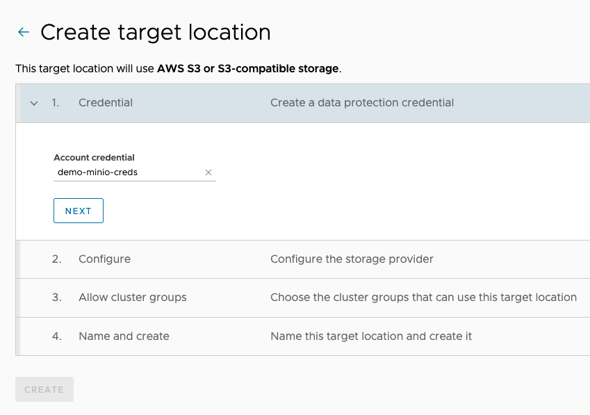

4. If you choose S3-compatible storage, specify the configuration of the storage.

    If you choose the storage managed by Tanzu Mission Control, you can skip this step.

i. Enter the URL that identifies the AWS S3 or S3-compatible storage location.

ii. Enter a name for the bucket in which to store backups.

iii. Specify the region in which to store backups.

iv.Click Next.

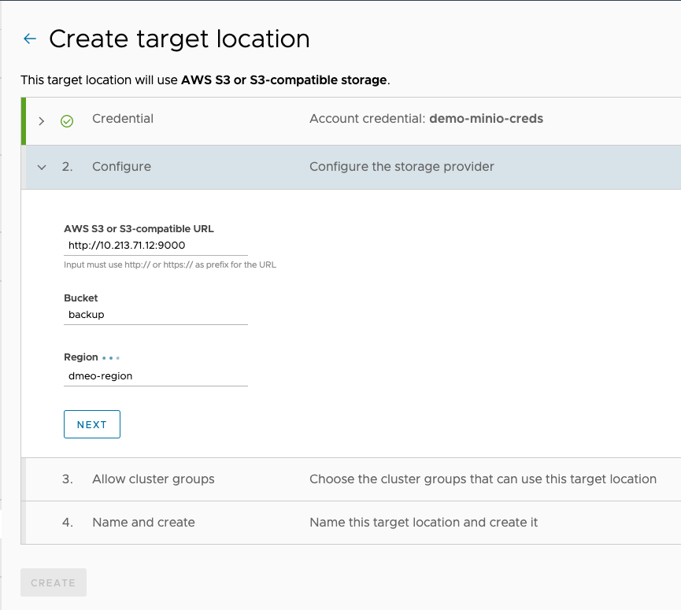

5. Specify the cluster groups whose clusters can use this target location for backups.

    Click **Add** after each selection.

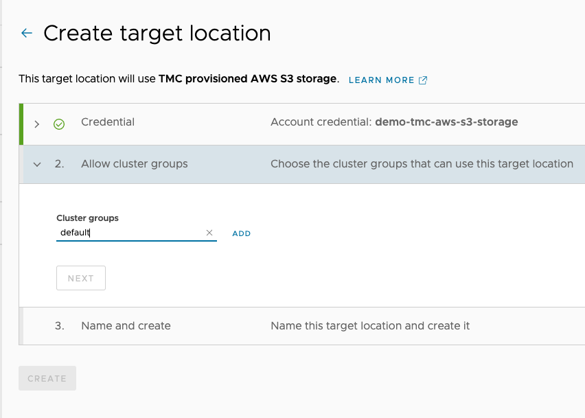

6. Click **Next**.

7. Provide a name for the target location.

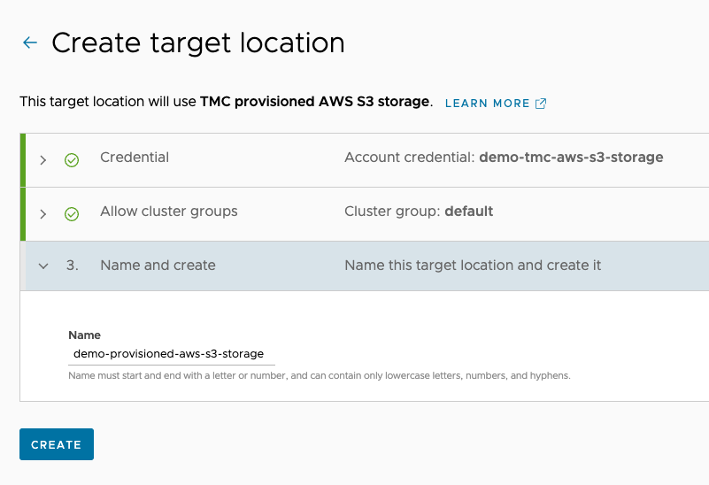

8. Click **Create**.

## **<ins>Proxy Configuration</ins>**

1. On the Administration page, click the Proxy Configuration tab.

2. Click Create Proxy Configuration.

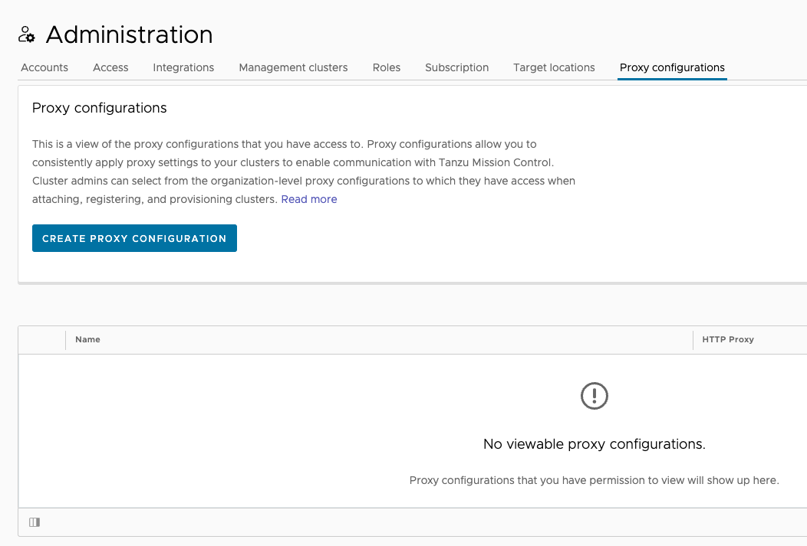

3. On the Create proxy page, enter a name for the proxy configuration.

     You can optionally provide a description.

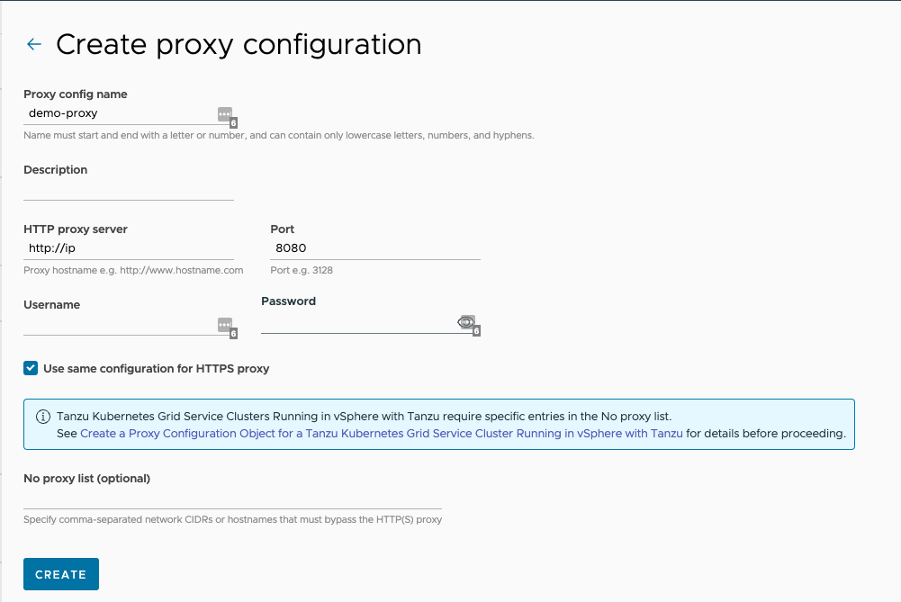

4. Specify the URL or IP address of the proxy server, and the port on which outbound traffic is allowed.

5. Enter the credentials (username and password) that permit outbound traffic through the proxy server.

6. You can optionally enter an alternative server/port and username/password for HTTPS traffic.

7. In No proxy list, you can optionally specify a comma-separated list of outbound destinations that must bypass the proxy server.

8. Click **Create**.

