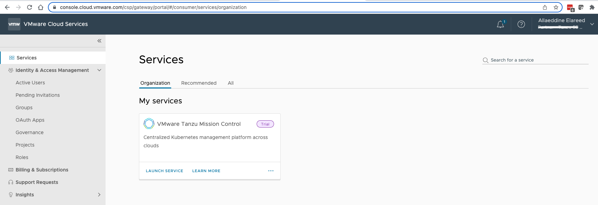
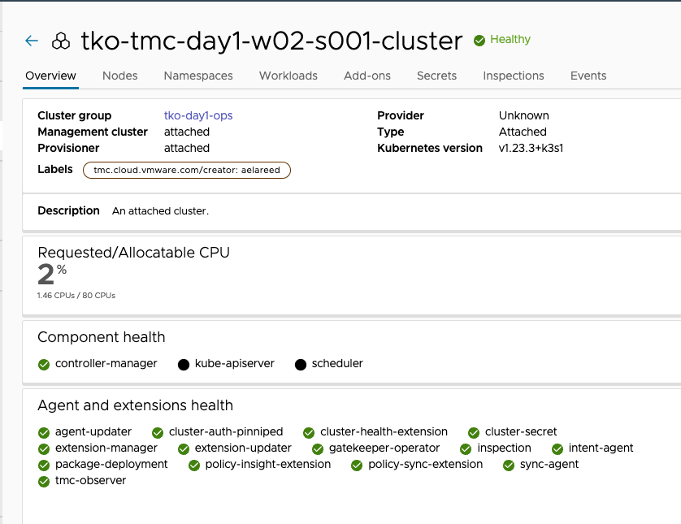

**Prerequisites**

To access the Tanzu Mission Control console, you must first make sure you have access to the Tanzu Mission Control service, as described in Get Access to Tanzu Mission Control below.

```dashboard:open-url
url: https://docs.vmware.com/en/VMware-Tanzu-Mission-Control/services/tanzumc-getstart/GUID-5EE71386-4279-4A31-974B-648BA3A9AEEC.html#GUID-5EE71386-4279-4A31-974B-648BA3A9AEEC
```

**Procedure**

1. Open a browser and log in to the VMware Cloud Services.

```dashboard:open-url
url: https://console.cloud.vmware.com
```




2. If you belong to multiple organizations, make sure you have selected **Partner - Tanzu SE Americas**. To change organizations, click your name in the title bar.

3. Click the Tanzu Mission Control tile to open the Tanzu Mission Control console. After you have logged in, you can return directly to the Tanzu Mission Control console using the following URL.

```dashboard:open-url
url: https://partnertanzuseamericas.tmc.cloud.vmware.com/
```

**Authenticate to TMC CLI**

If you don't have an API token to access TMC, see [How Do I Generate API Tokens](https://docs.vmware.com/en/VMware-Cloud-services/services/Using-VMware-Cloud-Services/GUID-E2A3B1C1-E9AD-4B00-A6B6-88D31FCDDF7C.html) documentation.   

* Provide your API Token and press enter
* For the login context name, leave to default


```execute-1
tmc login -n [login context name] --no-configure
```

* Configure environment defaults that make the CLI easier to use. 

```execute-1
tmc system context configure -l [log level] -m [management cluster name] -p [provisioner name]
```

**Create and prepare your TMC resources**

* Create your session's **Cluster Group: [my session]-cg**

```execute-1
tmc clustergroup create -n [my session]-cg
```
* Confirm that the cluster group **[my session]-cg** has been created    

```execute-1
tmc clustergroup get [my session]-cg 
```
   
* Add your Cluster Group to the **aws-s3-store** Backup Location 

```execute-1
tmc dataprotection provider backuplocation update aws-s3-store --assigned-cluster-groups [my session]-cg 
```

* Confirm that the cluster group **[my session]-cg** has been added to **aws-s3-store** Backup Location 

```execute-1
tmc dataprotection provider backuplocation get aws-s3-store -o json
```

* Attach your Cluster to [my session]-cg Cluster Group

```execute-1
tmc cluster attach -g [my session]-cg -n [my cluster name] -k .kube/config
```

On Tanzu Mission Control console, wait until the attachment is complete, and then the cluster **[my cluster name]** state changes to **Healthy**



```execute-1
tmc cluster validate -k .kube/config
```

```execute-all
clear
```

* Create your session's **Workspace: [my session]-ws**

```execute-1
tmc workspace create -n [my session]-ws
```

* Confirm that the workspace **[my session]-ws** has been created    

```execute-1
tmc workspace get [my session]-ws 
```

* Create **[my seesion namespace]** and add it to the workspace **[my session]-ws**:

```execute-1
tmc cluster namespace create -n [my session namespace] -k [my session]-ws -c [my cluster nanme]
```

* Confirm that the Namespace has been created

```execute-1
kubectl get ns [my seesion namespace] --kubeconfig=.kube/config
```
```execute-all
clear
```
