VMware Tanzu Mission Control uses secure-by-default, role-based access control (RBAC) to manage user permissions at each level of the hierarchical structure for your organization. Each object is protected by an access policy that defines who has access to that resource, and these policies are inherited down through the organizational hierarchy.

Access policies can be managed at four levels:

* organization level
* cluster group level
* cluster level 
* workspace level.

***Managing Users and Groups***

Before we start to look into how TMC can help you to use access policies to implement role-based access control (RBAC) for the users and resources in your organization, we need to understand how users and groups can be created and managed. For this purpose, you can use VMware Cloud Services Platform tools to invite users to your organization and organize them into user groups. 
By combining your users into groups, you can simplify access control by creating access policies that bind roles to groups rather than individuals. For more information about Identity & Access Management in VMware Cloud Services, see [Identity & Access Management](https://docs.vmware.com/en/VMware-Cloud-services/services/Using-VMware-Cloud-Services/GUID-D8316607-FE94-4DBA-9712-5CAD4DE885B5.html) in the Using VMware Cloud documentation.

You are not limited to create local users and groups in your VMWare Cloud Service Organization, you can also set up <ins>federation</ins> with your corporate domain that allows you to use your organization's single sign-on and identity source. For more information about federating identity management, see What is [enterprise federation and how does it work](https://docs.vmware.com/en/VMware-Cloud-services/services/setting-up-enterprise-federation-cloud-services/GUID-76FAECB3-CFAA-461E-B9C9-2A49C39CD17F.html) in the Using VMware Cloud Services Console documentation.

<ins>**Add local user**</ins> 

As an organization owner, you invite users to your organization and give them access to the services associated with it. You can also track the invitations you send. Invitations are valid for up to seven days. If you have sent an invitation in error, you can revoke it.

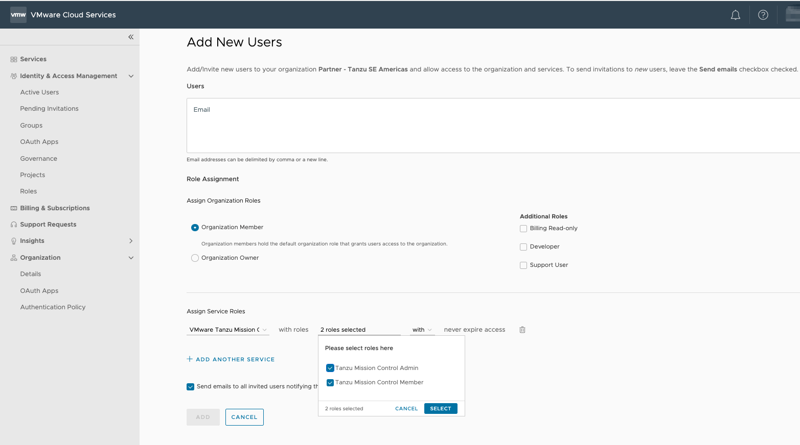

Below is an example of a user and a group

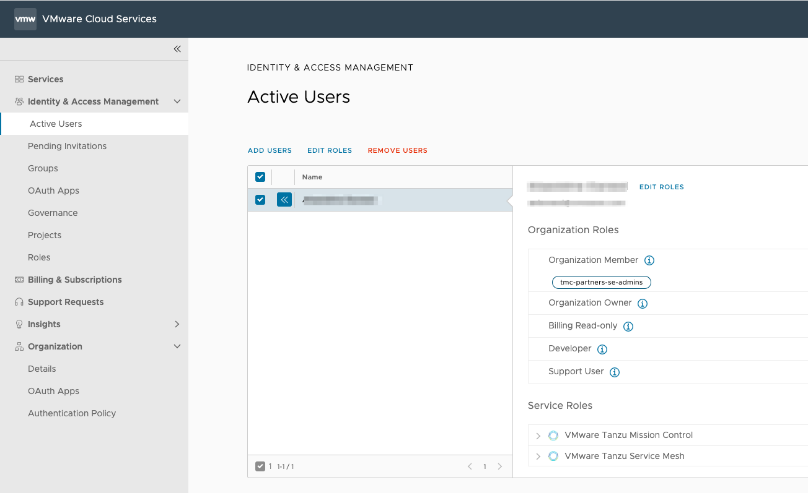

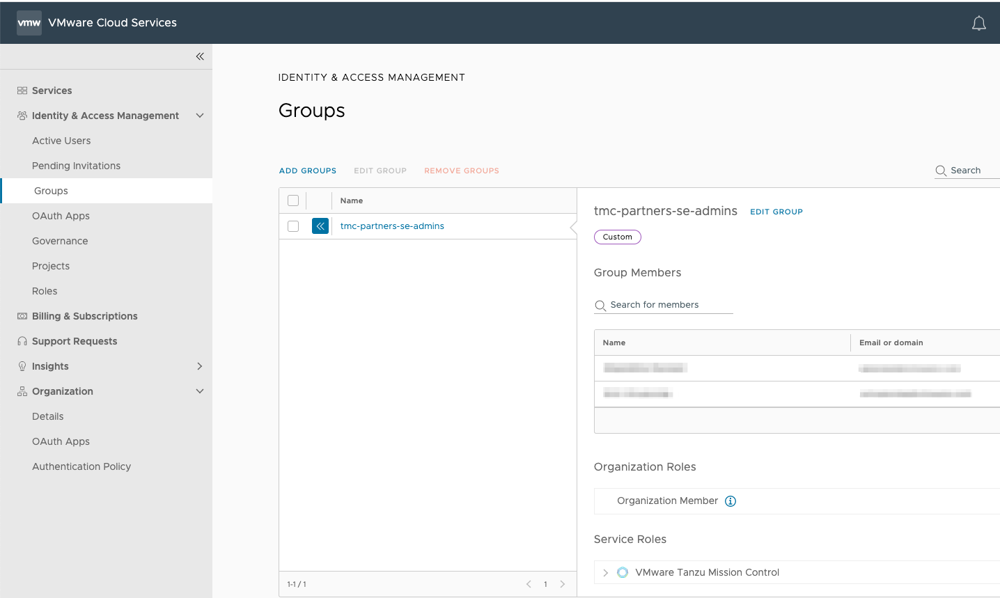

<ins>**About Roles in VMware Cloud Services Platform**</ins>

For services in the VMware Cloud Services platform, the organization provides two roles, owner and member. As an organization owner, you can specify the roles of members in your organization, both at the organizational level and at the service level. For the Tanzu Mission Control service, there are two service roles:

<ins>Service Admin</ins>

This role provides additional permissions for administrators of the service in your organization.

<ins>Service Member</ins>

This role provides typical service usage permissions for most members in your organization.

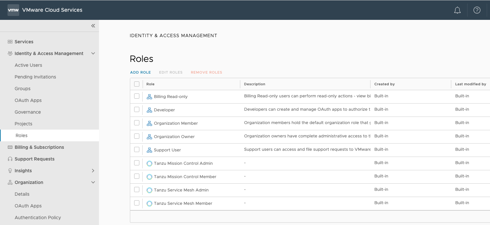

To grant a user or group an access privilege, click on Policies and then Assigments from the left pane, as shown below:

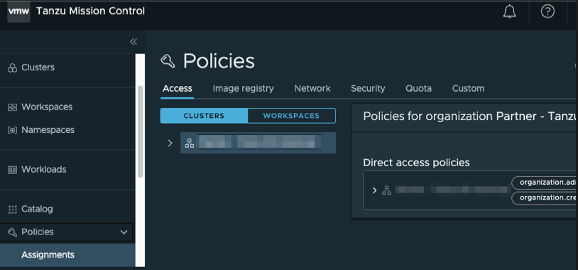

To edit the access policy for an object, you must be associated with the ***.admin*** role for that object.


<div class="info" style='background-color:#e7f3fe; color: #000000; border-left: solid #2196F3 4px; border-radius: 4px; padding:0.7em;'>
<span>
<p style='margin-top:1em; text-align:left'>
<b>Note:</b></p>
<p style='margin-left:1em;'>
There are predefined roles for each type of object in your organization. Each role defines a set of permissions that apply to a given type of object. By contrast, the access policy where you define the role binding defines the scope to which the role applies. The set of roles that can be assigned at a particular level in your organization depends on the level of the object. For example the set of roles that can be assigned at <b>Cluster Group</b> is different than the set of roles that can be assigned to a <b>Cluster</b> 

<p float="left">
  <b>Cluster Group Roles</b>
  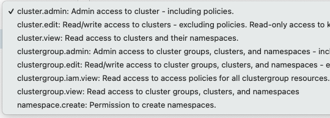

  <b>Cluster Roles</b>
  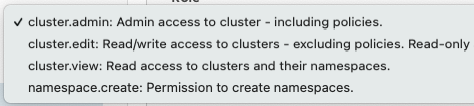 
</p>

</p>
</span>
</div>
<p></p>

<b><u>Access Policy at Organization Level</u></b>

Access policies can be configured at the organization level either using TMC Console or TMC CLI.
When you configure an access policy at the organization level, it will cascade to all existing and newly created cluster groups and clusters underneath.  

<details>
<summary><b>TMC Console</b></summary>
<p>

* Click on Access then the root organization in the left pane.
* In the organizational view on the Access tab of the Policies page, select the object whose access policy you want to add a role binding to.

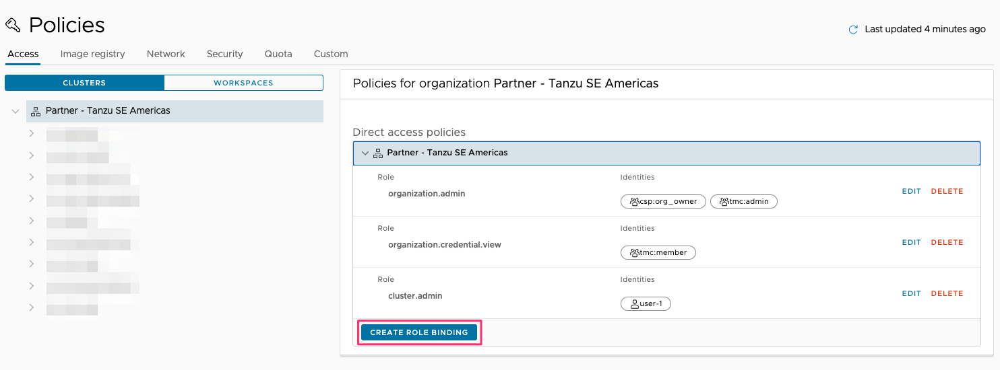

- Click on the organization:  ***Partner - Tanzu SE Americas***
- Click the arrow next to the object name ***Partner - Tanzu SE Americas*** under Direct access policies.
- Click Create Role Binding.
- Select the **cluster.admin** role to grant administrative access to this cluster group that you want to bind to an identity.
- Select the identity type (user or group) that you want to bind.
- Enter one or more identities, clicking Add after each identity, and then click Save.
</p> 
</details>
<details>
<summary><b>TMC CLI</b></summary>
<p>

* Create a policy 

    ```execute-1
    tmc organization iam add-binding -r cluster.edit -u tko-tmc-day1-w01-s001-user
    ```
* Confirm that the policy has been created    

    ```execute-1
    tmc organization iam get-policy
    ```   
</p> 
</details>

<p>
</p>

<b><u>Access Policy at Cluster Group Level and at Cluster Level</u></b>

Access policies can be configured at the cluster group level either using TMC Console or TMC CLI.
When you configure an access policy at the cluster group level, it will automatically cascade to all existing and newly created clusters underneath.  

<details>
<summary><b>TMC Console</b></summary>
<p>

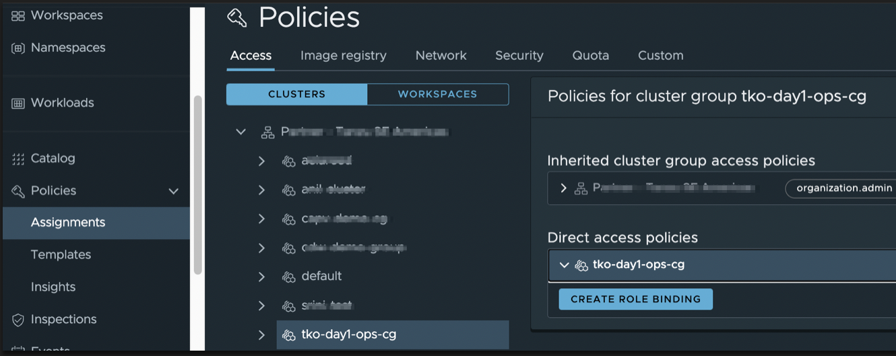

- Click on the cluster group:  ***tko-tmc-day1-w01-s001-cg***. 
- Click the arrow next to the object name under Direct access policies.
- Click Create Role Binding.
- Select the ***cluster.admin*** role to grant administrative access to this cluster group that you want to bind to an identity.
- Select the identity type (user or group) that you want to bind.
- Enter one or more identities, clicking Add after each identity, and then click Save.

<div class="info" style='background-color:#e7f3fe; color: #000000; border-left: solid #2196F3 4px; border-radius: 4px; padding:0.7em;'>
<span>
<p style='margin-top:1em; text-align:left'>
<b>Note:</b></p>
<p style='margin-left:1em;'>

You can repeat the same step above for <b>tko-tmc-day1-w01-s001-cluster</b> to assign access policies at cluster level 

</p>
</span>
</div>
<p></p>

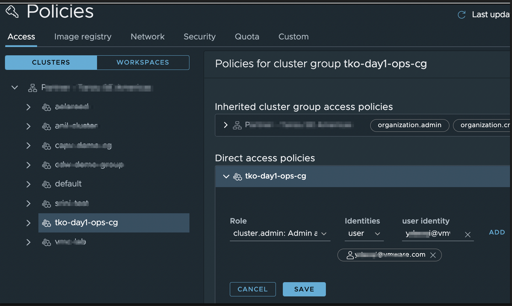
</p> 
</details>
<details>
<summary><b>TMC CLI</b></summary>
<p>

* Create a policy 
    * Cluster Group Level
    ```execute-1
    tmc clustergroup iam add-binding tko-tmc-day1-w01-s001-cg -r cluster.edit -u tko-tmc-day1-w01-s001-user
    ```
    * Cluster Level
    ```execute-1
    tmc cluster iam add-binding tko-tmc-day1-w01-s001-cluster -r cluster.edit -u tko-tmc-day1-w01-s001-user
    ```
* Confirm that the policy has been created    
    * Cluster Group Level
    ```execute-1
    tmc clustergroup iam get-policy tko-tmc-day1-w01-s001-cg
    ```
    * Cluster Level
    ```execute-1
    tmc cluster iam get-policy tko-tmc-day1-w01-s001-cluster
    ```
</p> 
</details>
<p></p>

<b><u>Access Policy at Workspace/Namespace Level</u></b>

Access policies can be configured at the workspace level either using TMC Console or TMC CLI.

<details>
<summary><b>TMC Console</b></summary>
<p>

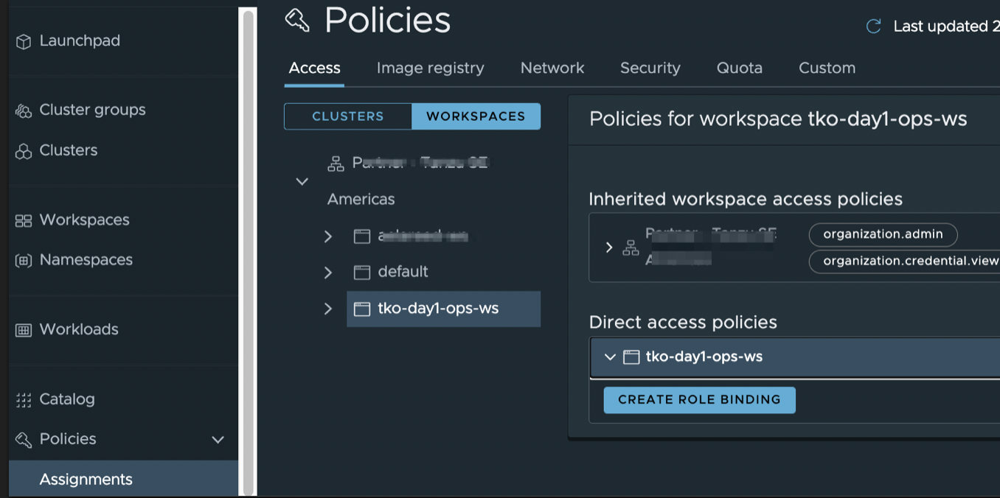

* click on the workspace: ***tko-tmc-day1-w01-s001-ws***. Similar to the steps given above, we can grant a desired 
role binding to the workspace:  ***tko-tmc-day1-w01-s001-ws*** as shown below, 
this time grant the ***namespace.admin*** privilege to a group of users. 

* click Add after each identity, and then click Save.

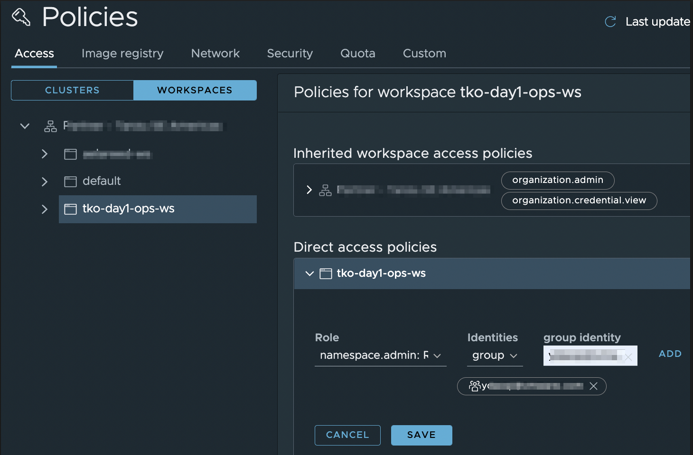

<div class="info" style='background-color:#e7f3fe; color: #000000; border-left: solid #2196F3 4px; border-radius: 4px; padding:0.7em;'>
<span>
<p style='margin-top:1em; text-align:left'>
<b>Note:</b></p>
<p style='margin-left:1em;'>

You can repeat the same step above to assign access policies at namespace level 

</p>
</span>
</div>

</p> 
</details>

<details>
<summary><b>TMC CLI</b></summary>
<p>

* Create a policy 

    ```execute-1
    tmc workspace iam add-binding tko-tmc-day1-w01-s001-ws -r namespace.edit -u tko-tmc-day1-w01-s001-user
    ```
* Confirm that the policy has been created    

    ```execute-1
    tmc workspace iam get-policy tko-tmc-day1-w01-s001-ws
    ```
</p> 
</details>

<p>
</p>

<b><u>Connect to *tko-tmc-day1-w01-s001-cluster* with kubectl</u></b>

<details>
<summary><b>TMC Console</b></summary>
<p>

1. In the left navigation pane of the Tanzu Mission Control console, click Clusters.
2. On the Clusters page, click ***tko-tmc-day1-w01-s001-cluster***.
3. On the cluster detail page, in the upper right corner, click Access this cluster.
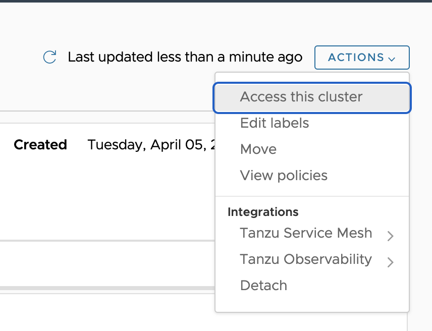
4. In the resulting popup modal, click Download KUBECONFIG file. and save the downloaded YAML file in a location that is accessible to kubectl (for example, in `~/.kube/config` or in a location specified in the KUBECONFIG environment variable).
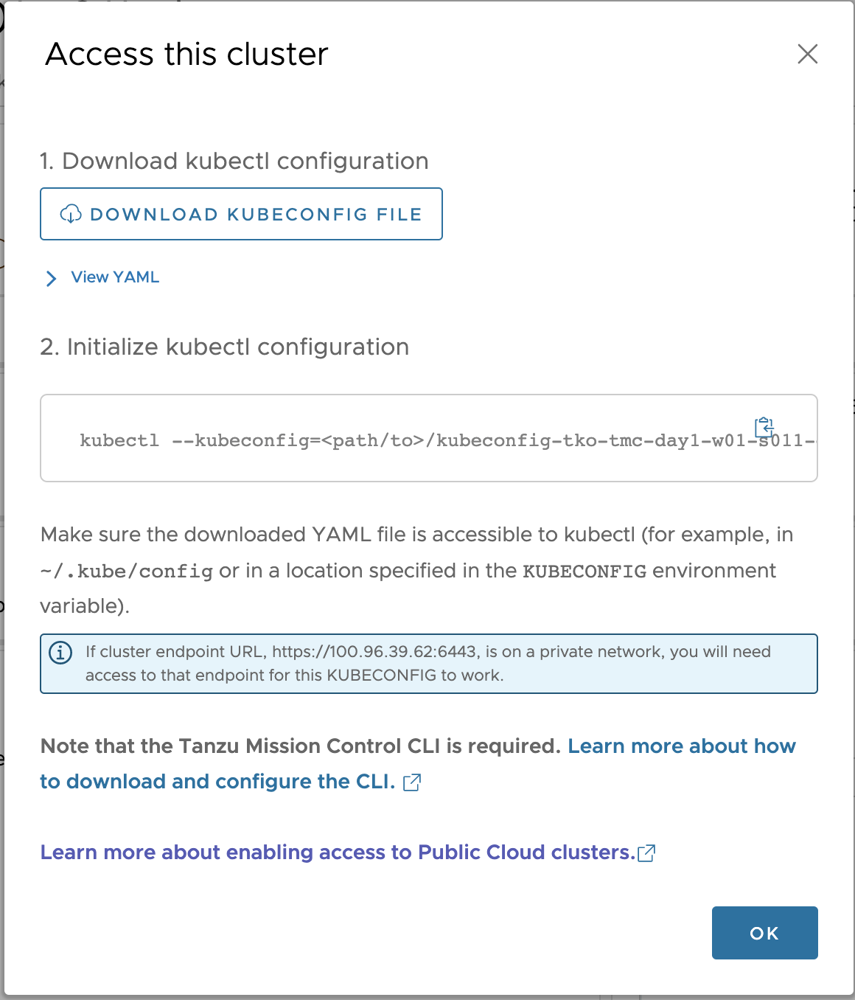
</p> 
</details>

<details>
<summary><b>TMC CLI</b></summary>
<p>

```execute-1
tmc cluster auth kubeconfig get tko-tmc-day1-w01-s001-cluster > kubeconfig.yaml
```
</p> 
</details>

<p>
</p>

To test the downloaded KUBECONFIG

```execute-1
kubectl get po -A --kubeconfig=kubeconfig.yaml
```
**Cleanup the created policies**

* Delete the created policy at the organization level

    ```execute-1
    tmc organization iam remove-binding -r cluster.edit -u tko-tmc-day1-w01-s001-user
    ``` 

* Delete the created policy at Cluster Group Level & at Cluster Level

    * Cluster Group Level
    ```execute-1
    tmc clustergroup iam remove-binding tko-tmc-day1-w01-s001-cg -r cluster.edit -u tko-tmc-day1-w01-s001-user
    ```

    * Cluster Level
    ```execute-1
    tmc cluster iam remove-binding tko-tmc-day1-w01-s001-cluster -r cluster.edit -u tko-tmc-day1-w01-s001-user
    ```

* Delete the created policy at the workspace level

    ```execute-1
    tmc workspace iam remove-binding tko-tmc-day1-w01-s001-ws -r namespace.edit -u tko-tmc-day1-w01-s001-user
    ```

