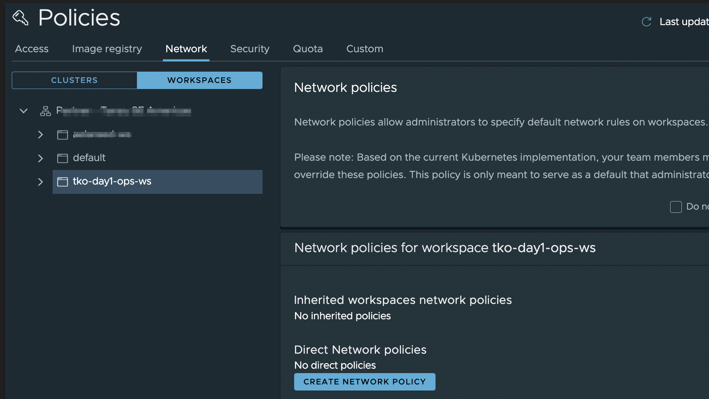
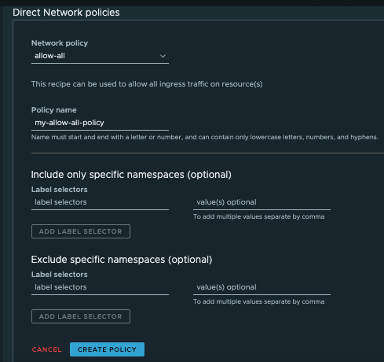

Using VMware Tanzu Mission Control, you can create a network policy that defines how pods communicate with each other and other network endpoints, using preconfigured templates called recipes. By default, Tanzu Mission Control does not impose any such restriction, and allows you to manage network restrictions at the organizational level and at the workspace level.

Tanzu Mission Control implements network policies using Kubernetes native network policies. Each namespace and workspace can be governed by a network policy, and these policies are inherited down through the organizational hierarchy. Network policies are additive, both inherited and direct network policies are applied and are effective on your namespaces according to Kubernetes rules.

To create a network policy for an object, you must be associated 
with the *.admin* role for that object.

Let us follow the following procedure to create a network policy that allows all ingress traffic in our workspace  **tko-day1-ops-ws**:

1. On the Policies page, click the Network tab, and then click the Workspaces organization view.

2. Use the tree control to navigate to and select the object for which you want to create a network policy.  In this case, click **tko-day1-ops-ws** to add a network policy for this workspace.

  

3. Click Create Network Policy.

4. Select the network policy recipe to use. Choose one of the values from the dropdown. Available values 
are:

- *`allow-all`* (allow all ingress traffic)
- *`deny-all`* (deny all ingress traffic)
- *`allow-all-to-pods`* (allow all ingress traffic to selected pods)
- *`deny-all-to-pods`* (deny all ingress traffic to selected pods)
- *`custom-ingress`* (define a custom ingress policy)
- *`custom-egress`* (define an egress policy). In this case, we select *allow-all*.


5. Provide a policy name: `{{ session_namespace }}-aa-policy`{{copy}}.

6. Click Create Policy.

   

Now let's create a `custom-ingress` policy and test it. This policy will allow ingress network connection to a `web-server` POD from `allowed-client` POD only. 

Before we apply this policy using the TMC CLI, let's have a look on its definition and do some modifications

```editor:open-file
file: ~/network-policy.yaml
```

```editor:select-matching-text
file: ~/network-policy.yaml
text: "name: (.*)"
isRegex: true
group: 1
```

```editor:replace-text-selection
file: ~/network-policy.yaml
text: "{{ session_namespace }}-ci-policy"
```

* Create a policy 

    ```execute-1
    tmc workspace network-policy create -f network-policy.yaml 
    ```
* Confirm that the policy has been created and synced to the {{ session_namespace }}-cluster   

    ```execute-1
    tmc workspace network-policy get {{ session_namespace }}-ci-policy  --workspace-name tko-day1-ops-ws 
    ```

    ```execute-1
    kubectl describe networkpolicies --kubeconfig=.kube/config tmc.wsp.{{ session_namespace }}.{{ session_namespace }}-ci-policy -n {{ session_namespace }}
    ```

Let's validate that our network policy is working by trying to deploy three PODs (`web-server`, `allowed-client` and `not-allowed-client`) to the namespace **{{ session_namespace }}**, which is part of the workspace **tko-day1-ops-ws**. 

* Deploy the test PODs:

```execute-1
kubectl --kubeconfig=.kube/config apply -f network-policy-deployment/ -n {{ session_namespace }}
```
* Confirm that the pods are up and running

```execute-1
kubectl --kubeconfig=.kube/config get po -n {{ session_namespace }}
```

* Run `curl command` from `not-allowed-client` POD to test the connection towards `web-server` POD.

```execute-1
kubectl --kubeconfig=.kube/config exec -n {{ session_namespace }} deploy/not-allowed-client -- curl http://web-server:80 --connect-timeout 3 -s
```

You should receive **command terminated with exit code 28** Error

* Run `curl command` from `allowed-client` POD to test the connection towards `web-server` POD

```execute-1
kubectl --kubeconfig=.kube/config exec -n {{ session_namespace }} deploy/allowed-client -- curl http://web-server:80 --connect-timeout 3 -s
```

As you can see, our policy allows the connection between `allowed-client` POD and `web-server` POD

* Delete the test PODs

```execute-1
kubectl --kubeconfig=.kube/config delete -f network-policy-deployment/ -n {{ session_namespace }}
```

* Delete the created policy 

```execute-1
tmc workspace network-policy delete {{ session_namespace }}-ci-policy  --workspace-name tko-day1-ops-ws
```