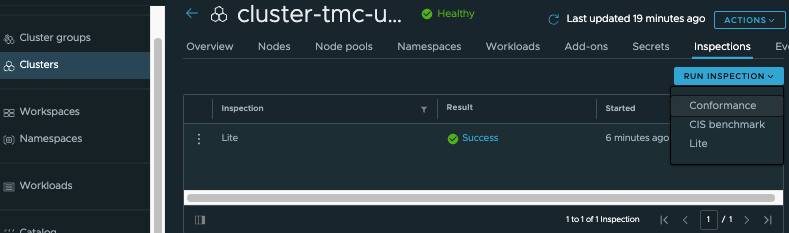

### **Cluster Inspection**

Using Tanzu Mission Control, a platform or infrastructure operator 
can run preconfigured cluster inspections using Sonobuoy to make sure 
that their Kubernetes clusters conform to a standard.

Why is conformance so important? A key goal for Kubernetes is portability. 
Developers can build an application in one environment and then deploy it 
into another with minimal changes. 
Businesses can pick the hosting platform that best meets their needs 
based on application requirements. 
If the requirements change or new offerings emerge, the application 
isn’t tied to a single Kubernetes environment. 
Without conformance, the key goals of Kubernetes, including portability 
and automated deployment, cannot be achieved.

To run a cluster inspection, you must be associated with the 
cluster.edit role in the cluster.

#### **Start a Cluster Inspection**
To intiate an inspection to verify the conformance of a cluster, follow
the following steps: 

1. In the left navigation pane of the Tanzu Mission Control console, click Cluster groups.

  

2. Click the cluster group that contains the cluster you want to inspect, and then click the cluster.
3. On the Overview tab of the cluster detail page, in the Inspection box at
the bottom of the page, click Run Inspection. 
Alternatively, you may use the Inspections tab. 

4. Choose Lite as the type of inspection you want to run, 
and then click Run Inspection. This will take the least amount of time to run.
There are three types of inspection that you may run: Conformance, 
CIS benchmark, and Lite.

The Conformance inspection validates the binaries running on your cluster and ensures that your cluster is properly installed, configured, and working. 
The Lite inspection is a node conformance test that validates whether nodes meet requirements for Kubernetes. 
The CIS benchmark inspection evaluates your cluster against the CIS Benchmark 
for Kubernetes published by the Center for Internet Security. 
CIS has developed prescriptive tests for establishing a secure configuration 
posture for Kubernetes. 

When you click Run Inspection, the inspection starts and you are directed back to the cluster detail page that shows your inspection is running. When the inspection is complete, the result of the inspection is displayed in the Inspection box.
You may download the generated report to assess and address any issues that arise. 


### **Stop a Cluster Inspection**
You have the option to stop a running inspection, after it has started.
In the left navigation pane of the Tanzu Mission Control console, click Inspections.
The Inspections page lists the clusters that have been inspected along 
with their inspection results, as well as the clusters that 
have inspections that are currently running.
Locate your cluster in the list of inspections, and then click the cluster.
On the Overview tab of the cluster detail page, in the Inspection box, click Cancel Inspection.

### **View and Download Inspection Results**
Once an inspection is finished, you may view and download the results of 
inspections that you have run, by following the steps below: 

1. In the left navigation pane, click Inspections.
The Inspections page lists the clusters that have been inspected along 
with their inspection results.
The Inspection field of this list shows the type of inspection that was run, 
while the Result field shows the status of the inspection 
(success, failure, or in progress).

2. To see the inspection report, click the link in the Result field.

3. You can optionally download a compressed TAR file of the inspection result 
by clicking the Actions dropdown at the top of the inspection detail page, 
and then choosing Download.

For this exericse, download the Lite inspection result that was generated 
earlier.


Now let us use TMC CLI to create a Lite inspection on the cluster: *{{ session_namespace }}-cluster*:
```execute-1
tmc cluster inspection scan create -m attached -c {{ session_namespace }}-cluster -p attached --inspection-type=LITE
```

List all the inspection scans (find the name of interest): 
```execute-1
tmc cluster inspection scan list --all
```

Finally delete the inspection: 
```execute-1
tmc cluster inspection scan delete $(tmc cluster inspection scan list --all -o json | jq '.scans[0].fullName.name' -r) --cluster-name {{ session_namespace }}-cluster 
```

