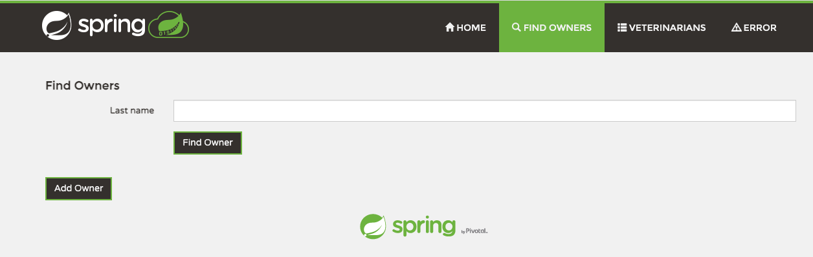
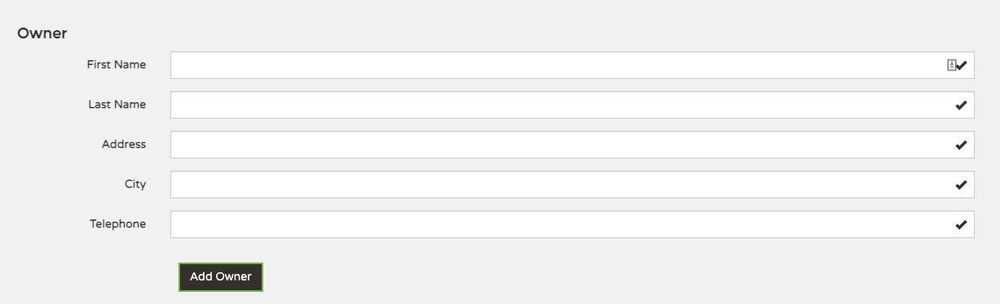

Using VMware Tanzu Mission Control, you can protect the valuable data resources in your Kubernetes clusters using the backup and restore functionality provided by Velero, an open source community standard.

The data protection features of Tanzu Mission Control allow you to create the following types of backups for managed clusters (both attached and provisioned):

* all resources in a cluster
* selected namespaces in a cluster
* specific resources in a cluster identified by a given label

You can selectively restore the backups you have created, by specifying the following:

* the entire backup
* selected namespaces from the backup
* specific resources from the backup identified by a given label

Additionally, you can schedule regular backups and manage the storage of backups and volume snapshots you create by specifying a retention period for each backup and deleting backups that are no longer needed.

When you perform a backup for a cluster, Tanzu Mission Control uses Velero to create a backup of the specified Kubernetes resources with snapshots of persistent volume data, and then stores the backup in the location that you specify.

**Enable Data Protection for *tkoworkshop-w01-s001-cluster* Cluster**

Before you can use Tanzu Mission Control to back up data resources in your clusters, you must set up your cluster and your target location. This procedure describes how to install the data protection extension (and Velero) on your cluster so that you can use Tanzu Mission Control to perform data protection actions using a specified backup location.

```execute-1
tmc cluster dataprotection create --cluster-name tkoworkshop-w01-s001-cluster
```
Wait until **STATUS** of **tkoworkshop-w01-s001-cluster** cluster to become **READY**

```execute-1
tmc cluster dataprotection list --cluster-name tkoworkshop-w01-s001-cluster
```

Now we will deploy the Petclinic Spring boot sample app with persistent data in mysql database on the cluster **tkoworkshop-w01-s001-cluster** in the **app** Namespace.

* Go to the workshop tab, on the Terminal Tab

```execute-1
kubectl create namespace app
```
* Deploy the Petclinic app in app namespace **app**

```execute-1
kubectl apply -f ./petclinic-app/deployment.yaml -n app
```
* Wait until the PODs in the **app** namespace are up and running 


* Open the Petclinic app and insert a new owner to list of the sample owners list 


1. Click FIND OWNERS -> Add Owner



2. Fill your example owner information 



For Example: 

First Name: `Example`

Last Name: `User`

Address: `Example Address 01`

City: `Example City`

Telephone: `0123456789`


3. Confirm that the owner has been added to the list 

FIND OWNERS -> Find Owner


* Let's make a backup of our Petclinic App

```execute-1
tmc cluster dataprotection backup create -n petclinic-app-backup --include-namespaces app --backup-location-name aws-s3-store --cluster-name tkoworkshop-w01-s001-cluster
```
* Check the STATUS of the **petclinic-app-backup** backup

```execute-2
tmc cluster dataprotection backup list --name petclinic-app-backup --cluster-name tkoworkshop-w01-s001-cluster
```

**Now, let's simulate disaster scenario**

```execute-1
kubectl delete ns app
```
```execute-1
kubectl get ns app
```
* Try to access the Petclinic App

* Let's trigger a restore process 

```execute-1
tmc cluster dataprotection restore create -n petclinic-app-restore --include-namespaces app --backup-name petclinic-app-backup --cluster-name tkoworkshop-w01-s001-cluster
```
* Check the STATUS of the **petclinic-app-restore** restore

```execute-2
tmc cluster dataprotection restore list --name petclinic-app-restore --cluster-name tkoworkshop-w01-s001-cluster
```

* Confirm that the newly created owner is in the list 


FIND OWNERS -> Find Owner


```dashboard:delete-dashboard
name: Petclinic APP
```
* Delete the created backup/restore resources  

```execute-1
tmc cluster dataprotection backup delete petclinic-app-backup --cluster-name tkoworkshop-w01-s001-cluster
```
```execute-1
tmc cluster dataprotection restore delete petclinic-app-restore --cluster-name tkoworkshop-w01-s001-cluster
```
