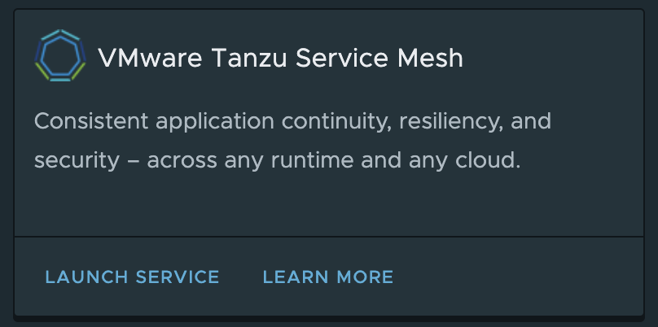
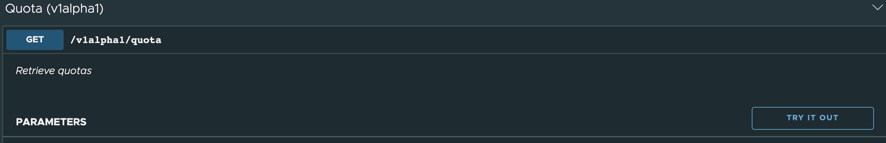
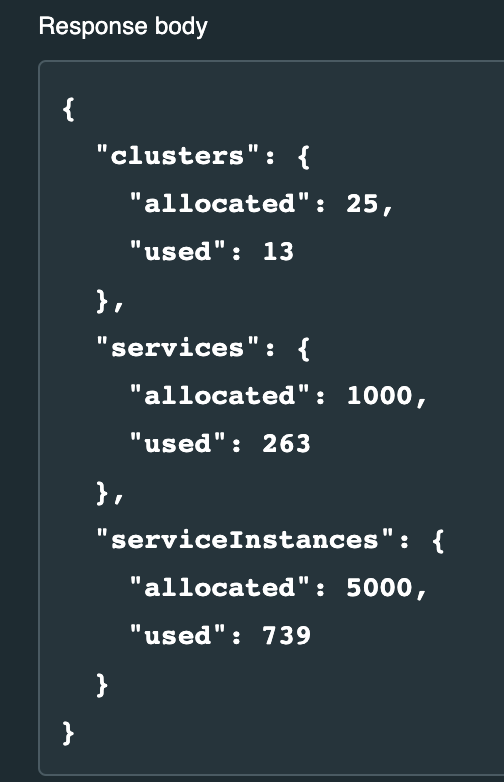

#### Lab 1 – Preparation Steps

In this lab, you will complete the preparation steps before starting cluster onboarding, GNS etc.

##### Objectives and Tasks

In this lab, you will learn about pre-requirements for onboarding a Kubernetes clusters on the TSM. You will complete the following tasks:

* Connect to the TSM environment
* Validate the TSM Quota
* Validate a Kubernetes version, Kubernetes providers, Resource requirements and required Network Connectivity
* Validate a Kubernetes Clusters access and permissions
* Domain availability for exposing public service
* Cluster Access Validation

<ins> **Task 1: Connect to the TSM environment** </ins>

* Login to the VMware Cloud Services.
```dashboard:open-url
url: https://console.cloud.vmware.com/
```
>Note: Google Chrome in `Incognito` mode is preferred and ensure that you have **Chrome browser version 74.x** or later is installed to avoid any TSM GUI related issues.

* Enter your email id and click on **NEXT**.

* Enter a password and click on **SIGN IN**.

* After the successful login, you will be redirected to a **VMware Cloud Services** Console.

* Ensure that you are in a correct organization by clicking on the **users/organization** settings icon. 


>Note: Correct organization for this workshop is “**Partner – Tanzu SE Americas**”

* **Optional**: In case you need to change the organization, click on the **Change Organization** dropdown and select and appropriate organization name.

* On the **VMware Cloud Services** console, under **Organization** tab, you will see the **VMware Tanzu Service Mesh** tile. Click on the **LAUNCH SERVICE** option.


* You will be redirected to the Tanzu Service Mesh UI home page. Now, you are successfully connected to the TSM UI.

<ins>**Task 2: Validate the TSM Quota**</ins>

In this task, you will validate the different object quotas within TSM Quota validation will be performed using TSM interactive **API Explorer**.
* On the right bottom corner of the TSM UI, you will see an API Explorer option. Click on it.


* You will notice that it opens an **API Explorer** page and **REST HTTP** is selected by default.

* We will be exploring more API as we go through different labs,  for now scroll down and look for Quota API.


* Once you click on it, you will notice that there is one GET API available. Click on it and then click **Try It Out**. 


* As soon you click **Try It Out**, it will display an **Execute** button for you to execute this api call. Click **Execute**.

* Scroll down a bit and look at the result under Response body. Review the quotas and their current usage. Ensure that there is atleast two cluster quota available.


<ins>**Task 3: Optional: Validate the Kubernetes version, Kubernetes providers, Resource requirements and required Network Connectivity** </ins>

>This is an optional task since these requirements have been taken care already. Keep this URL handy and review it for your information purpose.
```dashboard:open-url
url: https://docs.vmware.com/en/VMware-Tanzu-Service-Mesh/services/tanzu-service-mesh-environment-requirements-and-supported-platforms/GUID-D0B939BE-474E-4075-9A65-3D72B5B9F237.html
```

<ins>**Task 4: Optional: Validate the Kubernetes Clusters access & permissions**</ins>

>This is an optional task. You have been granted an admin access role to the Kubernetes clusters.

<ins>**Task 5: Optional: Domain availability**</ins>

>This is an optional task. You can go with a dummy domain name too but for this workshop, domain is already reserved and you will use the same.

<ins>**Task 6: Cluster Access**</ins>

In this workshop, you will have an EKS and AKS clusters pre-created. Validate them by running the following command.
* Initalize the environment on both terminals
  * Terminal 1
    ```execute-1
    source /opt/workshop/setup.d/01-configure-cluster-access.sh 
    ```
  * Terminal 2
    ```execute-2
    source /opt/workshop/setup.d/01-configure-cluster-access.sh 
    ```
* Validate an EKS and AKS cluster contexts
    ```execute-1
    kubectl config get-contexts 
    ```
