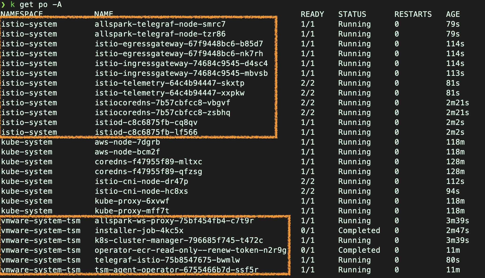

#### Lab 2 – Cluster Onboarding

In this lab, you will onboard both EKS and AKS Kubernetes cluster on the Tanzu Service Mesh environment using different options. There are three approaches to onboard a Kubernetes cluster listed below i.e. using TSM GUI, via TMC and using REST API. You will use the first approach i.e. using TSM GUI but feel free to review remaining two more methods as well and try them later. 

##### Objectives and Tasks

In this lab, you will perform the following tasks:

* Onboarding Kubernetes Clusters to TSM via UI
* `Optional`: Onboarding a Kubernetes Cluster to TSM via TMC
* `Optional`: Onboarding a Kubernetes Cluster to TSM via REST API

<ins>**Task 1: Onboarding a Kubernetes Cluster to TSM**</ins>

In this Task, you will learn to onboard Kubernetes Clusters to the TSM using TSM GUI/console.
<details>
<summary><b>Cluster Onboarding via TSM GUI</b></summary>
<p>

##### Onboarding First Cluster to the TSM 

* Login to the TSM console. Open a browser in a **`New Incognito Window`**.
```dashboard:open-url
url: https://prod-2.nsxservicemesh.vmware.com/home
```

* In the upper-left corner of the Tanzu Service Mesh Console, click **NEW WORKFLOW** and then **Onboard New Cluster** to open the `Onboard Clusters panel`.  
> Note: If you're onboarding a very first cluster to the Tanzu Service Mesh, the Onboard Clusters panel appears automatically when you login to the TSM.

* In the **Onboard Clusters** panel, enter a name of the first cluster that you will to onboard and click **GENERATE SECURITY TOKEN.**
  Your cluster name is:
  * Cluster 1 Name -   
    **`aks-{{ session_namespace }}`{{copy}}**

> Note: In this workshop, both Kubernetes clusters can reach out to TSM directly without any proxy in between. In case, you are onboarding a cluster that is behind proxy, then you need to select Configure a proxy to connect this cluster… option and provide the necessary details.


* You will now be provided with 2 kubectl commands: 
  * First one is to apply “operator-deployment.yaml” file which created all required TSM objects, such as Namespace, CRDs, Service Account, RoleBinding, deployments, secret etc. on the target cluster
  * The second one will create the required secret named “​​generic” under the namespace “vmware-system-tsm”


* Connect to the first cluster context
  ```execute-1
  kubectl config use-context $AKS_CL_CONTEXT
  ```

* Run both kubectl commands displayed on the TSM GUI one by one and wait for completion. 
* Once you have all the required objects created on both the clusters, the Tanzu Service Mesh console will prompt you to “**Install Tanzu Service Mesh on the cluster**”. 
* To install Tanzu Service Mesh in all the namespaces, select `Install on all Namespaces` (by default this is selected already). The system namespaces on the cluster, such as `kube-system`, `kube-public`, and `istio-system`, are excluded from Tanzu Service Mesh by default.

* Click **INSTALL TANZU SERVICE MESH** option and It will start installing TSM data plane component on the clusters.


* When the installation is completed, **Tanzu Service Mesh Installed** appears next to the cluster name.


* Click **`EXIT TO CONSOLE`** 
  
* Validate the TSM installation by running the following commands. All pod must be in a running state under `istio-system` namespace.

  ```execute-1
  kubectl get po -n istio-system
  ```

#### Onboarding Second Cluster to the TSM 

* In the upper-left corner of the Tanzu Service Mesh Console, click **NEW WORKFLOW** and then **Onboard New Cluster** to open the `Onboard Clusters panel`.  

* In the **Onboard Clusters** panel, enter a name of the first cluster that you will to onboard and click **GENERATE SECURITY TOKEN.**
  Your cluster name is:
  * Cluster 2 Name -   
    **`eks-{{ session_namespace }}`{{copy}}**


* You will now be provided with 2 kubectl commands: 
  * First one is to apply “operator-deployment.yaml” file which created all required TSM objects, such as Namespace, CRDs, Service Account, RoleBinding, deployments, secret etc. on the target cluster
  * The second one will create the required secret named “​​generic” under the namespace “vmware-system-tsm”


* Connect to the second cluster context
  ```execute-1
  kubectl config use-context $EKS_CL_CONTEXT
  ```
* Run both kubectl commands displayed on the TSM GUI one by one and wait for completion. 


* Once you have all the required objects created on both the clusters, the Tanzu Service Mesh console will prompt you to “**Install Tanzu Service Mesh on the cluster**”. 

* To install Tanzu Service Mesh in all the namespaces, select `Install on all Namespaces` (by default this is selected already). The system namespaces on the cluster, such as `kube-system`, `kube-public`, and `istio-system`, are excluded from Tanzu Service Mesh by default.


* Click **INSTALL TANZU SERVICE MESH** option and It will start installing TSM data plane component on the clusters.


* When the installation is completed, **Tanzu Service Mesh Installed** appears next to the cluster name.


* Click **`EXIT TO CONSOLE`** 
  
* Validate the TSM installation by running the following commands. All pod must be in a running state under `istio-system` namespace.

  ```execute-2
  kubectl get po -n istio-system
  ```
* You are done with both clusters onboarding.

</p> 
</details>
<br/>
**In this lab, we will not onboard clusters to TSM via REST API, but feel free to refer the process describe below**
<br/>
<details>
<summary><b>Onboarding a Kubernetes Cluster to TSM via REST API</b></summary>
<p>


In this task, you will learn the REST API way to onboard a Kubernetes Cluster to TSM.

**Cluster on-boarding Pre-requirement Tasks**

**Generate an API token**

* Login to the VMware Cloud Service Console
```dashboard:open-url
url:  https://console.cloud.vmware.com/csp/gateway/discovery
```
   

* In the upper-right corner of the VMware Cloud Services Console, click your user name and under **User Settings**, click **MyAccount**


* On the **My Account** page, click the **API Tokens** tab


* Click **Generate a new API token** and fill the required details**.**


* Click on **Generate**

* You will be prompted to copy the newly generated token for later use.


* Copy the token and click on **Continue. **

> *Note: You won’t be able to see the token again on the UI, so make sure
that you copy it.*

**Generate an Access Token**

* Set an environment variable for the API token, run the following command on terminal 1

> export CSP_TOKEN=\<put your API token here\> 

* To exchange the API token for an access token, submit the following request on terminal 1

> curl
> 'https://console.cloud.vmware.com/csp/gateway/am/api/auth/api-tokens/authorize'
> -H 'authority: console.cloud.vmware.com' -H 'pragma: no-cache' -H
> 'cache-control: no-cache' -H 'accept: application/json, text/plain,
> \*/\*' --data-raw 'refresh\_token=\<put your API token here\>'
> --compressed''

* After executing the above command, you will get a response in which **access\_token** is present. Copy it to the safe place for later use.

* We will be using the above access\_token in the **csp-auth-token** header during rest api call.


 **Cluster Onboarding Steps**

* To get the URL of the registration YAML file for your cluster, submit the following request on terminal 1

> 

 Note: GET call format is GET https://{server\_name}/tsm/v1alpha1/clusters/onboard-url

    - Where server_name is the name of TSM server and it can be different for you. So check your TSM URL once and change it accordingly.

    - Add the csp-auth-token header value

* In a terminal window, to apply the registration YAML to your cluster, run the following kubectl command, including the returned URL in the previous command.


* Now we need to submit the PUT request, here is the PUT request URL


  - Add a csp-auth-token in the header and send the PUT request.

  - In the PUT call, you need to update cluster\_id as and TSM server
    name.


For the PUT request body, here is the sample

> {
> 
> "displayName": "string",
> 
> "description": "string",
> 
> "tags": \[
> 
> "string"
> 
> \],
> 
> "labels": \[
> 
> {
> 
> "key": "string",
> 
> "value": "string"
> 
> }
> 
> \],
> 
> "autoInstallServiceMesh": false,
> 
> "enableNamespaceExclusions": true,
> 
> "namespaceExclusions": \[
> 
> {
> 
> "type": "string",
> 
> "match": "string"
> 
> }
> 
> \]
> 
> }
> 
Here, you will use the mandatory values only for simplicity purpose.
You can change the values depending on the type of Kubernetes cluster.

> {
> 
> "displayName": "eksclusterfromrest",
> 
> "description": "EKS cluster onboarding",
> 
> "tags": \[
> 
> "demoeks"
> 
> \],
> 
> "autoInstallServiceMesh": true,
> 
> "enableNamespaceExclusions": false
> 
> }
 
In the response body, you will see the token field. Make a note of it.
> 
> 

* To establish a secure connection between the cluster and Tanzu Service Mesh and register the cluster with Tanzu Service Mesh, run the following kubectl command on terminal 1

> kubectl -n vmware-system-tsm create secret generic cluster-token
> --from-literal=token=\<put your token here from previous step\>

* You will see the following output

> secret/cluster-token created

* Since I have used autoInstallServiceMesh to true during PUT request call, So the TSM Data plane component installation will happen in cluster automatically.

* Watch the progress of TSM data plane components installation by running the following command.
```execute-1
kubectl get po -A 
```



* It will take few mins to complete the installation. Monitor the progress.

* Finally, Review the status on TSM UI for the newly onboarded cluster. Cluster should be visible on the TSM UI.
</p>
</details>

<br/>
**In this lab, we will not onboard clusters to TSM via TMC, but feel free to refer the process describe below**
<br/>
<details>
<summary><b>Onboarding a Kubernetes Cluster to TSM via TMC</b></summary>
<p>


In this task, you will learn to onboard a Kubernetes Cluster on TSM via TMC. To accomplish this task, there are few additional pre-requirements
that needs to be completed.

**Pre-requirements**

* Integrating TSM with TMC – *<span class="underline">This is one time activity</span>*

* Login to the Tanzu Mission Control UI

* From the left navigation pane, Click **Administration** and then **Integrations**

* Click on **ENABLE** under Tanzu Service Mesh tile and **CONFIRM**


> Note:

  - To enable Tanzu Service Mesh and then add clusters, your Tanzu
    Service Mesh account must be in the same organization as your Tanzu
    Mission Control account.

  - To enable service mesh for your organization, you must be associated
    with the *organization.admin* role

* After clicking on the **CONFIRM** button, TSM integration with TMC will be enabled.

* Now, you need to onboard a Kubernetes cluster to TMC before it can be onboarded to TSM. Follow the steps.

> Note: Cluster lifecycle is covered under a different workshop, so if you are new to TMC, attend that first.

**Onboarding Cluster to TSM**

* Login to the VMware Cloud Services.
```dashboard:open-url
url: https://console.cloud.vmware.com/csp/gateway/discovery
```
* In the left side navigation pane, Click **Clusters.** You will see the list of attached and created clusters.

* From the list, look for your cluster and click on the cluster name.

* On the right side of the screen, you will see the **ADD INTEGRATION** option.


* Click on the **ADD INTEGRATION** and select **Tanzu Service Mesh**.


* You will see a prompt to select for the namespace exclusion. For this workshop purpose, go with first option.  


* Wait for \~10-15 mins, you can also watch the progress by running the following command.
    ```execute-1
    kubectl get all -n vmware-system-tsm
    ```

    ```execute-1
    kubectl get all -n istio-system
    ```
* To view the status on the UI, refresh the page by clicking on the icon  at the right top-corner to see the status.


* You have successfully onboarded your Kubernetes cluster to TSM via TMC.
</p>
</details>

