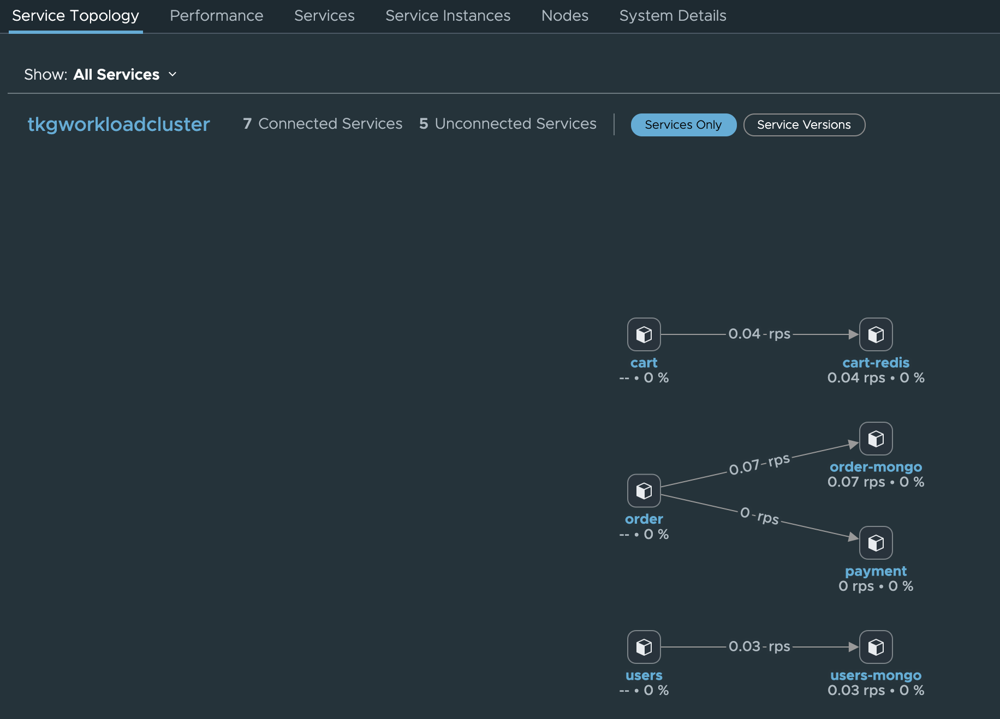
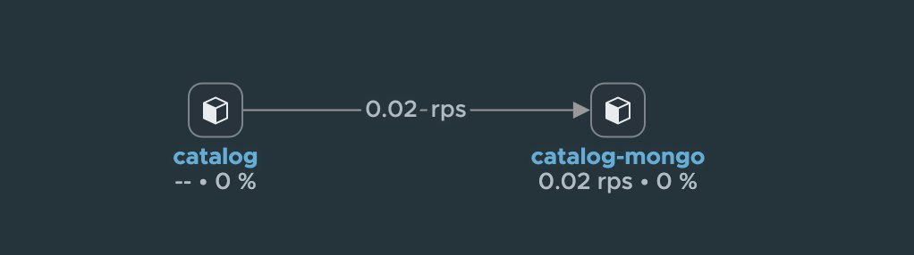
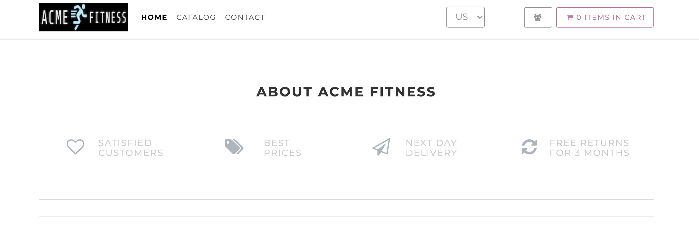

#### Lab 3 - Deploy the Acme Fitness Application

In this lab you will deploy the polyglot Acme Fitness application on both EKS and AKS clusters, acme fitness application is designed and developed using microservices architecture standard.

##### Objective and Tasks

In this lab, you will perform the following tasks:

* Deploy the first part of the Acme Fitness application on an AKS Cluster
* Deploy the second part of the Acme Fitness application on an EKS Cluster
* Validate Changes on the TSM GUI
* Validate Acme Fitness Application UI

<ins>**Task 1: Deploy the first part of the Acme Fitness Application on an AKS cluster**</ins>

In this Task, you will be deploying first part of the Acme Fitness application on an AKS cluster


* Open the acme_fitness_demo repository content and just glance over it
```editor:open-file
file: acme_fitness_demo/README.md
```

* Run the following command to change the context to an AKS cluster.
  ```execute-1
  kubectl config use-context $AKS_CL_CONTEXT
  ```

* Create a namespace with name `acme`
```execute-1
kubectl create ns acme
```

* Validate the istio-injection label on the newly created namespace.
```execute-1
kubectl describe ns acme
```

> Note: istio-injection should be enabled. You do not need to take any action for this as it’s being done by TSM.

* Create the required secrets by running the following command.
```execute-1
kubectl apply -f acme_fitness_demo/kubernetes-manifests/secrets.yaml -n acme
```

* Create the ingress gateway resource by running the following command.
```execute-1
kubectl apply -f acme_fitness_demo/istio-manifests/gateway.yaml -n acme
```

* Open the file to edit the value of `CATALOG_HOST` env variable
```editor:select-matching-text
file: acme_fitness_demo/kubernetes-manifests/acme_fitness_cluster1.yaml
text: "catalog.acme.com"
```
* Update the value of `CATALOG_HOST`
```editor:replace-text-selection
file: acme_fitness_demo/kubernetes-manifests/acme_fitness_cluster1.yaml
text: catalog.{{ session_namespace }}.{{ ENV_MAIN_DOMAIN_NAME }}
```

* Apply the edited file to create other resources by running the below command.
```execute-1
kubectl apply -f acme_fitness_demo/kubernetes-manifests/acme_fitness_cluster1.yaml -n acme
```

* Validate the created resources and ensure that all pods are in running state.
```execute-1
kubectl get pod -n acme
```


<ins>**Task 2: Deploy the second part of the Acme Fitness Application on an EKS Cluster**</ins>

In this Task, you will be deploying the second of the Acme Fitness application on an EKS cluster.

* Run the following command to update the EKS cluster context.
```execute-1
kubectl config use-context $EKS_CL_CONTEXT
```
* Create a namespace with name acme.
```execute-1
kubectl create ns acme
```
* Validate the `istio-injection` label on the newly created namespace.
```execute-1
kubectl describe ns acme
```
> Note: istio-injection should be enabled. You do not need to take any action for this as it’s being done by TSM.

* Create the required secrets for acme fitness app.
```execute-1
kubectl apply -f acme_fitness_demo/kubernetes-manifests/secrets.yaml -n acme
```
* Create the ingress gateway resource by running the following command.
```execute-1
kubectl apply -f acme_fitness_demo/istio-manifests/gateway.yaml -n acme
```

* Apply the yaml file to create other resources by running the following command.
```execute-1
kubectl apply -f acme_fitness_demo/kubernetes-manifests/acme_fitness_cluster2.yaml -n acme
```
* Validate the created resources and ensure that all pods are in running state.
```execute-1
kubectl get po -n acme
```


<ins>**Task 3: Validate Changes on the TSM UI**</ins>

In this task you will validate the application services deployed on clusters on the TSM UI.

* Login to the TSM UI
```dashboard:open-url
url: https://prod-2.nsxservicemesh.vmware.com/home
```

* Click **Home** option at the upper left corner and click **Cluster Overview**

* Look for your clusters and click on it (one at a time).

* Under Service Topology tab, you will notice the services graph. You might need to wait for few mins before you can see the graph.


* Similarly validate the services graph on second cluster.



<ins>**Task 4: Validate Acme Fitness Application UI**</ins>

In this task, you will be validating the deployed application UI and understand the need of TSM Global Namespaces.


* Switch to the AKS Cluster context
```execute-1
kubectl config use-context $AKS_CL_CONTEXT
```
* Get the list of Kubernetes services running on `istio-system` namespace on an AKS cluster. Note down the External IP address of **istio-ingresssgateway** service.
```execute-1
kubectl get services istio-ingressgateway --namespace istio-system --output 'jsonpath={.status.loadBalancer.ingress[0].ip}'
```

* Open a browser and browse the `http://<IP Address from previous command>`{{COPY}}

* You will get see Acme Fitness application UI is available.


* Try clicking **CATALOG** tab on the UI and you will notice that there are no products shown. This is because the catalog service is running on another Kubernetes cluster (in this case it’s EKS) and there is no connectivity between them yet. In `Global Namespace` lab, you will be creating a TSM Global Namespace and map the services to view the products on the `catalog` tab.
