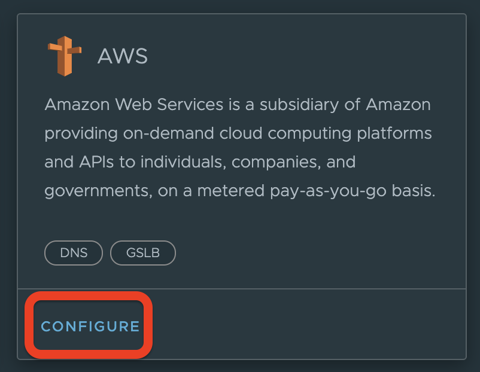
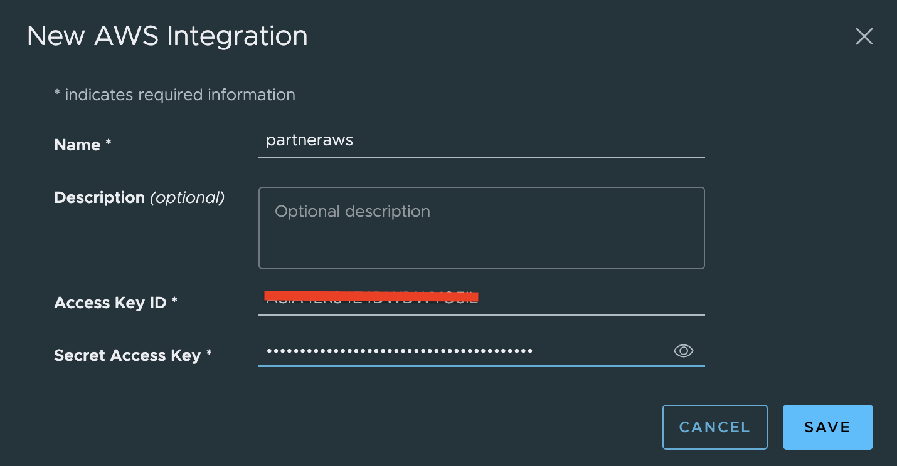
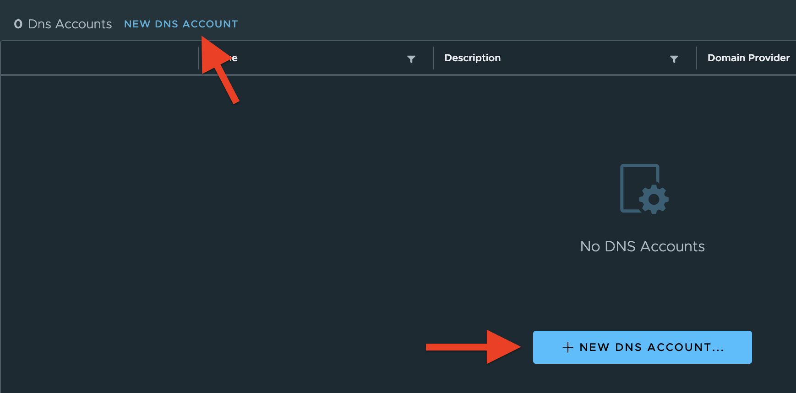
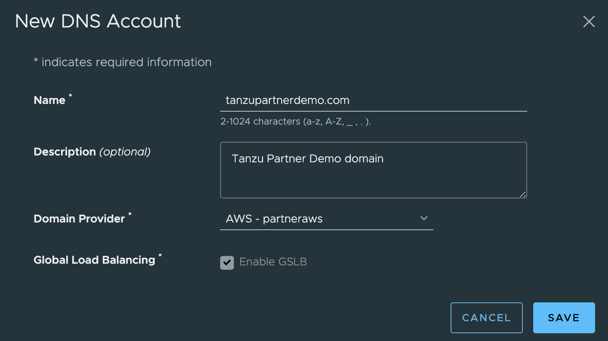

This is an **`information only`** lab. Below are one time activities and they are already completed by workshop admin. If you are interested, feel free to read through the steps to understand TSM integration with an AWS account. 

#### Lab 4 - Integrate TSM with AWS account for DNS and GSLB configuration

In this lab, you will integrate TSM with an AWS account for DNS and GSLB services.

##### Objective and Tasks   

In this lab, you will perform the following tasks: 

* Configure an AWS account
* Add a New DNS Account

<ins> **Task 1: Configure an AWS Account** </ins>

* Login to the TSM UI

* On the left navigation menu, Click **Tanzu Admin -\> Integrations**

* You will see the AWS tile, click **Configure** option

* It will open a form. Fill the details and click **Save.**

 
<ins>**Task 2: Add a New DNS Account**</ins>

* Login to the TSM UI

* On the left navigation menu, Click **Tanzu Admin -\> DNS & Domains**

* Click on **New DNS Account** option

 
> Note: If you are adding a first DNS, you can click on either of the options. However, if one or more DNS account already exists, you will only see the option on the top.

* After clicking on the **New DNS Account**, you need to fill the required details.

