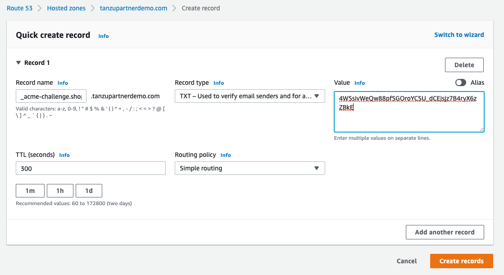

This is an **`information only`** lab. Below are one time activities and they are already completed by workshop admin. If you are interested, feel free to read through the steps to understand certification creation method. 

#### Lab 5 - Management of Certificates used by Tanzu Service Mesh

In this lab you will create a certificate for the shopping public service using let’s encrypt.

##### Objective and Tasks   

In this lab, you will perform the following tasks: 

* Creating a certificate using let’s encrypt

* Add a Certificate to the TSM

<ins>**Task 1: Creating a certificate using Let’s Encrypt**</ins>

In this task, you will create a certificate.
* Run the below command to create a certificate for **shopping.tanzupartnerdemo.com** domain.

> $ certonly --manual --preferred-challenges=dns --email=**\<valid email\>** --agree-tos -d shopping.tanzupartnerdemo.com --config-dir=./ --work-dir=./ --logs-dir=./

> Note: Provide a valid email address before running the command.

* It will ask you to create a DNS TXT record. In this case, It is under Route53.
    

* Follow the instructions displayed on the console before pressing **enter** to **continue**.

* Once the certificate is created successfully, you will see the different files and folders created by certbot command.

* Certificate data, key etc. are stored under the live directory. Make a note of this location as this is required during certificate addition on the TSM.

> **❯ ls -l live/shopping.tanzupartnerdemo.com**
> 
> total 8
> 
> \-rw-r--r-- 1 tripathid staff 692 Feb 28 12:55 README
> 
> lrwxr-xr-x 1 tripathid staff 53 Feb 28 12:55 cert.pem -\>
> ../../archive/shopping.tanzupartnerdemo.com/cert1.pem
> 
> lrwxr-xr-x 1 tripathid staff 54 Feb 28 12:55 chain.pem -\>
> ../../archive/shopping.tanzupartnerdemo.com/chain1.pem
> 
> lrwxr-xr-x 1 tripathid staff 58 Feb 28 12:55 fullchain.pem -\>
> ../../archive/shopping.tanzupartnerdemo.com/fullchain1.pem
> 
> lrwxr-xr-x 1 tripathid staff 56 Feb 28 12:55 privkey.pem -\>
> ../../archive/shopping.tanzupartnerdemo.com/privkey1.pem

<ins>**Task 2: Add a Certificate to the TSM**</ins>

In this task, you will be adding the newly created certificate (on the Task 1) to the TSM UI. Later, this certificate will be used during GNS creation for exposing public service over https.

* Login to the TSM UI

* From the left navigation menu, Click **Tanzu Admin** -\> **Keys & Certificates**

* Click **NEW CERTIFICATE** and fill the details then Click **Save**

> Note:
> 
> Name: Name of the certificate
> 
> Description (Optional): e.g., Tanzu Service Mesh Demo
> 
> Certificate Details: Select the files from the location noted under
> Task 1. **Ensure that you select full chain pem file under Certificate
> Chain.**

* Once the certificate is added successfully, you can view it from the
    TSM UI.

