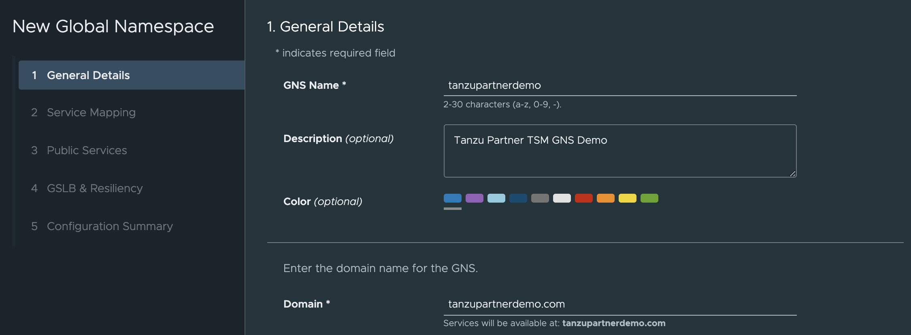
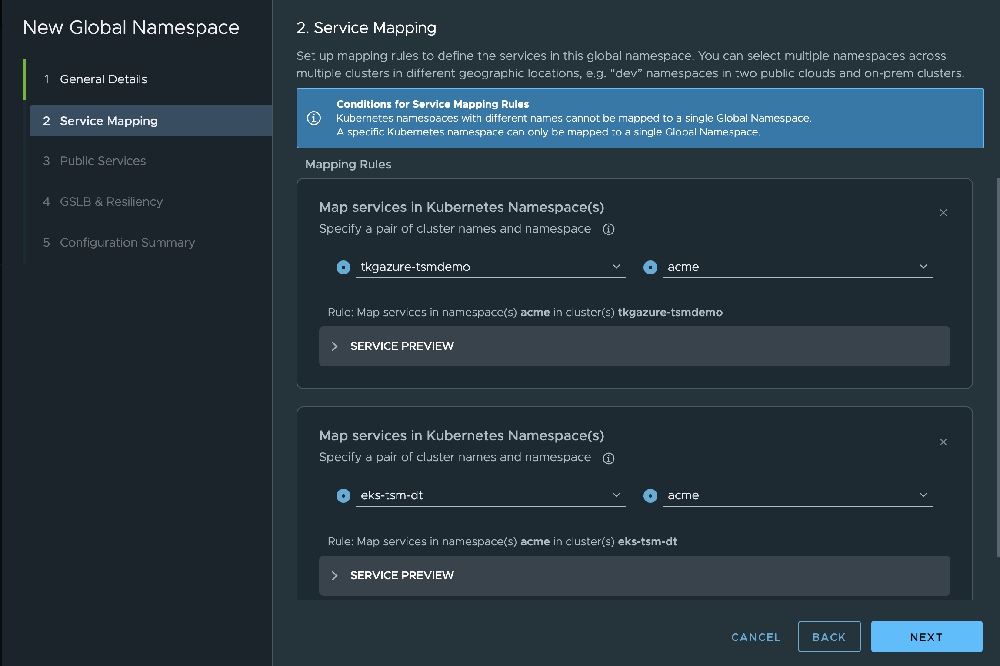
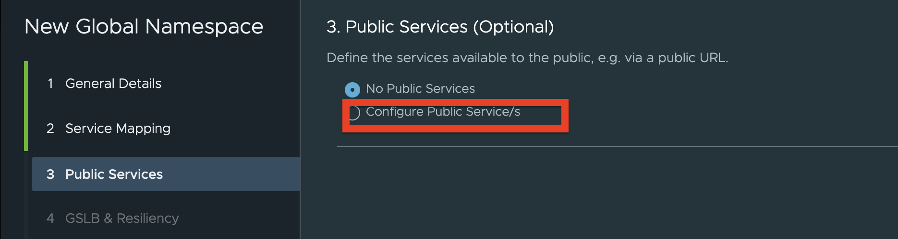
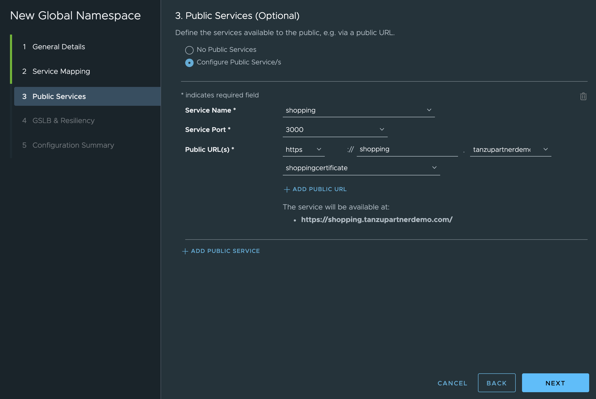
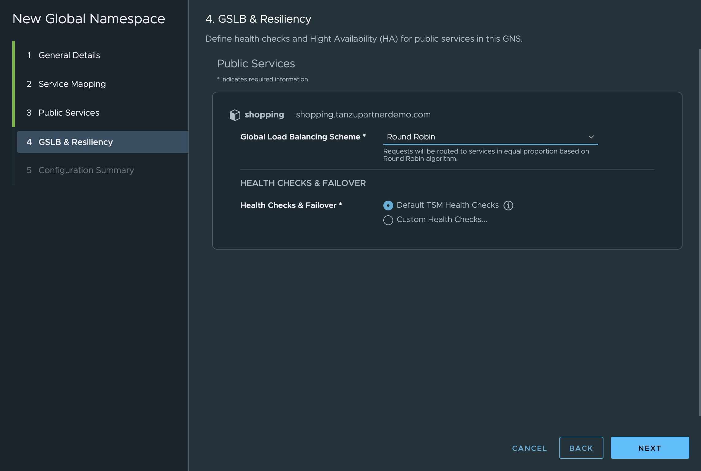
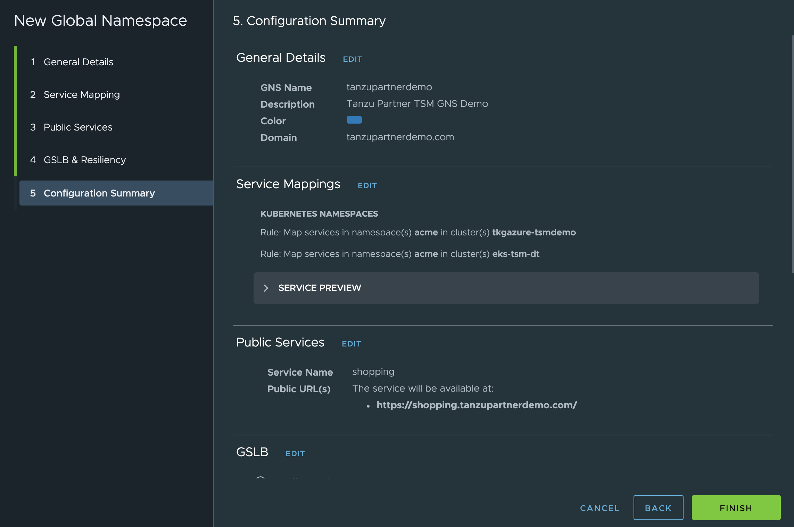
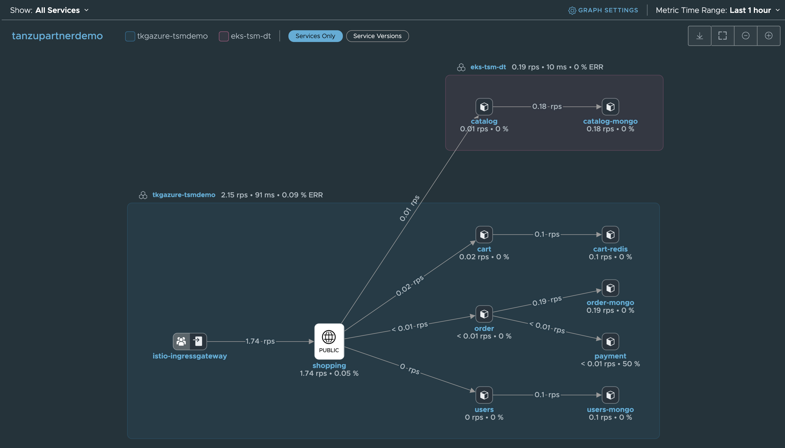

#### Lab 6 – Global Namespaces

In this lab you will create a Global Namespace. Global Namespace (GNS) maps the services running across different Kubernetes cluster and make them available using `virtual service` on the clusters. To know more about GNS, refer the below url.
```dashboard:open-url
url: https://docs.vmware.com/en/VMware-Tanzu-Service-Mesh/services/concepts-guide/GUID-9E3F1F90-4310-415B-98C8-C06E59B8A5EE.html
```


##### Objective and Tasks   

In this lab, you will perform the following task: 

* Create a Global Namespace


<ins>**Task 1: Create a Global Namespace (GNS)**</ins>  

In this task, you will create a GNS and maps the acme fitness app services running on the acme namespace in an AKS and EKS clusters.

* Login to the TSM console.
```dashboard:open-url
url: https://prod-2.nsxservicemesh.vmware.com/home
```

* Click **NEW WORKFLOW** option on the left upper corner of the screen and click **New Global Namespace…**

* Under General Details section, provide a unique GNS Name, description (optional) and domain name. Click **Next**.


> Note: Use the below parameters 
> 
> \-GNS Name: **`{{ session_namespace }}`{{copy}}**
> 
> \-Description: **`Tanzu Partner TSM GNS Demo`{{copy}}**
> 
> \-Domain: **`{{ session_namespace }}.{{ ENV_MAIN_DOMAIN_NAME }}`{{copy}}**
> 
> Cluster Names: **`eks-{{ session_namespace }}`{{copy}}** and **`aks-{{ session_namespace }}`{{copy}}**

* This is the important section. Here, you need to add a service mapping rule under **Mapping Rules**. Select your cluster name from the dropdown list and then choose a correct namespace where application is deployed. Similarly, for adding another cluster service in the service mapping rule, click **+ Add Service Mapping** and do the same for another cluster.

 
> Note:
> In this workshop, namespace is `acme`
> Order for cluster selection is not important. You need to have same namespace in both the cluster. Services running on different namespace cannot be mapped.

* Click **Next**

* Select **Configure Public Service/s** under the **Public Services** section. Click **Next**.

 
> Note: You are selecting **Configure Public Service** option because you will be accessing the shopping service from an internet.

* Fill the required details like service name, etc.
 
 
> Note:
> 
> \-Service Name: **`shopping`{{copy}}**
> 
> \-Service Port: **This will be populated automatically**. Do not make any change.
> 
> \-Public URL(s): select **`https`**, give a subdomain name as **`{{ session_namespace }}`{{copy}}**
> and select the domain **`{{ session_namespace }}.{{ ENV_MAIN_DOMAIN_NAME }}`** from the drop-down list. Finally, select your subdomain certificate from the dropdown list.
> 
* Run the below command to get a certificate name that you need to select:
```execute-1
echo $ACME_CERT_NAME
```
* Click **Next**.

* Leave the selections as it is and click **Next**.


* Review the Summary and click **Finish**.


* Wait until GNS status turned **`Healthy`**

* Once GNS status is **`Healthy`**, you will notice that there are additional virtual services added to both clusters. Run the below command on both clusters to view the virtual service.
* Switch to the EKS cluster context
```execute-1
kubectl config use-context $EKS_CL_CONTEXT
```
* Validate virtual services created on an EKS Cluster
```execute-1
kubectl get vs -A
```
* Now, switch to the AKS cluster context
```execute-1
kubectl config use-context $AKS_CL_CONTEXT
```
* Validate virtual services created on an AKS cluster
```execute-1
kubectl get vs -A
```

* Try accessing the shopping public service URL. You will notice that the service is available on `https` with a valid certificate.
```dashboard:open-url
url: https://{{ session_namespace }}.{{ session_namespace }}.{{ ENV_MAIN_DOMAIN_NAME }}
```
* Click **`CATALOG`** tab on the **`Acme Fitness`** UI and you will now see the products listed.

* Validate the service graph by going back to the TSM UI. Click `Home` -\> **`GNS Overview`**. Click on the **`{{ session_namespace }}`** GNS that you created, and you will see the service graph.
> Note: In your case, service graph might look different as it changes based on the services connections.
