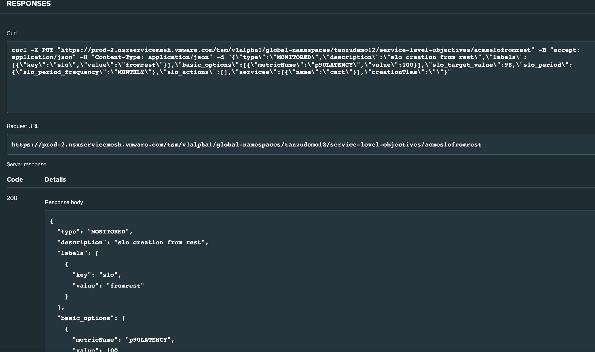

#### Lab 7 – Policy Management

In this lab you will learn about policy management in the Tanzu Service Mesh.

##### Objective and Tasks   

In this lab, you will perform the following tasks: 

* Add a new Service Level Objectives (SLO) Policy using TSM UI
* Validating SLO Policy
* Add a new SLO Policy using and interactive **API Explorer**
* Add a new Autoscaling Policy
* Testing an Autoscaling Policy

<ins> **Task 1: Add a new SLO Policy using TSM UI** </ins>

In this task, you will be creating a **`Monitored SLO policy`** that is GNS scoped. SLO describes the high-level objective for acceptable operation and health of one or more services over a length of time.

* Login to the TSM console.
```dashboard:open-url
url: https://prod-2.nsxservicemesh.vmware.com/home
```

* From the left navigation pane, Click **Policies -\> SLO’s**

* Click **+ Add NEW** to add new SLO policy


* Select **Monitored SLO** and click **OK**

* Fill up the details in the **Definition** section and click **Next**

 
> Note:
> 
> \-SLO Name `{{ session_namespace }}-monslo`{{copy}}
> 
> \-Select Policy Scope as `GNS Policy` and then select a GNS `{{ session_namespace }}` from the drop down.
> 
> \-Define the `Service Level Indicators` value as per screenshot: E.g., Values defined in the above screenshot
> means, `90th percentile latency` (the latencies for more than `90 percent`
> of the requests) must be below `120 ms`.
> 
> \-Define `Service Level Objective` as `99%` and review the `Estimated Monthly Error Budget`
> per month

* Select a `service` from the drop down list. In this case, **shopping**


* Review the summary and click **Save**.
* SLO policy is successfully created.

<ins> **Task 2: Validating SLO Policy** </ins>

In this task, you will be validating the newly created SLO in Task 1.
* Go back to the TSM UI
* Click `Policies` -> `SLOs`. It will list all the available SLO policies.
* Click `GNS` dropdown and select `{{ session_namespace }}` to view the SLO created by you.
* It will display your SLO policy, Click on it and validate the graph under `SLO Status` tab.

<ins> **Task 3: Add a new SLO Policy using API Explorer** </ins>

In this task you will be creating an SLO policy using TSM API with the help of **API Explorer** for a `cart` service.

* Login to the TSM UI

* On the bottom bar of the Tanzu Service Mesh Console UI, toward the right, click **API Explorer**.

* On the **REST HTTP** tab, scroll down to the **GNS Service Level Objective** section to see the API endpoints for SLO. Ignore if you see `v1alpha1`.

* Expand `PUT /v1alpha1/global-namespaces/{gnsId}/service-level-objectives/{sloId}` to create an SLO.
* Click `TRY IT OUT`

* Provide the following parameters:

> gnsId: `{{ session_namespace }}`{{copy}}
> 
> sloId: `{{ session_namespace }}-slofromapi`{{copy}}
> 
> Request Body: Below is the request body for creating a monitored SLO.
> 

{
  "type": "MONITORED",
  "description": "slo creation using api explorer",
  "labels": [
    {
      "key": "slo",
      "value": "fromrest"
    }
  ],
  "basic_options": [
    {
      "metricName": "p90LATENCY",
      "value": 100
    }
  ],
  "slo_target_value": 98,
  "slo_period": {
    "slo_period_frequency": "MONTHLY"
  },
  "slo_actions": [],
  "services": [
    {
      "name": "cart"
    }
  ],
  "creationTime": ""
}

* After updating the parameters, click **Execute** to send the PUT request.


* SLO policy is successfully created. Click on `Policies` -> `SLOs` and look for the newly created SLO policy.
  

<ins> **Task 4: Add a new Autoscaling Policy** </ins>

In this task, you will be creating an autoscaling policy. There are different methods to create autoscaling policies like TSM UI, API
Explore and by applying CRD. In this task, you will be using CRD to create an autoscaling policy.

There are two types of autoscaling policies, **Efficiency** and **Monitoring**. In this task, you will work with **Efficiency** mode
autoscaling policy as it supports both scale up and scale down of instances.

* Switch to the AKS Cluster Context.
```execute-1
kubectl config use-context $AKS_CL_CONTEXT
```
* Validate the `shopping` service autoscaling definition file
```editor:open-file
file: /home/eduk8s/shopping-asd.yaml
```
* Apply the autoscaling definition file
```execute-1
kubectl apply -f shopping-asd.yaml
```

* You can validate the autoscaling policy using TSM UI. 
  * Go back to TSM UI
  * Click `Policies` -> `Autoscaling` and look for the 
  

To know more about parameters used in the CRD, refer this doc
[here](https://docs.vmware.com/en/VMware-Tanzu-Service-Mesh/services/service-autoscaling-with-tsm-user-guide/GUID-EA4CF02D-CD84-40FA-8600-C2A08557D906.html)

<ins>**Task 5: Testing an Autoscaling Policy**</ins>

In this task, you will be testing the autoscaling policy created above.

* Go back to the TSM UI

* As we have created Org scoped policy above, you will be validating the policy at a cluster level. Click **Home** from the top left on TSM UI and click **Cluster Overview** tab.


* Look for your **`aks-{{ session_namespace }}`** cluster where you created the autoscaling policy and select **Open Detail Page**


* Click on **Services** tab and select then click on the **shopping** service


* It will open the **shopping** service summary page, click **Performance** tab.


* Since there is not much load on the shopping service, so you can see the CPU Usage is very low in the above screenshot.

* Now, generate load on the **shopping** service to see the autoscaling. Run the below command to create a load generator pod.
    * Switch to the AKS Cluster Context
    ```execute-1
    kubectl config use-context $AKS_CL_CONTEXT
    ```
    * Run the load generator pod
    ```execute-1
    kubectl apply -f https://gist.githubusercontent.com/dineshtripathi30/1c53811d176f786452b0f5eb008206c3/raw/f2cc9f4128634667a839d69fc3572f8ee6d0fdc2/shopping-load-gen.yaml
    ```

* Validate the newly created pod’s in a loadgen namespace by running the following command.
```execute-1
kubectl get po -n loadgen
```

* After running the load generator, you can see the CPU usage is going high. Refer the below screenshot.


* After waiting for few mins, Validate the **definition** resource created in the **acme** namespace. It shows that the deployment was autoscaled to more than one pod. You need to look for `CURRENT` and `DESIRED` values.
```execute-1
kubectl get definition -n acme
```

* Validate the **shopping** deployment and number of pods in it, you can see the 5 pods running.
```execute-1
kubectl get deploy shopping -n acme
```


* Now, remove the load generator and it should scale down the number of pods as per definition file.
```execute-1
kubectl delete -f https://gist.githubusercontent.com/dineshtripathi30/1c53811d176f786452b0f5eb008206c3/raw/f2cc9f4128634667a839d69fc3572f8ee6d0fdc2/shopping-load-gen.yaml
```

* Wait for the time specified for **windowSeconds** parameter in the **definition** resource and notice the scale down of pods. In this case it is `100`
* Run the following command to view the `DESIRED` capacity to `1`
```execute-1
kubectl get definition -n acme
```

* You can also see the CPUMillicore usage is going down after load generator removal and the number of pods came down to 1.


* You have successfully completed the testing of autoscaling policy. 


<ins>**Task 6: Delete Autoscaling Policy**</ins>

In this task, you will remove the autoscaling policies created above.
* Delete an autoscaling policy
```execute-1
kubectl delete -f ~/shopping-asd.yaml
```