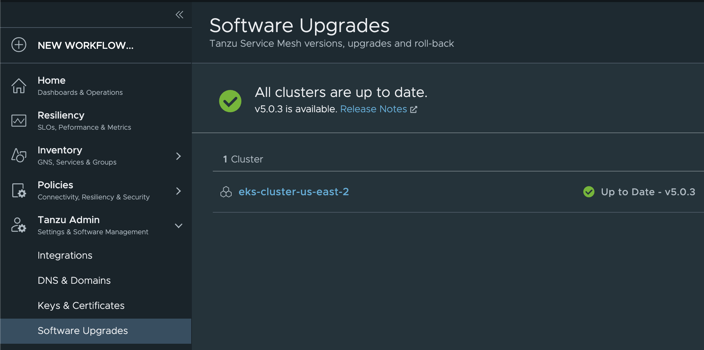

This is an `information only` lab. Below are one time activities you may not be able to complete because of no upgrade available.
#### Lab 8 – Managing Software Upgrades

In this lab, you will perform TSM data plane components upgrade. Upgrading TSM data plane components is very easy and straightforward process that you can follow from the TSM UI. 

##### Objective and Tasks

In this lab, you will perform the following task.

* Software Upgrades

<ins>**Task 1: Software Upgrades** </ins>

In this task, you will upgrade the TSM data plane components running on an AKS cluster.


* Refer the document below to know more about TSM upgrade
```dashboard:open-url
url: https://docs.vmware.com/en/VMware-Tanzu-Service-Mesh/services/using-tanzu-service-mesh-guide/GUID-25E04AE4-39AA-480F-8965-EBB9C2863D46.html
```
