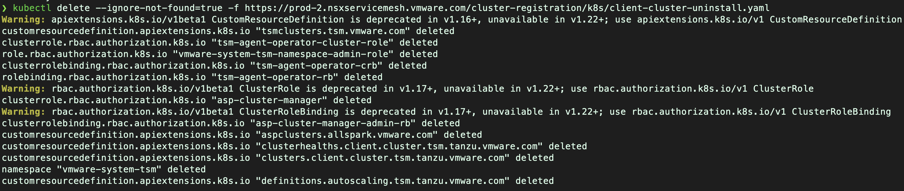

#### Lab 9 - Cleanup

Finally, let’s cleanup the resources that was created in earlier labs. This lab mainly include **deleting GNS** and **cluster offboarding** from TSM.

##### Objective and Tasks   

In this lab, you will perform the following tasks: 

* Delete a Global Namespace
* Clusters Offboarding

<ins>**Task 1: Delete a Global Namespace**</ins>

In this task, you will delete the global namespace that you created in Lab 6.

* Login to the TSM UI
* Click `HOME` from the left navigation menu
* Find your Global Namespace **`{{ session_namespace }}`**{{copy}} inside `GNS Overview` tab and Click on it
* Click option `MORE` and click on `Delete Global Namespace` option
* Click `Delete` to delete the global namespace.


<ins>**Task 2: Clusters Offboarding**</ins>

In this task, you will remove your onboarded cluster from the TSM.
#### Offboarding First Cluster
* Login to the TSM UI

* From the left navigation menu, click **Home** then click on the **Cluster Overview**

* Look for your clusters and then click on **three dots**. To know the name of your first cluster, run the below command.
```execute-1
 echo -e "$AKS_CL_NAME"
```


* You will be prompted to select the option, click **Remove Cluster…**
    > You will be prompted to confirm, Click **REMOVE**
    > 
    > Cluster removal task will be triggered, you can monitor the progress
    > on TSM GUI and note the `url` displayed at the end.
    > 

* At the end, it will prompt you to run the kubectl command on a cluster to remove the TSM dependencies. Copy and run the command on your first cluster.
  * Connect to an AKS Cluster.
    ```execute-1
    kubectl config use-context $AKS_CL_CONTEXT
    ```
  * Run the command copied from previous step and wait for it's completion.

#### Offboarding Second Cluster
* From the left navigation menu, click **Home** then click on the **Cluster Overview**

* Look for your clusters and then click on **three dots**. To know the name of your first cluster, run the below command.
```execute-1
 echo -e "$EKS_CL_NAME"
```
  * Connect to an EKS Cluster.
    ```execute-1
    kubectl config use-context $EKS_CL_CONTEXT
    ```
  * Run the command copied from previous step and wait for it's completion.

* You can see the different TSM dependent resources will be deleted.


* Finally, TSM created namespaces are removed from your cluster.

* Cleanup completed.