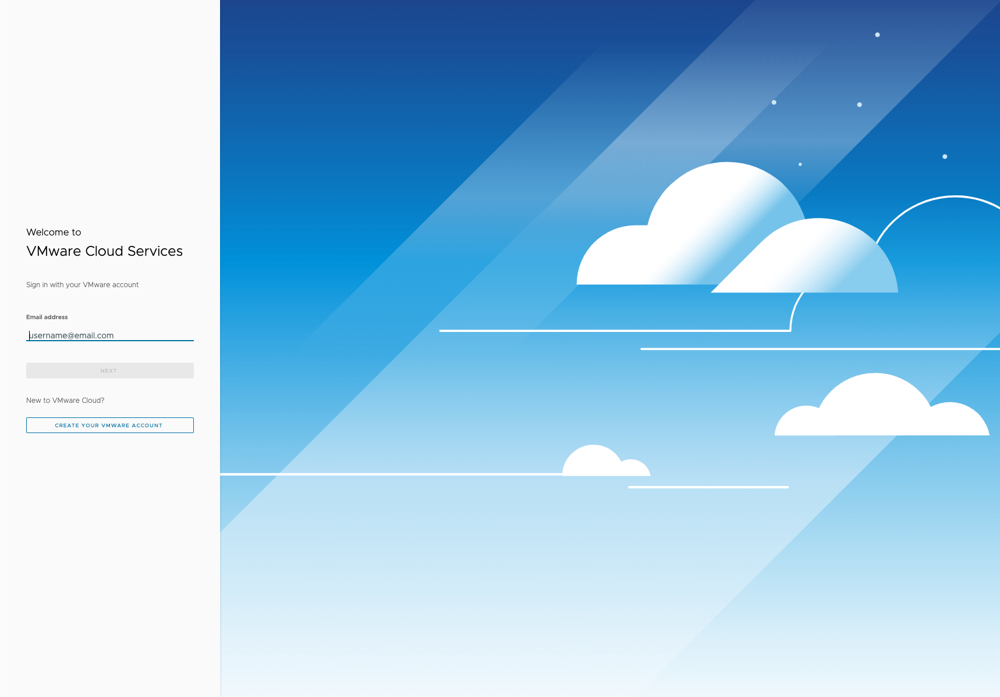
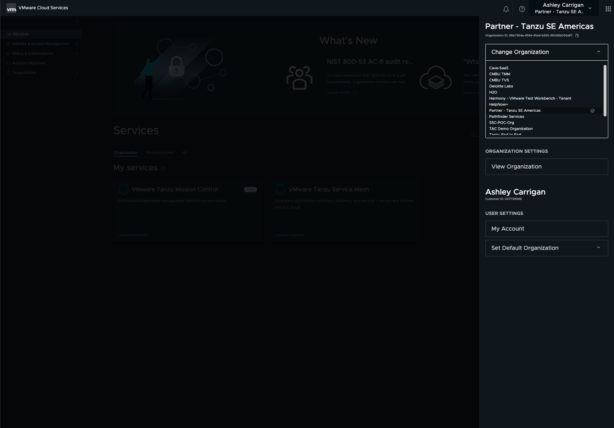
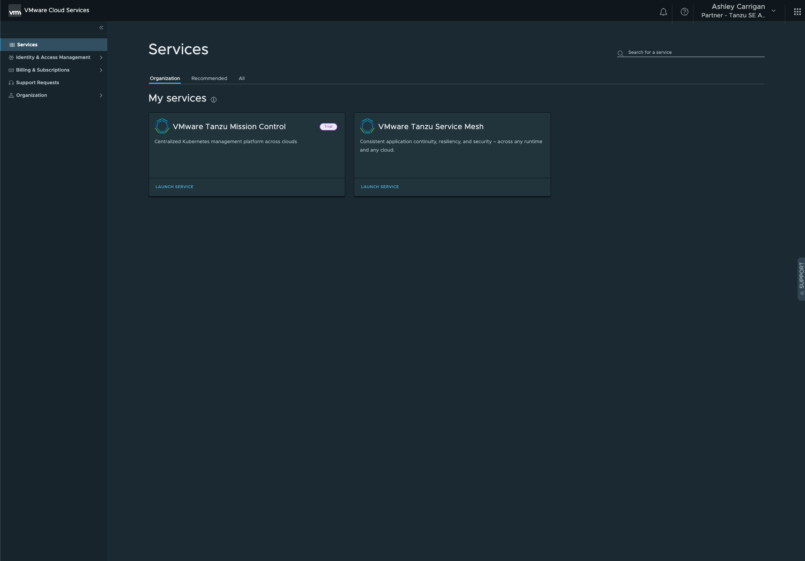
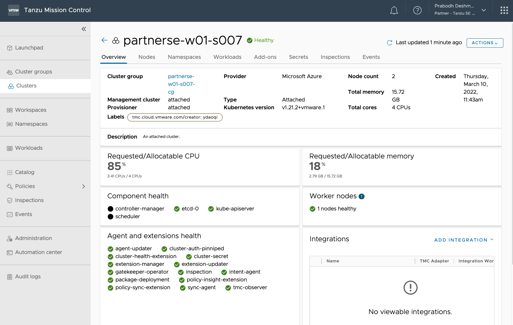
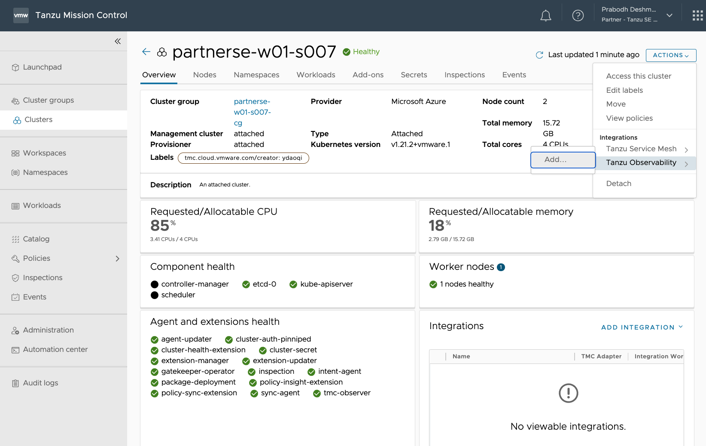
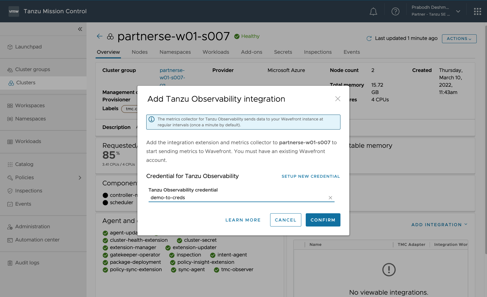
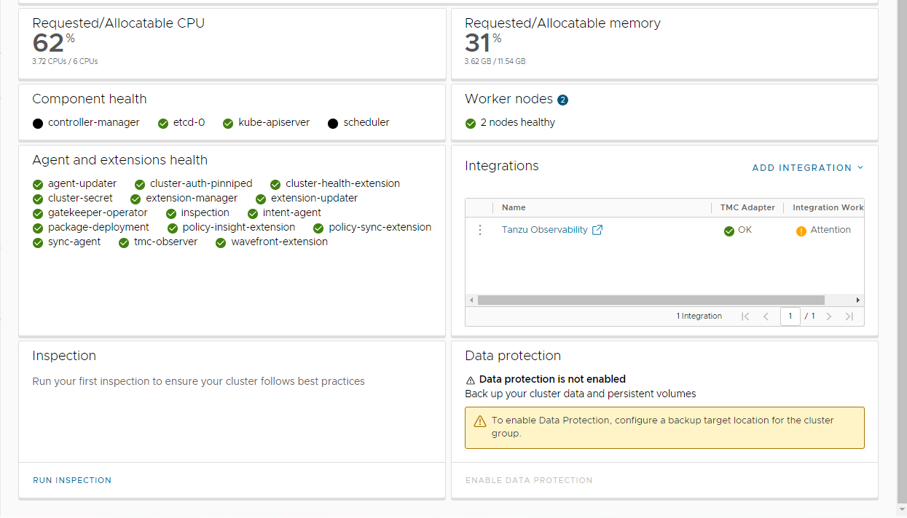
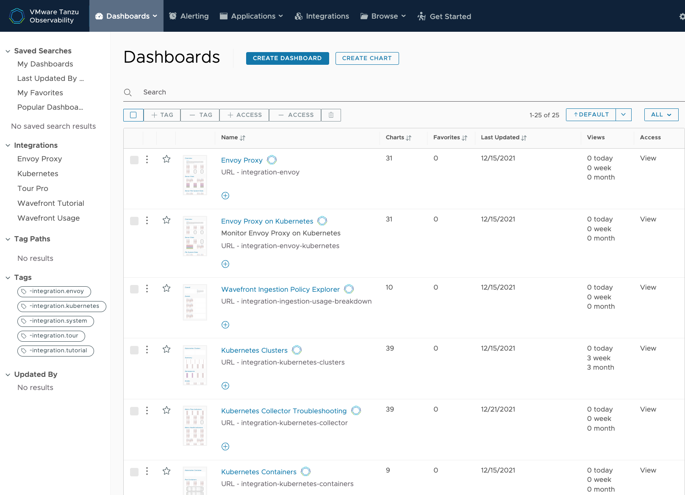
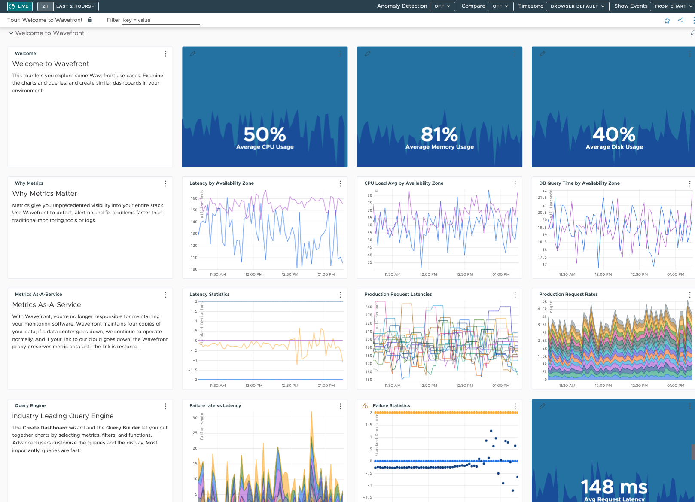

# Table of Contents

[Module 1: Connect to TO and Exploration](#module-1-connect-to-to-and-exploration)

[Objectives and Tasks](#objectives-and-tasks)

[Task 1: Connect to TO from TMC](#task-1-connect-to-to-from-tmc)

[Task 2: Explore out of the box dashboards and metrics](#task-2-explore-out-of-the-box-dashboards-and-metrics)

[Module 2: Full Stack Observability Dashboard](#module-2-full-stack-observability-dashboard)

[Objectives and Tasks](#objectives-and-tasks-1)

[Task 1: Spring Boot Starter integration via Micrometer](#task-1-spring-boot-starter-integration-via-micrometer)

[Task 2: Create and refine a full stack dashboard for the ACME Fitness application](#task-2-create-and-refine-a-full-stack-dashboard-for-the-acme-fitness-application)

[Task 3: Explore different team views of the dashboard – business, application, platform, infrastructure, SRE, UX, OS, VM, and hardware](#task-3-explore-different-team-views-of-the-dashboard-business-application-platform-infrastructure-sre-ux-os-vm-and-hardware)

[Module 3: Explore Integrations and Deep Dive on Kubernetes and Slack Integrations](#module-3-explore-integrations-and-deep-dive-on-kubernetes-and-slack-integrations)

[Objectives and Tasks](#objectives-and-tasks)

[Task 1: Explore some of TO’s integrations including database, webhook, ITSM, Prometheus, AWS, GCP, Azure, and vSphere](#task-1-explore-some-of-tos-integrations-including-database-webhook-itsm-prometheus-aws-gcp-azure-and-vsphere)

[Task 2: Explore Kubernetes integrations including clusters, nodes, pods, containers, and namespaces](#task-2-explore-kubernetes-integration-including-clusters-nodes-pods-containers-and-namespaces)

[Task 3: Explore ITSM integrations including webhooks to send alert notifications](#task-3-explore-itsm-integration-including-webhooks-to-send-alert-notifications)

[Module 4: Create Alerts](#module-4-explore-and-create-alerts)

[Objectives and Tasks](#objective-and-tasks-1)

[Task 1: Create actionable and informational alerts – 'what, when, who, why and activate'](#task-1-create-actionable-and-informational-alerts-what-when-who-why-and-activate)

[Task 2: Different alerting capabilities including splitting complex queries across multiple lines, links to runbooks, and links to dashboards](#task-2-different-alerting-capabilities-including-splitting-complex-queries-across-multiple-lines-links-to-runbooks-and-links-to-dashboards)

[Task 3: Fine tune alerts by building context and test results with AI/ML root cause analysis](#task-3-fine-tune-alerts-by-building-context-and-test-results-aiml-root-cause-analysis)

[Module 5: Explore Distributed Tracing Capabilities](#module-5-explore-distributed-tracing-capabilities)

[Objectives and Tasks](#objective-and-tasks-2)

[Task 1: Access distributed traces using the service dashboard traces and matching span](#task-1-access-distributed-traces-using-the-service-dashboard-traces-and-matching-span)

[Task 2: Use the trace service map and service inventory to identify service errors](#task-2-use-the-trace-service-map-and-service-inventory-to-identify-service-errors)

[Task 3: Drill down into error traces to find out the critical path breakdown and the source of error](#task-3-drill-down-into-error-traces-to-find-out-the-critical-path-breakdown-and-the-source-of-error)

[Module 6: TO Administration and Best Practices](#module-6-wavefront-administration-and-best-practices)

[Objectives and Tasks](#objectives)

[Section 1: TO Security](#section-1-wavefront-security)

[Section 2: Authorization and User Management](#section-2-authorization-and-user-management)

[Section 3: Authentication](#section-3-authentication)

[Section 4: Monitoring and Troubleshooting](#section-4-monitoring-and-troubleshooting)

[Section 5: Best Practices](#section-5-best-practices)

#### Module 1: Connect to TO and Exploration

In this lab, you will get started with Tanzu Observability and explore
out of the box dashboards and features.

##### Objectives and Tasks

1.  Connect to TO from TMC cluster

2.  Explore out of the box views, graphs, data, and features

##### Task 1: Connect to TO from TMC 

1. Log into VMware Cloud Services with your credentials: https://console.cloud.vmware.com/

2. Ensure that you are in the correct Organization ID titled, **Partner - Tanzu SE Americas**. If you are unsure which Organization you are in, click your user name in the top right hand corner. You will see a side panel open which will give you the option to **Change Organization**. Click on the carrot button next to **Change Organiztion** and scroll down to and select **Partner - Tanzu SE Americas**.

3. Under **Services -> Organization -> My services**, look for the **VMware Tanzu Mission Control** tile. Select **LAUNCH SERVICE**. 

4. Once inside the Tanzu Mission Control GUI, click on **Clusters** in the left hand side panel to view your existing clusters. Select the cluster that you created in TMC from the previous TKO Module (ex: "partnerse-w01-s00X").

5.  Click on the **Actions** button in the top right hand corner.

Click on **Integrations -> Tanzu Observability >** and select **Add...** from the side menu.

A wizard will open and ask for a Tanzu Observability account. Select the account that is available from the drop-down list. Click on the **CONFIRM** button.

This integrates Tanzu Observability with your Kubernetes cluster.

##### Task 2: Explore out of the box dashboards and metrics

Tanzu Observability includes curated dashboards for the open-source Prometheus and Grafana solutions. Take advantage of full-stack Kubernetes monitoring and smart out-of-the-box alerting. Ingest data from Kubernetes or choose from 250+ integrations including cloud (Amazon Web Services, Microsoft Azure, Google Cloud Platform), monitoring software, and so on. Use predefined dashboards, or clone and customize the predefined dashboards and alerts. You can also create your own dashboards or alerts by using the Wavefront Query Language or PromQL.

1. Log into Tanzu Observability inside the TMC GUI (within the appropriate Kubernetes cluster that you just added the TO integration to in Task 1) by clicking **Integrations -> Tanzu Observability** and entering the login data into the TO dashboard.

2. In the top menu of the VMware Tanzu Observability menu, select **Dashboards**, and look at the existing dashboards which come out of the box.

Click on the **Tour: Welcome to Wavefront** dashboard.  This tour lets you explore some Wavefront use cases. Examine the charts and queries, and create similar dashboards in your own environment.

Tanzu Observability creates these default views so that you can immediately start gaining value without having to create your own dashboards from scratch. These are great starting points; from here you can clone and customize them to meet your business's own unique needs.

#### Module 2: Full Stack Observability Dashboard

In this lab, you will see the Spring Boot Starter integration with Micrometer, and then create and explore a full stack observability dashboard for the ACME Fitness application.

##### Objectives and Tasks

1. Spring Boot Starter integration (start.spring.io) via Micrometer

2. Create and refine a full stack dashboard for the ACME Fitness application

3. Explore different team views of the dashboard - business, application, platform, infrastructure, SRE, UX, OS, VM, and hardware

##### Task 1: Spring Boot Starter integration via Micrometer

1. ...

##### Task 2: Create and refine a full stack dashboard for the ACME Fitness application

1. ...

##### Task 3: Explore different team views of the dashboard: business, application, platform, infrastructure, SRE, UX, OS, VM, and hardware

1. ...

# Module 3 – Explore Integrations and Deep Dive on Kubernetes and Slack Integrations

In this lab, you will explore the various types of integrations that you can have with Tanzu Observability and focus on
Kubernetes and Slack integrations.

## Objectives and Tasks

In this lab, you will perform the following tasks:

1.  Look at a few of the hundreds of integrations offered by TO

2.  Explore Kubernetes integrations including clusters, nodes, pods,
    containers, and namespaces

<!-- end list -->

5.  Explore Slack integrations including webhooks to send alert
    notifications

### Task 1: Explore some of TO’s integrations including database, webhook, ITSM, Prometheus, AWS, GCP, Azure, and vSphere

In this task, …….

### Task 2: Explore Kubernetes integrations including clusters, nodes, pods, containers, and namespaces

In this task, …….

### Task 3: Explore ITSM integrations including webhooks to send alert notifications

In this task, …….

### 

# Module 4 - Create Alerts

In this lab, you will see how alerting is a critical component of TO.
Better alerts translate to better results.

## Objectives and Tasks   

In this lab, you will perform the following tasks: 

1.  Create actionable and informational alerts – 'what, when, who, why
    and activate'

2.  Different alerting capabilities including splitting complex queries
    across multiple lines, links to runbooks, and links to dashboards

3.  Fine tune alerts by building context and test results and AI/ML root
    cause analysis

### 

### Task 1: Create actionable and informational alerts – 'what, when, who, why and activate'

In this task, …….

### Task 2: Different alerting capabilities including splitting complex queries across multiple lines, links to runbooks, and links to dashboards

In this task, ……. 

### Task 3: Fine tune alerts by building context and test results, AI/ML root cause analysis 

In this task, …….

### 

# Module 5 – Explore Distributed Tracing Capabilities

In this lab, you will explore distributed tracing capabilities using
service dashboards, traces, and spans.

## Objectives and Tasks   

In this lab, you will perform the following tasks: 

1.  Access distributed traces using the service dashboard, traces and
    matching spans

2.  Use the trace service map and service inventory to identify service
    errors

3.  Drill down into error traces to find out the critical path
    breakdown and the source of error

### Task 1: Access distributed traces using the service dashboard traces and matching span

In this task, …….

### Task 2: Use the trace service map and service inventory to identify service errors

In this task, …….

### 

### Task 3: Drill down into error traces to find out the critical path breakdown, and the source of error

In this task, …….

### 

# Module 6 – TO Administration and Best Practices

In this lab, you will understand what you can do as a Wavefront
administrator.

## Objectives and Tasks

In this lesson, you will learn about the following: 

1.  TO Security

2.  Authorization and User Management

3.  Authentication

4.  Monitoring & Troubleshooting

5.  Best Practices

### Section 1: Wavefront Security

In this task, …….

### Section 2: Authorization and User Management

In this task, …….

### 

### Section 3: Authentication

In this task, …….

### 

### Section 4: Monitoring and Troubleshooting

In this task, …….

### Section 5: Best Practices

In this task, …….

### 

###
