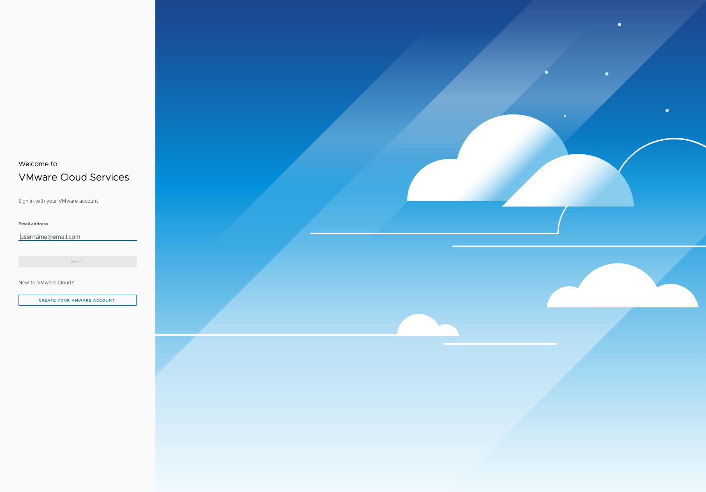
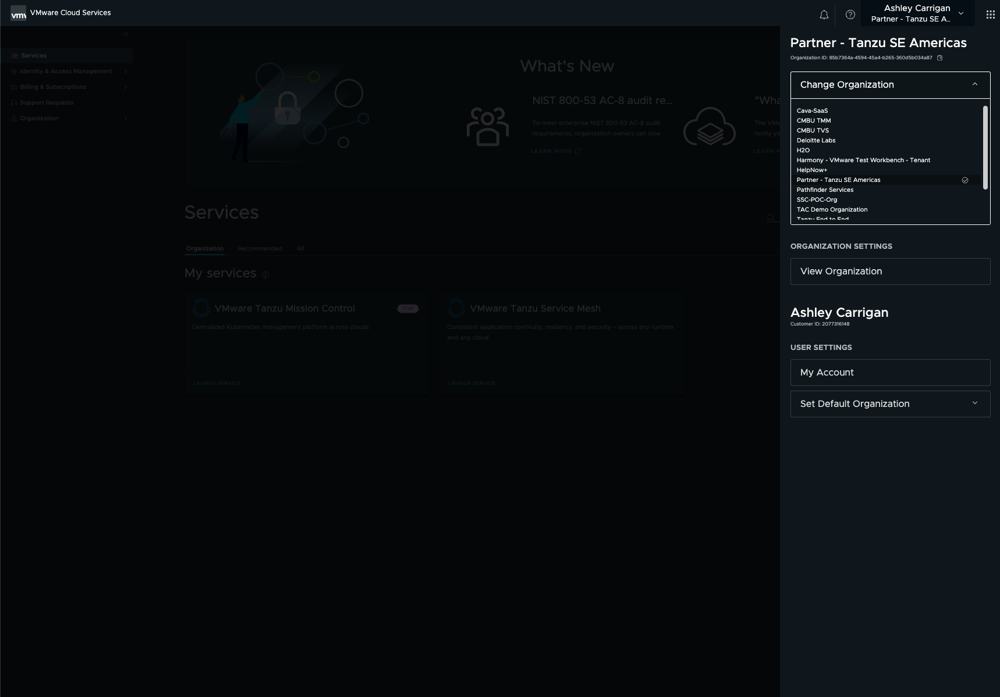
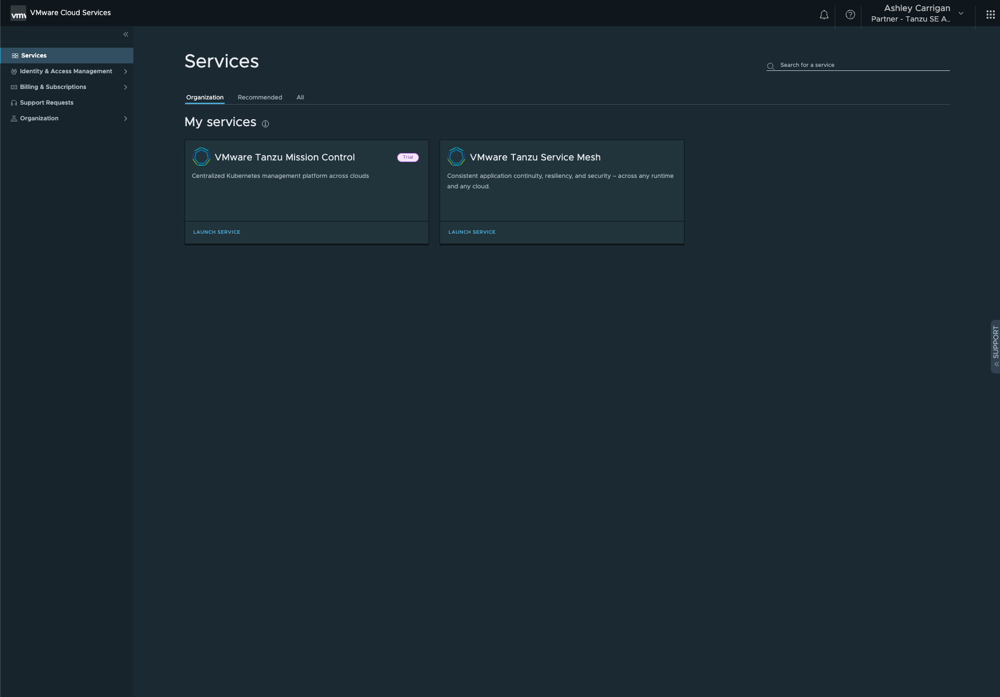
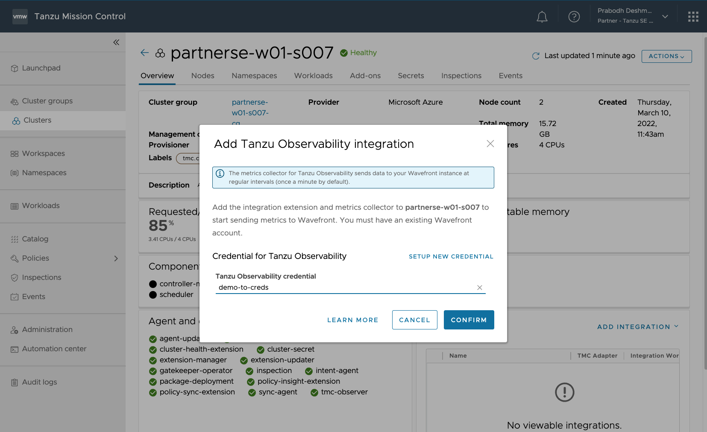
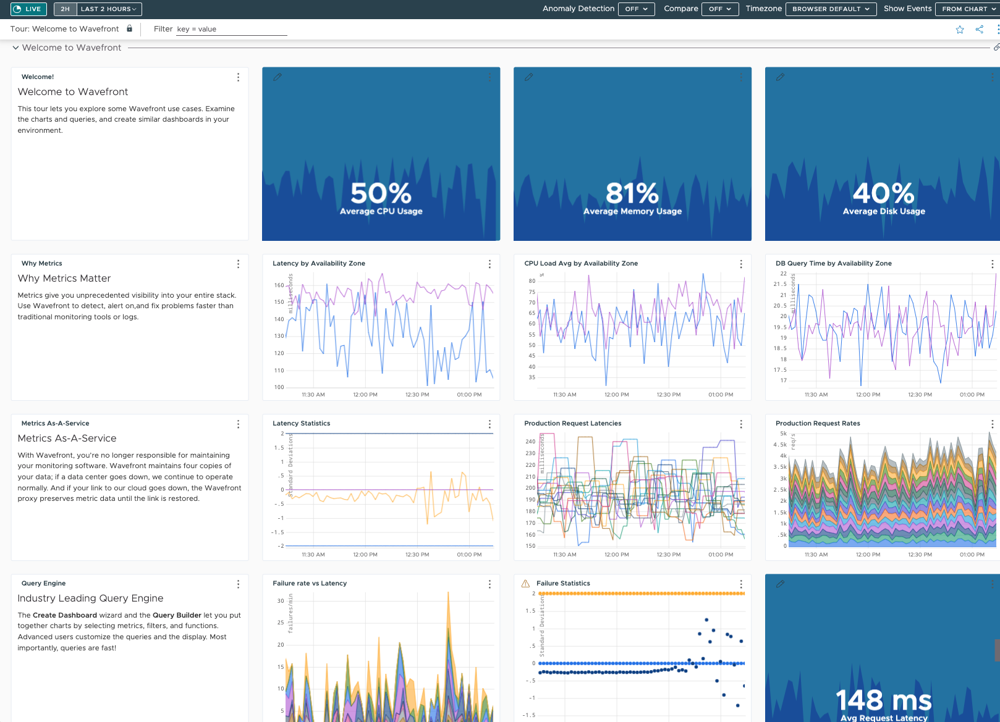

### Table of Contents

[Module 1: Connect to TO and Exploration](#module-1-connect-to-to-and-exploration)

[Objectives and Tasks](#objectives-and-tasks)

[Task 1: Connect to TO from TMC](#task-1-connect-to-to-from-tmc)

[Task 2: Explore out of the box dashboards and metrics](#task-2-explore-out-of-the-box-dashboards-and-metrics)

#### Module 1: Connect to TO and Exploration

In this lab, you will get started with Tanzu Observability and explore
out of the box dashboards and features.

##### Objectives and Tasks

1.  Connect to TO from TMC cluster

2.  Explore out of the box views, graphs, data, and features

##### Task 1: Connect to TO from TMC cluster

1. Log into VMware Cloud Services with your credentials: https://console.cloud.vmware.com/

2. Ensure that you are in the correct Organization ID titled, **INSERT-DEMO-ORG**. If you are unsure which Organization you are in, click your user name in the top right hand corner. You will see a side panel open which will give you the option to **Change Organization**. Click on the carrot button next to **Change Organiztion** and scroll down to and select **INSERT-DEMO-ORG**.

3. Under **Services -> Organization -> My services**, look for the **VMware Tanzu Mission Control** tile. Select **LAUNCH SERVICE**. 

4. Once inside the Tanzu Mission Control GUI, click on **Clusters** in the left hand side panel to view your existing clusters. Select the cluster that you created in TMC from the previous TKO Module (ex: "partnerse-w01-s00X").

5.  Click on the **Actions** button in the top right hand corner.

Click on **Integrations -> Tanzu Observability >** and select **Add...** from the side menu.

A wizard will open and ask for a Tanzu Observability account. Select the account that is available from the drop-down list. Click on the **CONFIRM** button.

This integrates Tanzu Observability with your Kubernetes cluster.

##### Task 2: Explore out of the box dashboards and metrics

Tanzu Observability includes curated dashboards for the open-source Prometheus and Grafana solutions. Take advantage of full-stack Kubernetes monitoring and smart out-of-the-box alerting. Ingest data from Kubernetes or choose from 250+ integrations including cloud (Amazon Web Services, Microsoft Azure, Google Cloud Platform), monitoring software, and so on. Use predefined dashboards, or clone and customize the predefined dashboards and alerts. You can also create your own dashboards or alerts by using the Wavefront Query Language or PromQL.

1. Log into Tanzu Observability inside the TMC GUI (within the appropriate Kubernetes cluster that you just added the TO integration to in Task 1) by clicking **Integrations -> Tanzu Observability** and entering the login data into the TO dashboard.

2. In the top menu of the VMware Tanzu Observability menu, select **Dashboards**, and look at the existing dashboards which come out of the box.

Click on the **Tour: Welcome to Wavefront** dashboard.  This tour lets you explore some Wavefront use cases. Examine the charts and queries, and create similar dashboards in your own environment.

Tanzu Observability creates these default views so that you can immediately start gaining value without having to create your own dashboards from scratch. These are great starting points; from here you can clone and customize them to meet your business's own unique needs.
