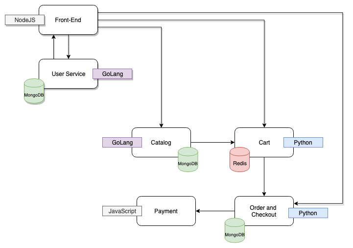

### Table of Contents

[Module 2: Deploy the ACME Fitness Application](#module-2-deploy-the-acme-fitness-application)

[Objectives and Tasks](#objectives-and-tasks)

[Task 1: Deploy the first part of the ACME Fitness application on an AKS cluster](#task-1-deploy-the-first-part-of-the-acme-fitness-application-on-an-aks-cluster)

[Task 2: Validate the ACME Fitness application URL](#task-2-validate-the-acme-fitness-application-url)

#### Module 2: Deploy the ACME Fitness Application

In this lab you will deploy the polyglot ACME Fitness application in AKS clusters that have been created for you ahead of this workshop. We are deploying this application to later integrate into your Tanzu Observability dashboard. 

The ACME Fitness application is designed and developed using the microservices architecture standard. It is comprised of 6 microservices and 4 datastores (1x Redis, 1x Postgres and 2x MongoDB):

* Frontend NodeJS

* Cart Python

* Catalog GoLang

* Orders and checkout Python

* User service GoLang

* Payment JS

Environment and integrations:

* Minikube (1x control-plane + 1x worker-node) with docker-engine (6CPU, 8GB RAM)

* Longboard tenant (TO free trial)

* Integrations: k8s, ISTIO -data-plane and and control-plane, Jaeger/distributed tracing

* Emulate user-traffic using Locust while kube-monkey would randomly introduce chaos in the ACME namespace causing stady state to deviate and trigger alerts

##### Objectives and Tasks

In this lab, you will perform the following tasks:

1. Deploy the first part of the ACME Fitness application on an AKS cluster
2. Validate the ACME Fitness application URL

##### Task 1: Deploy the first part of the ACME Fitness application on an AKS Cluster

These instructions will allow you to deploy and run the entire ACME Fitness application.



* Clone the repository.
```execute-1
git clone https://github.com/anilvmware/acmefitness.git
```
* Label the node with "apptype=acme".
```execute-1
  kubectl label node --all apptype=acme 
```

* Create a namespace with name `tko`.
```execute-1
kubectl create ns tko
```
* Navigate to acmefitness/kubernetes-manifests.
```execute-1
cd acmefitness/kubernetes-manifests
```

##### Task 2: Validate the ACME Fitness application URL


##### ACME FITNESS in K8s

We will create a polyglot demo application comprised of (presently) 6 microservices and 4 datastores.
The contents here are the necessary YAML files to deploy the ACME Fitness application in a Kubernetes cluster.

##### Datastore Dependent Services
This section covers the deployment of the datastore-dependent microservices. It is recommended to deploy these services first.

###### Cart Service
* Add a secret for the service to use in authenticating with the cache.
```execute-1
kubectl create secret generic cart-redis-pass --from-literal=password=passwd -n tko
```
* Deploy the Redis cache and cart service.
```execute-1
kubectl apply -f cart-redis-total.yaml -n tko
```
```execute-1
kubectl apply -f cart-total.yaml -n tko
```
###### Catalog Service

* Add a secret for the service to use in authenticating with the cache.
```execute-1
kubectl create secret generic catalog-mongo-pass --from-literal=password=passwd -n tko
```
* Run the following command to initialize the catalog database with items.
```execute-1
kubectl create -f catalog-db-initdb-configmap.yaml -n tko
```
* Deploy the Mongo instance and catalog service.
```execute-1
kubectl apply -f catalog-db-total.yaml -n tko
```
```execute-1
kubectl apply -f catalog-total.yaml -n tko
```
###### Payment Service
* The payment service does not have an associated datastore. It can be deployed with the following command:
```execute-1
kubectl apply -f payment-total.yaml -n tko
```

###### Order Services
* Before deploying the orders datastore (Postgres) and the order service, please add a secret for the service to use in authenticating with the cache.
```execute-1
kubectl create secret generic order-postgres-pass --from-literal=password=passwd -n tko
```
* Once the secret object is created, deploy the mongo instance and order service.
```execute-1
kubectl apply -f order-db-total.yaml -n tko
```
```execute-1
kubectl apply -f order-total.yaml -n tko
```
###### User Services
* Before deploying the users datastore (Mongo), users cache (Redis) and users service, please add secrets for the service to use in authenticating with the database and cache.
```execute-1
kubectl create secret generic users-mongo-pass --from-literal=password=passwd -n tko
```
```execute-1
kubectl create secret generic users-redis-pass --from-literal=password=passwd -n tko
```
* Next you need to initialize the database with an initial set of users.
```execute-1
kubectl create -f users-db-initdb-configmap.yaml -n tko
```
* Once the secret object is created and the users database is seeded, deploy the users database and users service.
```execute-1
kubectl apply -f users-db-total.yaml -n tko
```
```execute-1
kubectl apply -f users-redis-total.yaml -n tko
```
```execute-1
kubectl apply -f users-total.yaml -n tko
```

##### Datastore Independent Services

###### Front End Services
* The front end service also functions without an associated datastore. The manifests in this repository deploy the front end service as a NodePort type for testing purposes.
* 
* To deploy the front end service, run the following command:
```execute-1
kubectl apply -f frontend-total.yaml -n tko
```
* To find the external port on which to access the site in browser, run the following command:
```execute-1
kubectl get services -l service=frontend -n tko
```
* Get the list of Kubernetes services running on `tko` namespace on the AKS cluster. Keep record of the external IP address of the **front end** service.
```execute-1
kubectl get services frontend --namespace tko --output 'jsonpath={.status.loadBalancer.ingress[0].ip}'
```
```dashboard:open-url
url: http://YOUR-EXTERNAL-IP:3000
```
###### Point-of-Sales
* Just like the front end service, the point-of-sales application functions without any associated datastores. The only prerequisite is that the front end service is deployed.
* To deploy the service, run the following command:
```execute-1
kubectl apply -f point-of-sales-total.yaml -n tko
```
* To find the external port on which to access the site in browser, run the following command:
```execute-1
kubectl get services -l service=pos -n tko
```
