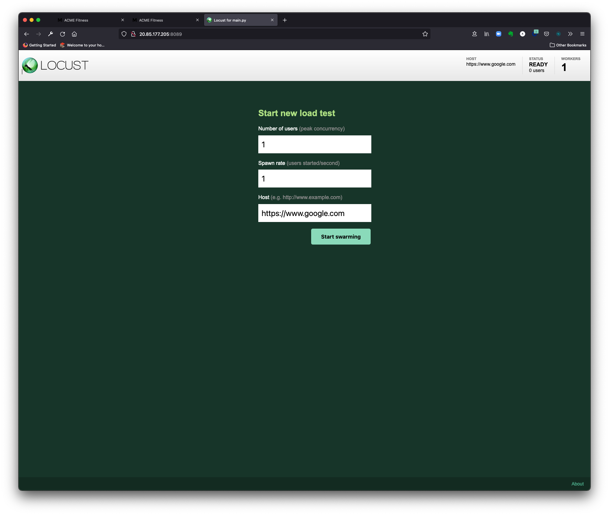
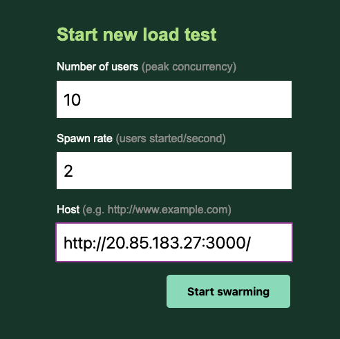
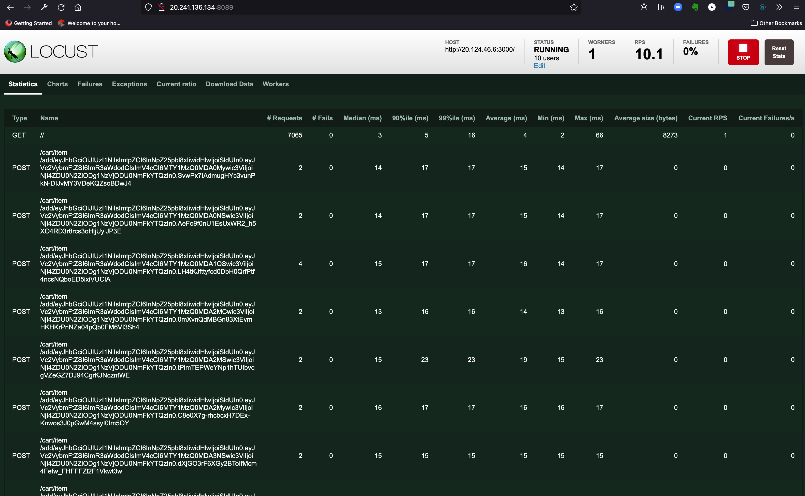

### Table of Contents

[Module 3: Setup Wavefront Proxy for an AKS Cluster](#module-3-setup-wavefront-proxy-for-an-aks-cluster)

[Objectives and Tasks](#objectives-and-tasks)

[Task 1: Setup a Wavefront proxy on an AKS cluster](#task-1-setup-a-wavefront-proxy-on-an-aks-cluster)

[Task 2: Setup Jaeger with wavefront-proxy](#task-2-setup-jaeger-with-wavefront-proxy)

[Task 3: Setup Locust](#task-3-setup-locust)


#### Module 3: Setup Wavefront Proxy for an AKS Cluster

In this lab, you will setup a Wavefront proxy on an AKS cluster.

##### Objectives and Tasks

1. Setup a Wavefront proxy on an AKS cluster
2. Setup Jaeger with wavefront-proxy
3. Setup Locust

##### Task 1: Setup a Wavefront proxy on an AKS cluster

* Install Wavefront agent.
```execute-2
    helm repo add wavefront https://wavefronthq.github.io/helm/ && helm repo update  
```
* Create Wavefront namespace. 
```execute-2
    kubectl create namespace wavefront 
```    
* Install Wavefront Proxy. You will need to insert your Wavefront API token under **--set wavefront.token=INSERT TOKEN HERE**. Your API token can be retrieved by accessing: **Wavefront Dashboard -> Gear Icon (upper right hand corner) -> Select your Username -> API Access -> Generate (new token)** and saving the generated token privately. 

* Copy the command below to your own notepad, enter your own clusterName (ex: **tko-to-username**)and your own Wavefront API token, then paste into the terminal 2.

Copy this `helm install wavefront wavefront/wavefront --set wavefront.url=https://longboard.wavefront.com --set wavefront.token=INSERT TOKEN HERE --set clusterName={CLUSTER-NAME} --namespace wavefront`{{copy}} 

* Go to /acmefitness/kubernetes-manifests directory.
```execute-2
    cd ~/acmefitness/kubernetes-manifests
``` 
* Edit the wavefront-proxy deployment by adding a value parameter for "WAVEFRONT_PROXY_ARGS" key.
```execute-2
    kubectl edit deployment wavefront-proxy -n wavefront 
```
Add this to edit the deployment: add value for "WAVEFRONT_PROXY_ARGS" key   `value: --traceJaegerGrpcListenerPorts 12345`{{copy}}

* Check the wavefront-proxy pod status.
```execute-2
    kubectl get po -n wavefront |grep wavefront-proxy
```
* If the pod is up and running, browse to the Wavefornt dashboard url.
```dashboard:open-url
    url: https://longboard.wavefront.com/
```
#### Task 2: Setup Jaeger with wavefront-proxy
* Collect the IP address of the wavefront-proxy pod.
```execute-2
    kubectl get po -n wavefront -owide
```
* Update jaeger-all-in-one.yaml with proxy ip as args: spec: containers:  args: - --reporter.grpc.host-port=172.17.0.24:12345

```editor:open-file
    file: ~/acmefitness/kubernetes-manifests/jaeger-all-in-one.yml
``` 
* Deploy Jaeger.
* ```execute-2
    kubectl apply -f jaeger-all-in-one.yml -n tko
```
* Collect the ip address of the jaeger pod
```execute-2
    k get po -n tko -o wide |grep jaeger
```
* Update JAEGER_AGENT_HOST with ip-address:port of the jaeger-agent.

* Edit the cart, catalog, order, users, payemnt files with the IP of the jaeger pod.

```editor:open-file
    file: ~/acmefitness/kubernetes-manifests/cart-total.yaml
```
```editor:open-file
    file: ~/acmefitness/kubernetes-manifests/catalog-total.yaml
```
```editor:open-file
    file: ~/acmefitness/kubernetes-manifests/order-total.yaml
```
```editor:open-file
    file: ~/acmefitness/kubernetes-manifests/payment-total.yaml
```
```editor:open-file
    file: ~/acmefitness/kubernetes-manifests/users-total.yaml
```
```editor:open-file
    file: ~/acmefitness/kubernetes-manifests/frontend-total.yaml
```
* Redeploy all the services.

* Delete the existing services.
```execute-1
    kubectl delete deploy cart -n tko
    kubectl delete deploy catalog -n tko
    kubectl delete deploy order -n tko
    kubectl delete deploy users -n tko
    kubectl delete deploy frontend -n tko
    kubectl delete deploy payment -n tko
    kubectl delete svc cart -n tko
    kubectl delete svc catalog -n tko
    kubectl delete svc order -n tko
    kubectl delete svc users -n tko
    kubectl delete svc frontend -n tko
    kubectl delete svc payment -n tko
```
```execute-1
    kubectl apply -f cart-total.yaml -n tko
```
```execute-1
    kubectl apply -f catalog-total.yaml -n tko
```
```execute-1
    kubectl apply -f order-total.yaml -n tko
```
```execute-1
    kubectl apply -f users-total.yaml -n tko
```
```execute-1
    kubectl apply -f payment-total.yaml -n tko
```
```execute-1
    kubectl apply -f frontend-total.yaml -n tko
```
* Get the list of Kubernetes services running on `tko` namespace on the AKS cluster. Keep record of the external IP address of the **front end** service.
```execute-1
kubectl get services frontend --namespace tko --output 'jsonpath={.status.loadBalancer.ingress[0].ip}'
```
```dashboard:open-url
url: http://YOUR-EXTERNAL-IP:3000
```
#### Task 3: Setup Locust

* Create namespace locust.
```execute-1
    kubectl create ns locust
```
* Create the configmap.
```execute-1
    kubectl create configmap my-loadtest-locustfile --from-file ~/acmefitness/traffic-generator/main.py -n locust
````
* Install and deploy the repo.
```execute-1
    helm repo add deliveryhero https://charts.deliveryhero.io/    
```
```execute-1
    helm install locust deliveryhero/locust --set loadtest.name=my-loadtest --set loadtest.locust_locustfile_configmap=my-loadtest-locustfile -n locust   
```
* Change the locust service from ClusterIP to Loadbalancer.
```execute-1
    kubectl -n locust patch svc locust -p '{"spec": {"type": "LoadBalancer"}}'
```
```execute-1
    kubectl -n locust get svc locust --output 'jsonpath={.status.loadBalancer.ingress[0].ip}'
```
* Browse the locust app. Change localhost with the IP address above.

```dashboard:open-url
    url: http://localhost:8089
```
* By default, Locust should look like this:



* In Locust, change the number of users to "10", the spawn rate to "2", and the host address to your application's IP address and port number.



* You should see Locust beginning to send traffic to the demo application. This should also begin sending metrics to your Tanzu Observability dashboard.


