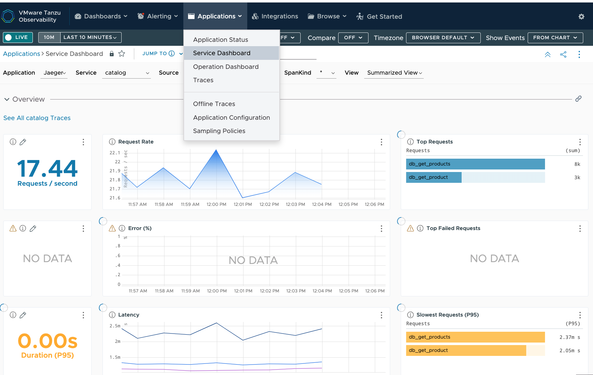
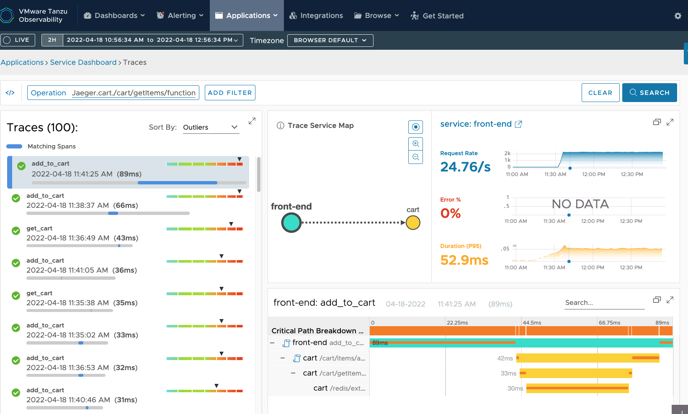
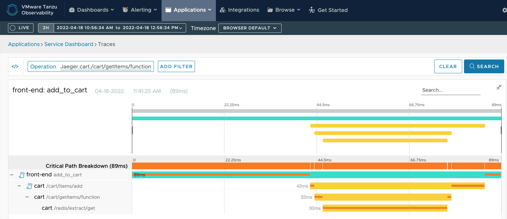

### Table of Contents

[Module 4: Explore Distributed Tracing Capabilities](#module-4-explore-distributed-tracing-capabilities)

[Objectives and Tasks](#objectives-and-tasks)

[Task 1: Access distributed traces using the service dashboard traces and matching span](#task-1-access-distributed-traces-using-the-service-dashboard-traces-and-matching-span)

[Task 2: Use the trace service map and service inventory](#task-2-use-the-trace-service-map-and-service-inventory)

[Task 3: Drill down into error traces to find out the critical path breakdown, and the source of error](#task-3-drill-down-into-the-trace-to-find-out-the-critical-path-breakdown)

#### Module 4: Explore Distributed Tracing Capabilities 

In this lab, you will explore distributed tracing capabilities using
service dashboards, traces, and spans

##### Objectives and Tasks   

In this lab, you will perform the following tasks: 

1.  Access distributed traces using the service dashboard traces and matching spans

2.  Use the trace service map and service inventory 

3.  Drill down into matching span to find out the critical path breakdown

##### Task 1: Access distributed traces using the service dashboard traces and matching span

Click Applications -> Service Dashboard on the top menu to access the service dashboard.  You will see the request rate, errors (if any), request latency, and other details

##### Task 2: Use the trace service map and service inventory 
Click on and request operation under Top Requests.  This will take you to the distributed trace service map 

##### Task 3: Drill down into the trace to find out the critical path breakdown
Expand the critical path breakdown of teh matching span to see the request critical path with an orange bar

##### 

