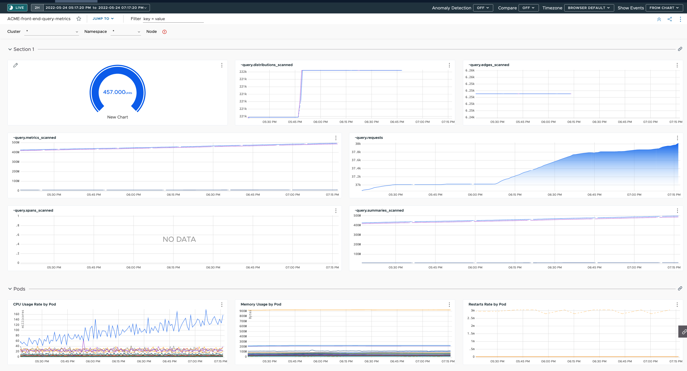
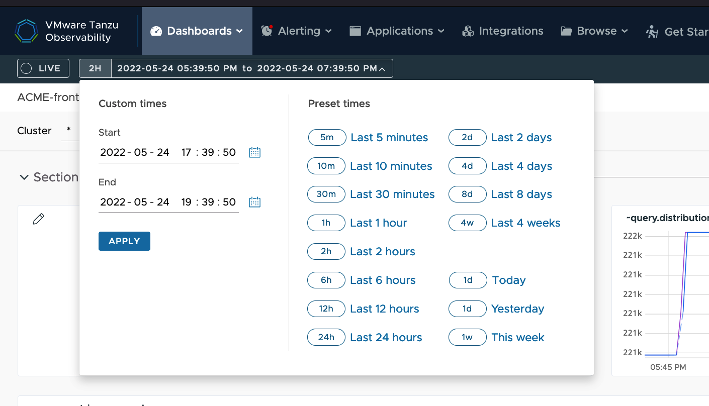

### Table of Contents

[Module 5: Full Stack Observability Dashboard](#module-4-full-stack-observability-dashboard)

[Objectives and Tasks](#objectives-and-tasks)

[Task 1: Create and refine a full stack dashboard for the ACME Fitness application](#task-1-create-and-refine-a-full-stack-dashboard-for-the-acme-fitness-application)

[Task 2: Examine metrics in dashboard view mode](#task-2-examine-metrics-in-dashboard-view-mode)

[Task 3: Customize dashboard](#task-3-customize-dashboard)


#### Module 5: Full Stack Observability Dashboard

In this lab, you will create and explore a full stack observability dashboard for the ACME Fitness application.

##### Objectives and Tasks

1. Create and refine a full stack dashboard for the ACME Fitness application
2. Examine metrics in dashboard view mode
3. Customize dashboard

##### Task 1: Create and refine a full stack dashboard for the ACME Fitness application

Here is a quick video on how to create a dashboard:
```dashboard:open-url
url: https://vmwaretv.vmware.com/media/t/1_gqelhfur
```

Users with Dashboards permissions can create a new dashboard with one or multiple charts from metrics, a chart type, or an integration. You have several options for creating a dashboard. Inside your https://longboard.wavefront.com instance you can do any of the following to create a dashboard: 

* Select **Dashboards > Create Dashboard**, drag in the Data or New Chart widget, and follow the wizard to create a single-chart or multi-chart dashboard.
* Select **Dashboards > Create Dashboard**, drag in the Templates widget, and select an integration, then pick the dashboards and charts you'd like to include. 
* Select **Dashboards > All Dashboards** and **Create Dashboard**.
* Select **Browse > Metrics** and click **Create Dashboard**.

**Create a Dashboard for ACME Fitness**

To create a dashboard: 
1. Select **Dashboards > Create Dashboard** from the toolbar.
2. Drag the **Data** widget to the canvas.
3. Select **Metrics** and add **~query.** In the botton of the Data window, select **Import Metrics as Multiple Charts**. Feel free to drag and drop the different charts around to see how easy it is to rearrange them.
4. Drag the **New Chart** widget to the canvas. 
5. Select **Gauge**, and name your chart "jaeger-tracing-front-end"
6. In the **Data** drop-down menu, select **Delta Counters** and then select **tracing. > aggregated. > derived. > Jaeger. > front-end. > invocation. > count** and in the bottom right hand corner, select **Save**.
7. Drag the **Integration Templates** widget to the canvas. Select **Kubernetes > Kubernetes Pods > Pods**.
8. In the top left, under "Enter dashboard name", type "ACME-front-end-query-metrics". In the top right, click **Save** and specify a name and URL for the dashboard. By default, you can keep the 'ACME-front-end-query-metrics" name and URL.

* Your dashboard should look similar to this:
 


##### Task 2: Examine Metrics in Dashboard View Mode

All users can examine metrics, set the time window, and make temporary changes to dashboards. By default, everyone can explore, set dashboard time window, zoom in and out, and perform other customizations. While all users can view and explore charts, you must have 'Dashboards Permissions' to make permanent changes such as saving a chart to a dashboard.

Here is a quick video on how to set the Time Window:
```dashboard:open-url
url: https://vmwaretv.vmware.com/media/t/1_zew0muhn
```

1. In the 'ACME-front-end-query-metrics' dashboard, in the top menu, toggle between the viewable timeframes, timezones, and event viewing options. Since you recently deployed your application, most of your data will not be viewable past the ACME Fitness application deployment time (~several mins.), but you will at least have an understanding of the types of data that is accessible from a dashboard.
2. Try selecting from some of the Preset times in the timeframe menu on the left hand side. Can you see a difference between the 'Last 5 minutes' option and the 'Last 10 minutes' option? 



By default, dashboards: 

* Show a two-hour time window in each chart. You can configure the default time window as part of the Dashboard Display Preferences.
* Display real-time (live) data.
* Update charts every 30s.

##### Task 3: Customize Dashboard

All users can customize their dashboards to drill down into data. You can find different sections, filter using variables or filters, set the time for the dashboard, and share the dashboard with others (you will need 'Dashboards Permissions' to save your changes). 

Here is a quick video on how to customize a dashboard:
```dashboard:open-url
url: https://vmwaretv.vmware.com/embed/secure/iframe/entryId/1_gunwcmwm/uiConfId/49694343/pbc/252649793/st/0
```


